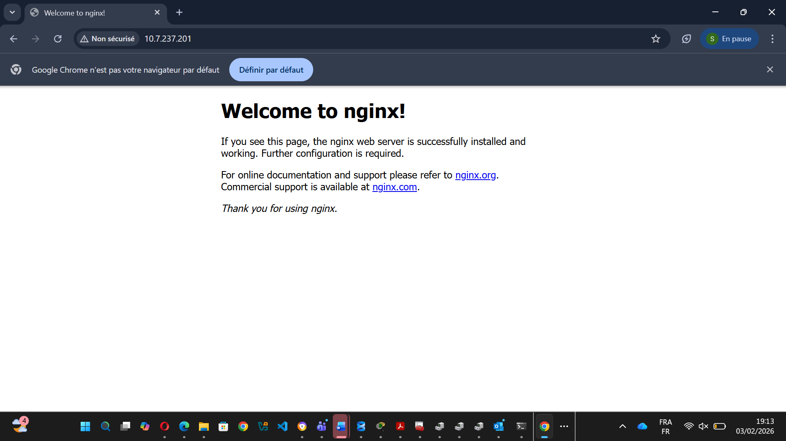
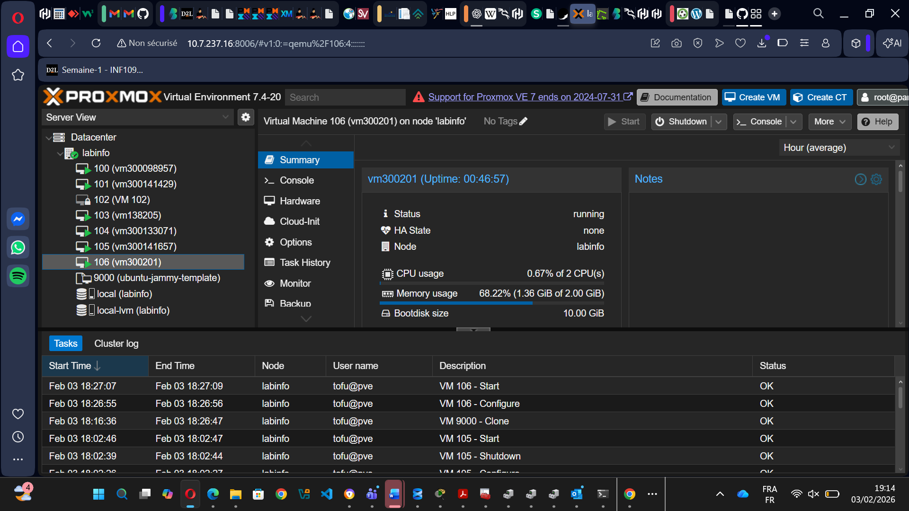
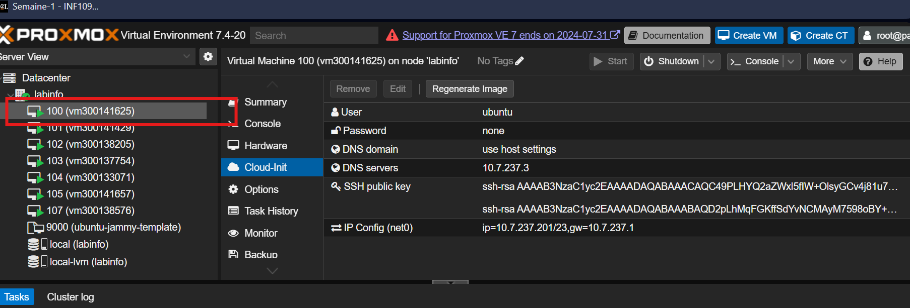

# Lab 3 – Infrastructure as Code (IaC) avec OpenTofu

## 🎯 Objectif
Déployer automatiquement une VM Ubuntu sur Proxmox avec OpenTofu (Terraform).

## 📂 Structure
300141625/
├── images/
├── .gitignore
├── README.md
├── main.tf
├── provider.tf
└── variables.tf
## 📸 Captures d'écran

### 1. VM déployée — Page Nginx


### 2. VM dans Proxmox


### 3. Configuration Cloud-Init


## ▶️ Exécution
```bash
tofu init
tofu plan
tofu apply
```

## 🧪 Vérification
```bash
curl http://10.7.237.201
```

## ✅ Conclusion
OpenTofu permet de déployer automatiquement une infrastructure complète sur Proxmox de façon déclarative et reproductible.

## 👤 Auteur
- Nom : Fatou
- ID Boréal : 300141625
