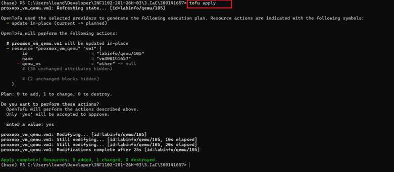
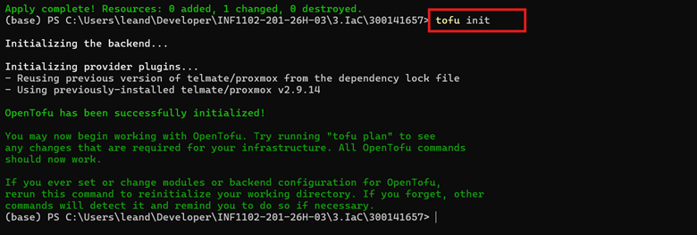
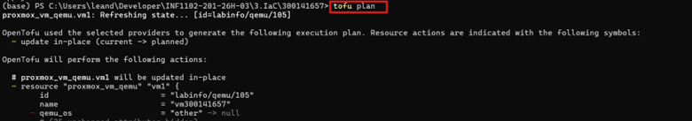
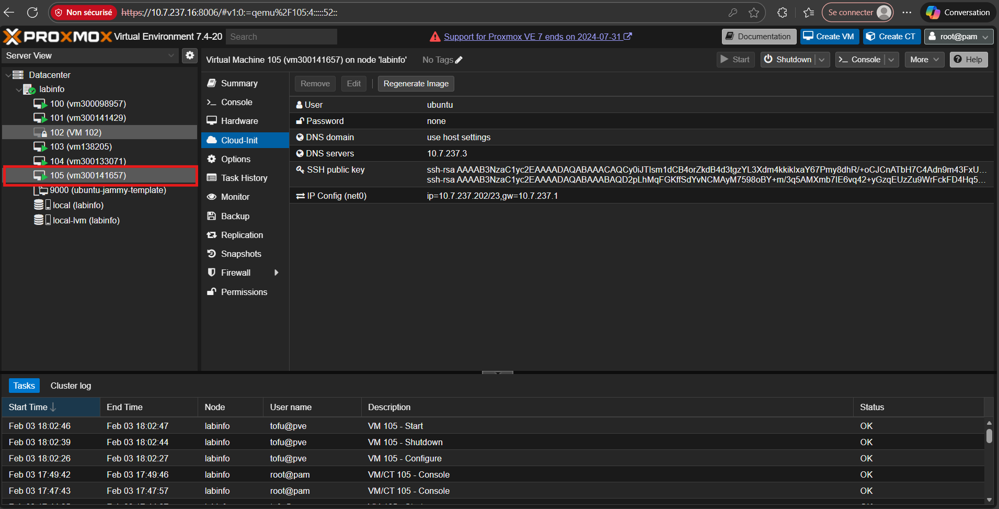
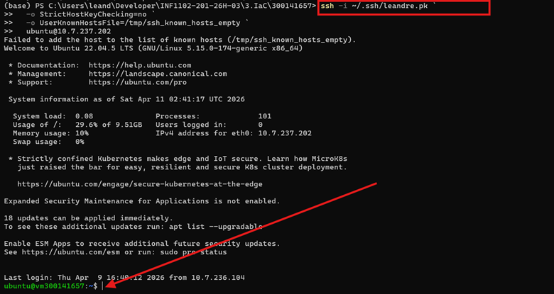
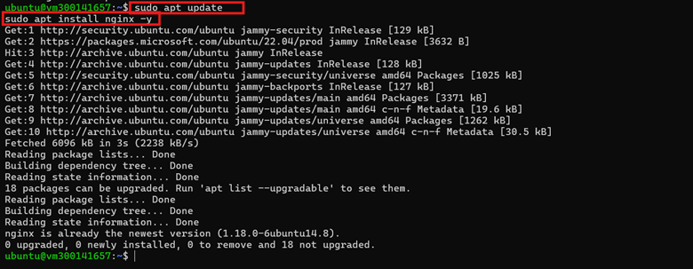
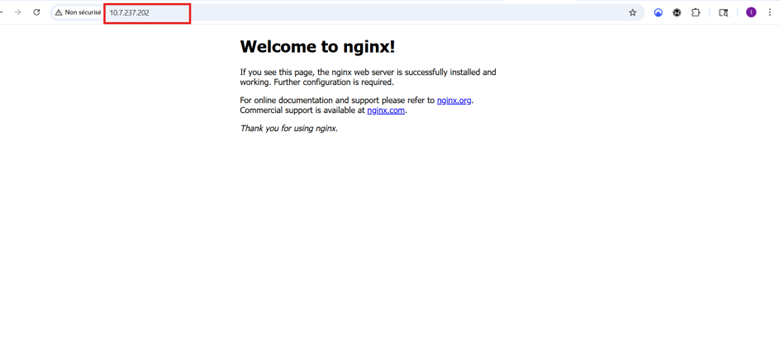

```
pm_vm_name      = "vm300141657"
pm_ipconfig0    = "ip=10.7.237.202/23,gw=10.7.237.1"
pm_nameserver   = "10.7.237.3"
pm_url          = "https://10.7.237.16:8006/api2/json"
pm_token_id     = "tofu@pve!opentofu"
pm_token_secret = "4fa24fc3-bd8c-4916-ba6e-09a8aecc3b00"
```


1. Application de la configuration avec tofu apply
Commande
tofu apply
Rôle

Cette commande applique réellement les changements définis dans les fichiers OpenTofu sur l’infrastructure Proxmox.

Dans mon cas, OpenTofu a détecté une machine virtuelle existante et a effectué une mise à jour en place de la ressource. Le résultat final confirme que l’opération s’est bien terminée.

Résultat observé
Apply complete! Resources: 0 added, 1 changed, 0 destroyed.
Capture
<p align="center">  </p>
2. Initialisation du projet avec tofu init
Commande
tofu init
Rôle

Cette commande initialise le projet OpenTofu.

Elle permet de préparer le dossier de travail et de charger le provider telmate/proxmox, nécessaire pour communiquer avec l’API Proxmox. Le message affiché confirme que l’environnement OpenTofu est prêt à être utilisé.

Capture
<p align="center">  </p>
3. Vérification du plan avec tofu plan
Commande
tofu plan
Rôle

Cette commande affiche les changements qu’OpenTofu prévoit d’effectuer avant l’exécution réelle.

Elle permet de vérifier la configuration avant l’application. Dans ce projet, le plan annonce une modification sur la machine virtuelle existante, sans création ni suppression.

Capture
<p align="center">  </p>
4. Vérification de la machine virtuelle sur Proxmox
Rôle

Cette capture montre que la machine virtuelle vm300141657 est bien présente dans l’interface Proxmox.

On peut également voir plusieurs informations importantes, comme l’utilisateur, la configuration réseau et les paramètres Cloud-Init. Cela confirme que la machine virtuelle est bien déployée et reconnue par Proxmox.

Capture
<p align="center">  </p>
5. Vérification de l’accès au serveur avec SSH
Commande
```
ssh -i ~/.ssh/leandre.pk `
  -o StrictHostKeyChecking=no `
  -o UserKnownHostsFile=/tmp/ssh_known_hosts_empty `
  ubuntu@10.7.237.202
  ```
  
Rôle

Cette commande permet de se connecter à la machine virtuelle à distance par SSH avec une clé privée.

Les options utilisées évitent les blocages liés aux empreintes de clé dans un environnement de laboratoire où les machines virtuelles peuvent être recréées souvent. La connexion réussie confirme que la machine est accessible et fonctionnelle.

Capture
<p align="center">  </p>
6. Mise à jour du système et installation de NGINX
Commandes
sudo apt update
sudo apt install nginx -y
Rôle

Ces commandes permettent de mettre à jour la liste des paquets et d’installer NGINX sur la machine virtuelle.

Cette étape démontre que la VM déployée avec OpenTofu est pleinement utilisable et qu’il est possible d’y installer un service réel.

Capture
<p align="center">  </p>
7. Vérification finale de la page web NGINX
Adresse testée
http://10.7.237.202
Rôle

Cette capture montre la page par défaut de NGINX affichée dans le navigateur.

Cela confirme que :

la machine virtuelle fonctionne correctement
la connectivité réseau est bonne
NGINX est bien installé
le serveur web est accessible depuis le navigateur
Capture
<p align="center">  </p>
Résultat final

À la fin du TP, la machine virtuelle a bien été :

gérée par OpenTofu
validée dans Proxmox
accessible en SSH
configurée avec NGINX
testée avec succès dans le navigateur

Le projet montre donc que l’approche Infrastructure as Code a été appliquée correctement sur une infrastructure fonctionnelle.

Conclusion

Ce travail m’a permis de mettre en pratique l’utilisation de OpenTofu avec Proxmox dans un contexte concret d’administration système.

Les différentes étapes ont permis de confirmer que la configuration peut être initialisée, vérifiée, appliquée, puis validée à travers une machine virtuelle opérationnelle et un service web accessible.

Ce TP démontre donc avec succès le déploiement et la validation d’une infrastructure simple avec l’approche IaC.
