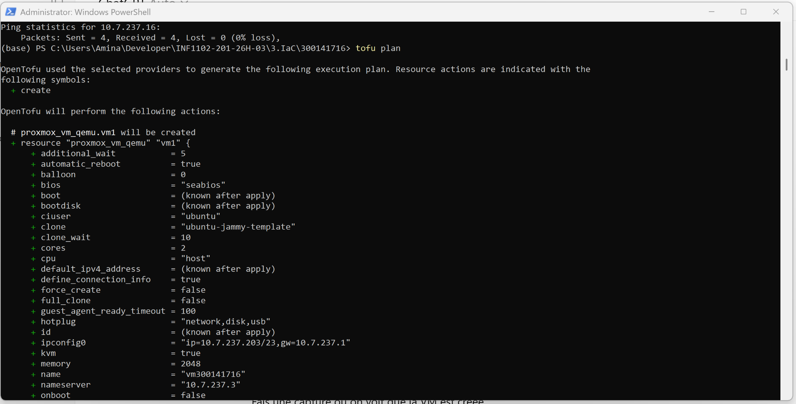
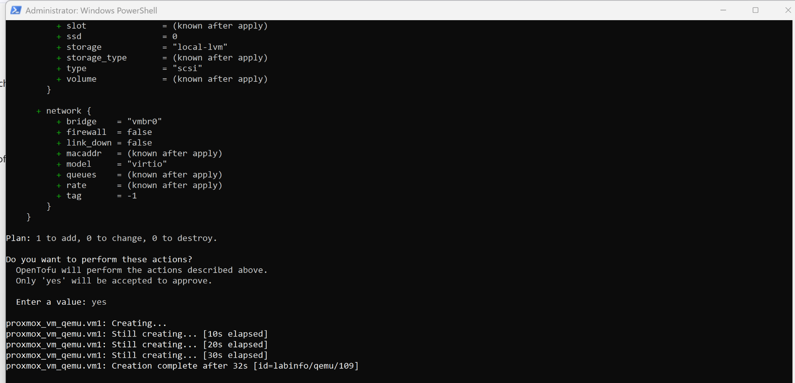
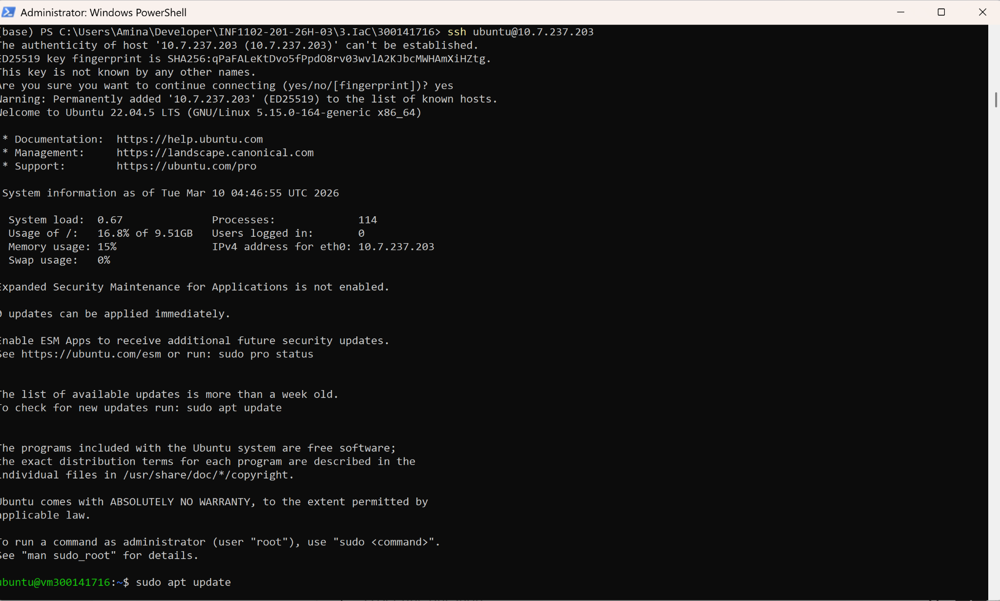
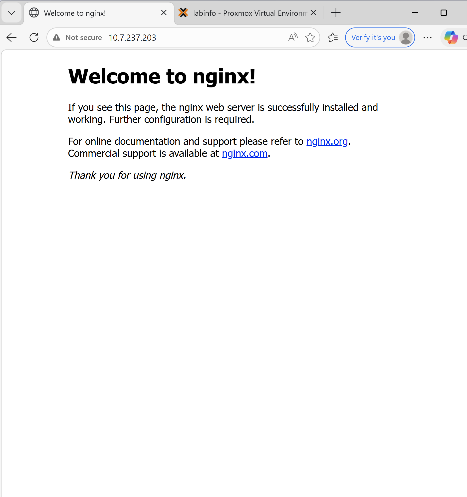

# Infrastructure as Code (IaC) – OpenTofu & Proxmox

## Étudiante
Nom : Nabila Oulad-Bouih  
Boréal ID : 300141716  
Cours : INF1102 – Programmation système / DevOps  

---

## Objectif du laboratoire

L’objectif de ce laboratoire est de mettre en pratique le concept **Infrastructure as Code (IaC)** en utilisant **OpenTofu** avec **Proxmox VE** afin de déployer automatiquement une machine virtuelle Linux.

Ce laboratoire permet de :

- Comprendre le principe de l’Infrastructure as Code
- Automatiser la création d’une machine virtuelle
- Utiliser un provider OpenTofu avec Proxmox
- Déployer un serveur Linux automatiquement
- Installer un serveur web accessible depuis un navigateur

---

## Concepts abordés

- Infrastructure as Code (IaC)
- Automatisation de l’infrastructure
- Virtualisation avec Proxmox
- OpenTofu (compatible Terraform)
- Cloud-Init
- Connexion SSH
- Déploiement d’un serveur web

---

## Outils utilisés

- OpenTofu
- Proxmox VE
- Ubuntu Server
- SSH
- Git / GitHub
- NGINX (serveur web)

---

## Structure du projet

300141716/
│
├── provider.tf
├── main.tf
├── variables.tf
├── terraform.tfvars
├── README.md
│
└── images
├── tofu_plan.png
├── tofu_apply.png
├── ssh_connection.png
└── nginx_web.png

---

## Configuration utilisée

pm_vm_name = "vm300141716"
pm_ipconfig0 = "ip=10.7.237.203/23,gw=10.7.237.1"
pm_nameserver = "10.7.237.3"

Serveur Proxmox :

https://10.7.237.16:8006

---

## Commandes utilisées

Initialisation du projet :

tofu init

Plan de déploiement :

tofu plan

Création de la machine virtuelle :

tofu apply

---

## Vérification

### Plan OpenTofu

---

### Déploiement de la VM

---

### Connexion SSH

Connexion à la machine virtuelle :

ssh ubuntu@10.7.237.203

---

### Serveur Web NGINX

Le serveur web est accessible dans un navigateur :

http://10.7.237.203

---

## Résultats obtenus

- Déploiement automatique d’une machine virtuelle Ubuntu
- Infrastructure décrite entièrement avec du code
- Connexion SSH fonctionnelle
- Installation et démarrage du serveur web NGINX
- Accès web fonctionnel via navigateur

---

## Conclusion

Ce laboratoire démontre comment **Infrastructure as Code** permet d’automatiser le déploiement d’une infrastructure informatique.  
Grâce à OpenTofu et Proxmox, il est possible de créer et configurer une machine virtuelle rapidement et de manière reproductible.
