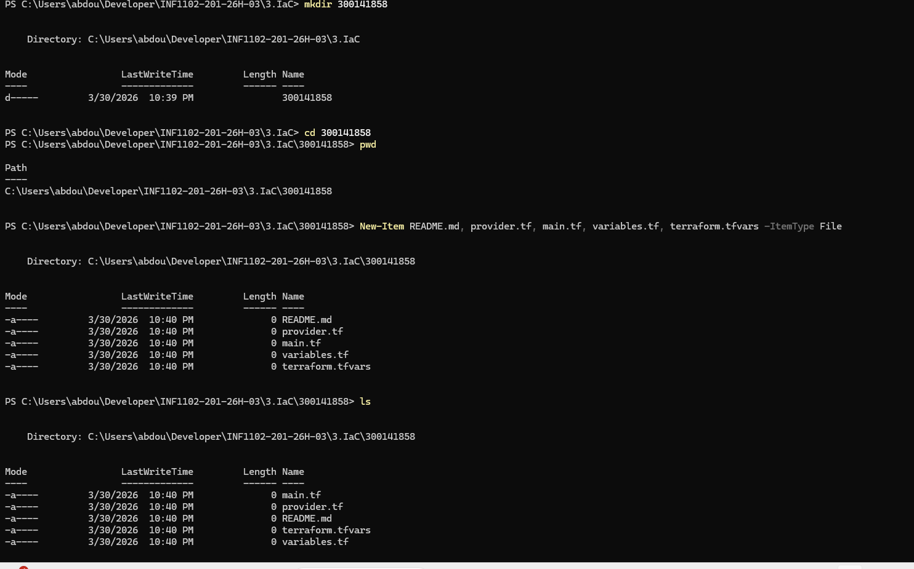
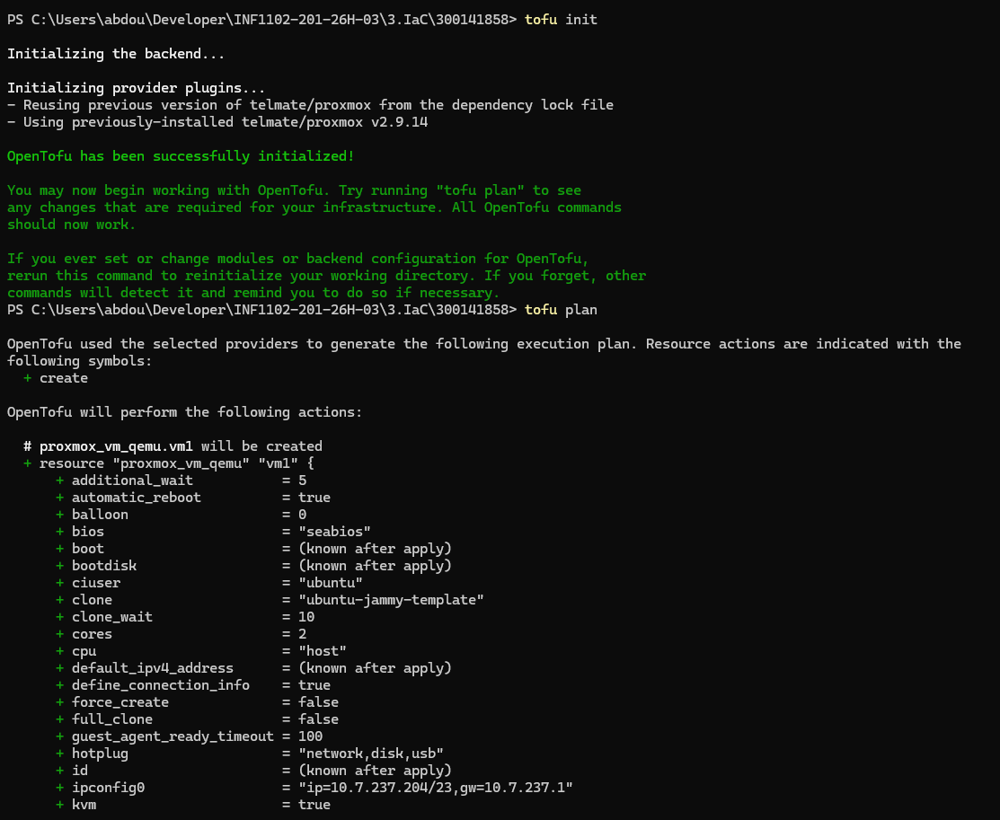
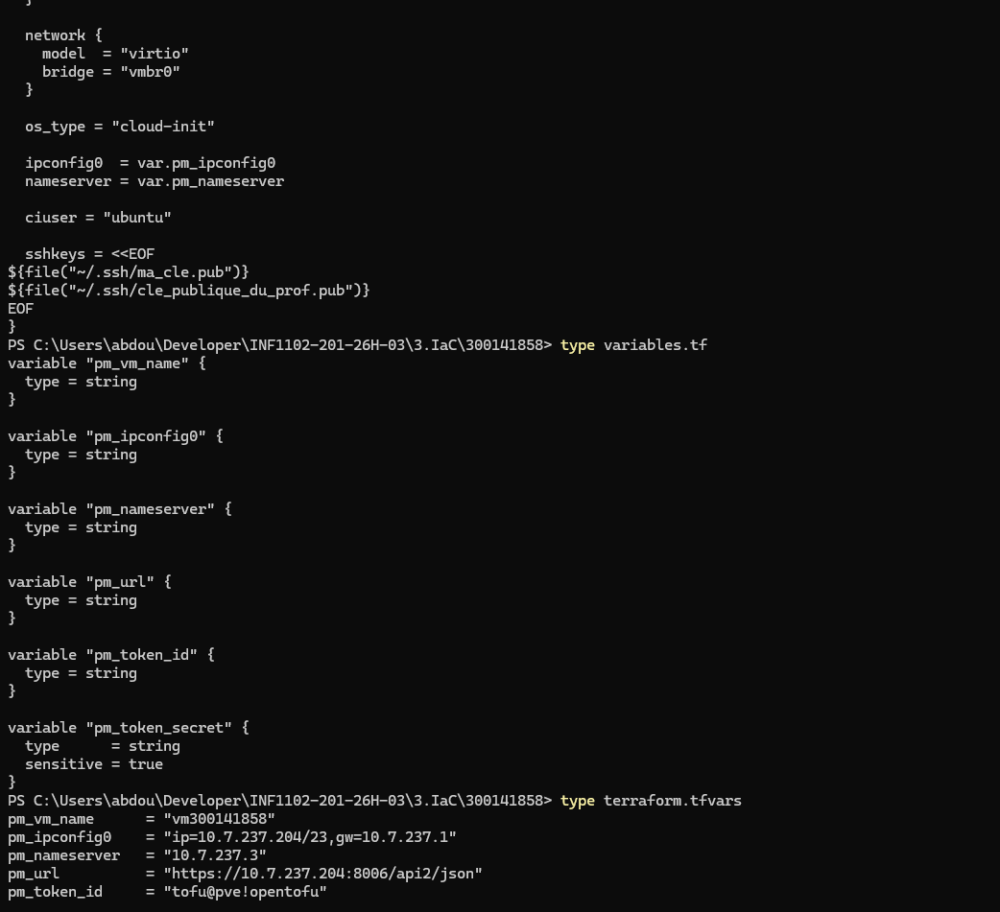

# 🚀 Infrastructure as Code avec OpenTofu

---

## 👨‍🎓 Informations

| Champ | Valeur |
|------|--------|
| Nom | Abdou Karim NIANG |
| ID | 300141858 |
| Cours | INF1102-201-26H-03 |
| VM | vm300141858 |
| IP | 10.7.237.204 |

---

## 🎯 Objectif

Ce laboratoire a pour objectif de déployer automatiquement une machine virtuelle Ubuntu dans Proxmox en utilisant **OpenTofu**, selon le principe de l’**Infrastructure as Code (IaC)**.

---

## 🧱 Étape 1 — Création du projet

Création du dossier et des fichiers nécessaires :

- `provider.tf`
- `main.tf`
- `variables.tf`
- `terraform.tfvars`

### 📸 Capture


---

## 🔐 Étape 2 — Configuration SSH

- Vérification des clés SSH
- Ajout de la clé du professeur
- Vérification de OpenTofu (`tofu version`)

### 📸 Capture


---

## ⚙️ Étape 3 — Configuration Terraform

Configuration des fichiers pour déployer la VM automatiquement.

### 📸 Capture


---

## 🚀 Étape 4 — Initialisation et plan

```bash
tofu init
tofu plan