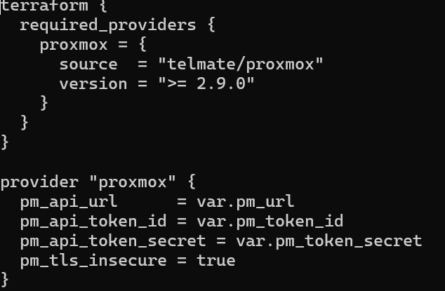
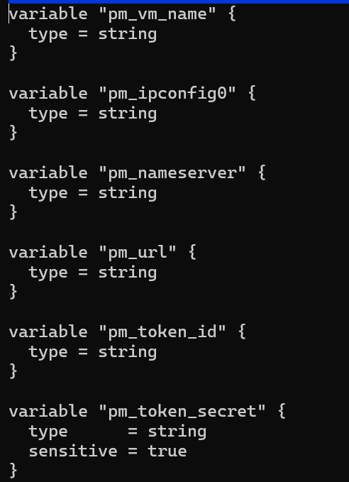
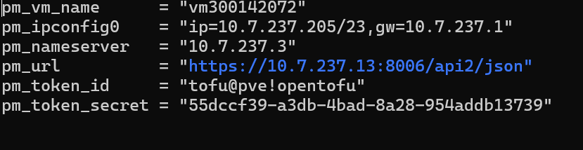
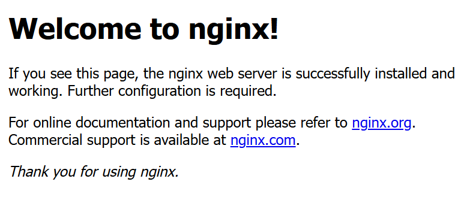

🌻RAPPORT DU TRAVAL IAC 

⭐ Installation de tofu
```
choco install opentofu
```
```
tofu version
```
```
OpenTofu v1.11.3
on darwin_arm64
+ provider registry.opentofu.org/telmate/proxmox v2.9.14
```
⭐ Creation et configuration des fichiers provider.tf main.tf variables.tf terraform.tfvars

🅰️ Creation des fichiers provider.tf main.tf variables.tf terraform.tfvars

```
touch provider.tf main.tf variables.tf terraform.tfvars
```
🆎 Configuration des fichiers

- main.tf 
  
  
- provider.tf

  
-variables.tf

  
-terraforms.tfvars


⭐ Test d'acces a la VM proxmox

on utilise la commande suivantes en mettant le nom de notre clef publique :
```
ssh -i ~/.ssh/siga.pk `
  -o StrictHostKeyChecking=no `
  -o UserKnownHostsFile=/tmp/ssh_known_hosts_empty `
  ubuntu@10.7.237.205
```


  
