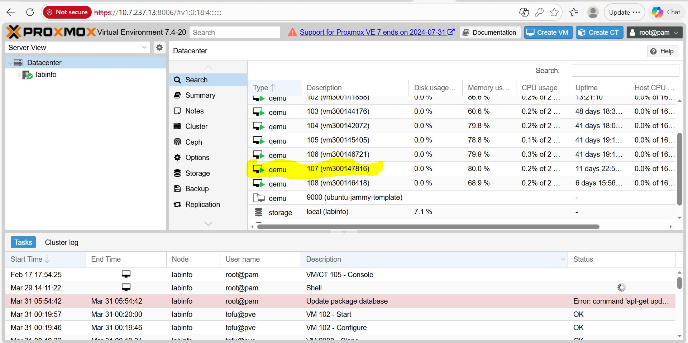

**#🚀 Projet IaC - Déploiement Automatisé sur Proxmox**

**👤 Étudiant**
**Identifiant:** 300147816  

**Cours :** Programmation Système / Infrastructure as Code  

**Outil utilisé :** OpenTofu (Alternative open-source à Terraform)

---

## 1. Objectif du projet
L'objectif était de passer d'une administration manuelle à une approche **IaC**. Au lieu de créer une machine virtuelle (VM) à la souris dans l'interface Proxmox, j'ai utilisé des fichiers de configuration déclaratifs pour définir les ressources (CPU, RAM, Réseau, Stockage).

Contrairement à une installation manuelle, cette méthode permet de :

* Décrire l'infrastructure de manière **déclarative**.

* Garantir la **reproductibilité** (même code = même résultat).

* Éliminer les erreurs humaines lors de la configuration réseau et système.

## 🛠️ Outils & Technologies

* **OpenTofu v1.6+** : Moteur d'orchestration pour le déploiement.

* **Proxmox VE 7** : Hyperviseur cible pour héberger la VM.

* **Provider Telmate/Proxmox** : Plugin permettant à OpenTofu de communiquer avec Proxmox.

* **Cloud-Init** : Pour la configuration automatique de l'utilisateur `ubuntu` et de l'IP au premier démarrage.

## 2. Configuration de l'environnement

Pour ce projet, j'ai configuré les fichiers suivants dans mon répertoire `300147816` :

* `provider.tf` : Connexion à l'API Proxmox (`10.7.237.13`).

* `main.tf` : Définition des ressources de la VM (2 vCPU, 2GB RAM, Disque 10GB) (Clonage de `ubuntu-jammy-template`).

* `variables.tf` : Paramétrage des variables (IP, noms, secrets) pour la flexibilité du code.

* `terraform.tfvars` : Valeurs spécifiques à mon matricule (IP statique : **10.7.237.213**).

## 3. contenu de terraform.tfvars

```text
pm_vm_name      = "vm300133071"
pm_ipconfig0    = "ip=10.7.237.194/23,gw=10.7.237.1"
pm_nameserver   = "10.7.237.3"
pm_url          = "https://10.7.237.16:8006/api2/json"
pm_token_id     = "tofu@pve!opentofu"
pm_token_secret = "4fa24fc3-bd8c-4916-ba6e-09a8aecc3b00"

```
## 4. Étapes de déploiement de l'infrastructure

J'ai suivi le cycle de vie standard de l'IaC pour déployer la VM

1.  **Initialisation** : `tofu init` pour télécharger les plugins (provider Telmate Proxmox).

2.  **Planification** : `tofu plan` pour vérifier les modifications avant exécution (création de `proxmox_vm_qemu.vm1`).

3.  **Application** : `tofu apply` pour créer réellement la VM sur le serveur.

---

## ✅ Vérification et Résultats

La VM a été déployée avec succès sur le nœud `labinfo`.

### 1. Preuve visuelle (Interface Proxmox)



*Cette image montre la VM `vm300147816` active et fonctionnelle sur l'IP 10.7.237.213.*

### 2. Test de connexion SSH

La connexion à la VM a été validée via la commande :

```bash
ssh -i ~/.ssh/ma_cle.pk ubuntu@10.7.237.213
```

**🧠 Conclusion**

Ce laboratoire prouve qu'avec l'IaC, l'infrastructure devient un logiciel. En quelques secondes, une VM complète avec configuration réseau et clés SSH a été provisionnée sans aucune intervention manuelle dans l'interface graphique de Proxmox.
