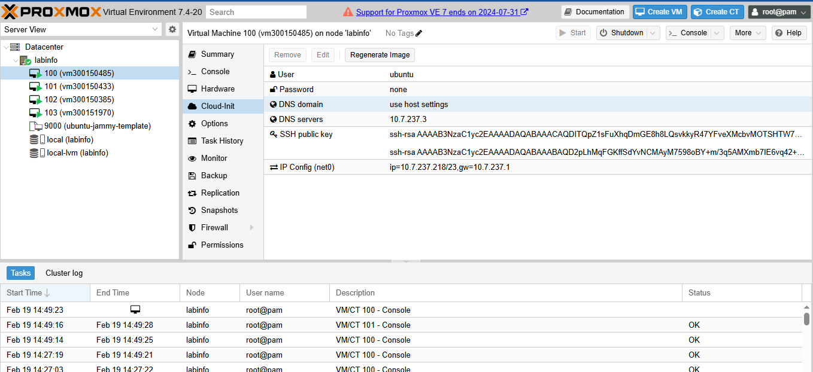

# 🏗️ Infrastructure as Code — OpenTofu & Proxmox

> Projet étudiant réalisé dans le cadre du cours **INF1102** — Collège Boréal  
> Dossier : `3.IaC/300150485`


---

## 📋 Description

Ce projet consiste à déployer automatiquement une **VM Ubuntu** sur un serveur **Proxmox** en utilisant **OpenTofu** (alternative open-source à Terraform). L'infrastructure est entièrement décrite en code (IaC), avec authentification SSH par clé et configuration Cloud-Init.

---

## 🎯 Objectifs

- Comprendre le concept d'Infrastructure as Code (IaC)
- Utiliser OpenTofu pour provisionner une VM sur Proxmox
- Configurer Cloud-Init pour l'initialisation automatique de la VM
- Gérer l'authentification SSH par clé publique
- Séparer la configuration en fichiers modulaires

---

## 🛠️ Technologies utilisées

| Technologie | Rôle |
|-------------|------|
|  | Outil IaC — provisionnement de l'infrastructure |
|  | Hyperviseur — hébergement des VMs |
|  | Système d'exploitation de la VM |
| Cloud-Init | Initialisation automatique de la VM |
|  | Versionnement du projet |

---

## 📁 Structure du projet

```
3.IaC/300150485/
├── 📄 main.tf           # Configuration principale de la VM
├── 📄 provider.tf       # Configuration du provider Proxmox
├── 📄 variables.tf      # Déclaration des variables
├── 🖼️ images/
│   ├── tofu_apply.png   # Capture du tofu apply
│   └── vm_runing.png    # Capture de la VM en cours d'exécution
└── 📖 README.md         # Documentation du projet
```

---

## ⚙️ Configuration de la VM

| Paramètre | Valeur |
|-----------|--------|
| **ID Boréal** | 300150485 |
| **Node Proxmox** | `labinfo` |
| **Adresse IP** | `10.7.237.218` |
| **OS** | Ubuntu 22.04 LTS |
| **Authentification** | Clé SSH publique |
| **Cloud-Init** | Activé |

---

## 📄 Explication des fichiers

### `provider.tf`
Configure le provider Proxmox pour OpenTofu :
- URL du serveur Proxmox
- Identifiants de connexion
- Paramètres TLS

### `main.tf`
Fichier principal contenant la configuration de la VM :
- Définition de la VM (CPU, RAM, disque, réseau)
- Configuration Cloud-Init (utilisateur, clé SSH, IP statique)

### `variables.tf`
Déclaration des variables réutilisables :
- IP de la VM
- Nom du nœud Proxmox
- Identifiants de connexion

---

## ▶️ Instructions d'exécution

### Prérequis

- OpenTofu installé (`tofu --version`)
- Accès au serveur Proxmox
- Clé SSH générée (`~/.ssh/ma_cle`)

### Initialiser OpenTofu

```bash
tofu init
```

### Planifier le déploiement

```bash
tofu plan
```

### Appliquer le déploiement

```bash
tofu apply
```

### Détruire l'infrastructure

```bash
tofu destroy
```

---

## 📸 Captures d'écran

### Déploiement avec `tofu apply`


### VM en cours d'exécution sur Proxmox


---

## 📊 Résultats attendus

Après `tofu apply` :

```
Apply complete! Resources: 1 added, 0 changed, 0 destroyed.

Outputs:
vm_ip   = "10.7.237.218"
vm_name = "vm300150485"
```

La VM est ensuite accessible via SSH :

```bash
ssh -i ~/.ssh/ma_cle ubuntu@10.7.237.218
```

---

## 💡 Concepts clés

| Concept | Explication |
|---------|-------------|
| **IaC** | L'infrastructure décrite entièrement en code |
| **Provisionnement** | Création automatique des ressources |
| **Cloud-Init** | Initialisation automatique au premier démarrage |
| **Idempotence** | Appliquer 2 fois = même résultat |
| **Provider** | Plugin OpenTofu pour communiquer avec Proxmox |

---

## 👤 Auteur

**Nadir Fetis**  
Étudiant en Techniques de l'informatique — Collège Boréal

---

## 🏫 Contexte académique

| Champ | Détail |
|-------|--------|
| Établissement | Collège Boréal |
| Cours | INF1102 — Introduction au DevOps |
| LAB | 3 — Infrastructure as Code (IaC) |
| Session | Hiver 2026 |
| Dossier | `3.IaC/300150485` |

---

<div align="center">
  <sub>Fait avec ❤️ par Nadir Fetis — Collège Boréal</sub>
</div>
