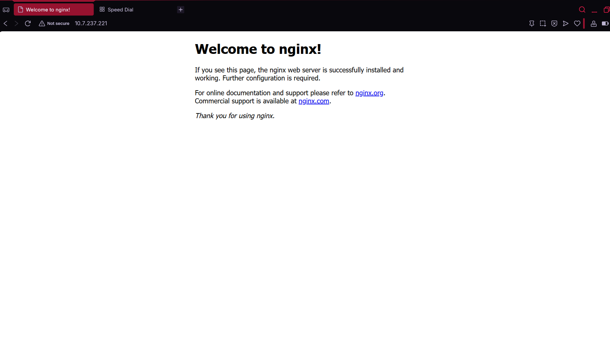

📸 Aperçu du déploiement

  

🏗️ Infrastructure as Code avec OpenTofu et Proxmox
📌 But du projet

Ce projet vise à introduire le principe de l’Infrastructure as Code (IaC). Cette méthode consiste à gérer une infrastructure informatique via des fichiers de configuration, plutôt que par des actions manuelles. Elle permet d’automatiser les déploiements, de limiter les erreurs humaines et d’assurer une cohérence entre les environnements.

📖 Notions abordées

Nous avons comparé deux approches :

Gestion traditionnelle : configuration manuelle des serveurs, souvent longue et sujette à des incohérences
Infrastructure as Code : description complète de l’infrastructure dans du code, versionné et réutilisable

L’IaC offre plusieurs avantages, notamment :

une meilleure traçabilité grâce au versionnement (Git)
une automatisation des déploiements
une reproduction fiable des environnements

Deux modèles d’IaC ont également été étudiés :

Déclaratif : on définit le résultat attendu, et l’outil se charge de l’atteindre
Impératif : on décrit les étapes à exécuter dans un ordre précis
🛠️ Technologies utilisées

Pour cette activité, nous avons utilisé :

OpenTofu pour orchestrer l’infrastructure
Proxmox comme plateforme de virtualisation
GitHub pour gérer et versionner le projet

L’objectif était de déployer automatiquement une machine virtuelle Linux à partir d’un template cloud-init.

⚙️ Mise en place

Le projet a été structuré avec plusieurs fichiers de configuration :

provider.tf
main.tf
variables.tf
terraform.tfvars

Nous y avons défini différents paramètres, notamment :

la connexion à l’API Proxmox
les caractéristiques de la machine virtuelle
la configuration réseau (IP, DNS)
le stockage
les clés SSH
les संसौrces matérielles (CPU, RAM)
🚀 Exécution du déploiement

Le déploiement s’effectue en plusieurs étapes avec OpenTofu :

tofu init
tofu plan
tofu apply

Ces commandes permettent respectivement d’initialiser le projet, de visualiser les changements à apporter, puis de créer l’infrastructure.

🧠 Conclusion

Ce travail nous a permis de comprendre l’intérêt de l’IaC dans un contexte professionnel. L’utilisation d’OpenTofu combinée à Proxmox facilite grandement le déploiement automatisé de machines virtuelles, tout en garantissant une meilleure cohérence et reproductibilité des environnements.
