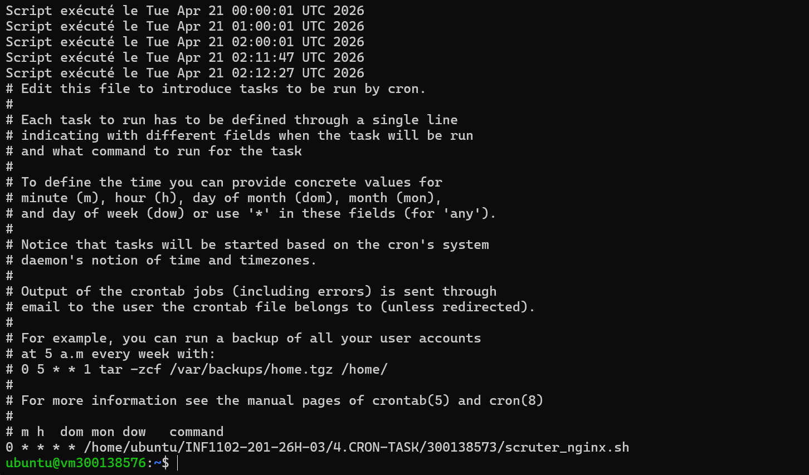

# 🔧 Lab CRON TASK – Analyse des logs Nginx

## 📌 Objectif

Ce laboratoire a pour objectif d’analyser le fichier de logs Nginx afin d’extraire les adresses IP des visiteurs, de supprimer les doublons et d’automatiser cette tâche à l’aide du service **CRON**.

---

## 🗂️ Structure du projet

```
4.CRON-TASK/
└── 300138576/
    ├── scruter_nginx.sh
    ├── nginx_ips.txt
    ├── nginx_ips.log
    └── images/
        └── 1.png
```

---

## ⚙️ Étapes réalisées

### 1️⃣ Extraction des adresses IP

Nous avons utilisé la commande suivante pour extraire uniquement les adresses IP du fichier `/var/log/nginx/access.log` :

```bash
awk '{print $1}' /var/log/nginx/access.log
```

---

### 2️⃣ Suppression des doublons et sauvegarde

Les adresses IP ont été triées et les doublons supprimés avec :

```bash
awk '{print $1}' /var/log/nginx/access.log | sort | uniq > nginx_ips.txt
```

---

### 3️⃣ Création du script Bash

Un script nommé **scruter_nginx.sh** a été créé pour automatiser le processus :

```bash
#!/bin/bash

LOG_FILE="/var/log/nginx/access.log"
OUTPUT_FILE="nginx_ips.txt"
EXEC_LOG="nginx_ips.log"

awk '{print $1}' "$LOG_FILE" | sort | uniq > "$OUTPUT_FILE"
echo "Script exécuté le $(date)" >> "$EXEC_LOG"
```

---

### 4️⃣ Attribution des permissions

Le script a été rendu exécutable avec :

```bash
chmod +x scruter_nginx.sh
```

---

### 5️⃣ Automatisation avec CRON

Une tâche CRON a été configurée pour exécuter le script chaque heure :

```bash
0 * * * * /home/ubuntu/INF1102-201-26H-03/4.CRON-TASK/300138576/scruter_nginx.sh
```

---

## 📊 Résultat

* Le fichier **nginx_ips.txt** contient toutes les adresses IP uniques.
* Le fichier **nginx_ips.log** enregistre chaque exécution du script avec la date et l’heure.

---

## 🖼️ Preuve d’exécution



---

## ✅ Conclusion

Ce laboratoire a permis de :

* Manipuler les logs système
* Utiliser des commandes Linux avancées (awk, sort, uniq)
* Créer et exécuter un script Bash
* Automatiser une tâche avec CRON

Ce processus est essentiel pour l’administration système et l’analyse de trafic réseau.

---

