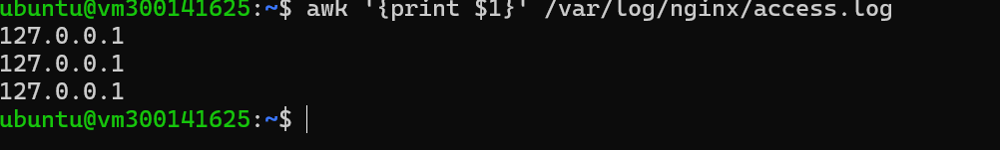
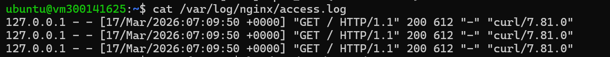
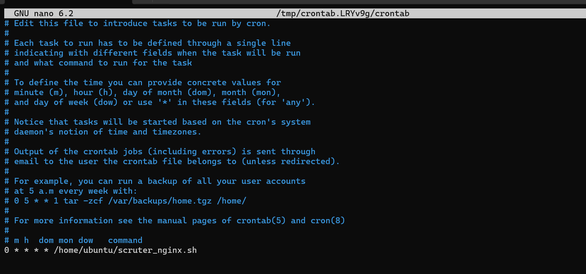
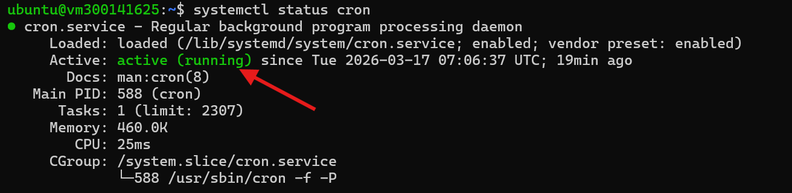
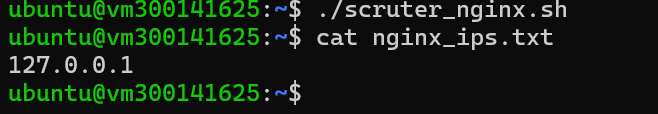

# 🎯 CRON-TASK : Surveillance Nginx

## Objectif
Extraire automatiquement les adresses IP des visiteurs du serveur Nginx et automatiser la tâche avec cron.

---

## 1️⃣ Extraction des IP avec awk
La commande `awk '{print $1}'` permet d'extraire la première colonne du fichier de log, qui contient l'adresse IP du visiteur.
```bash
awk '{print $1}' /var/log/nginx/access.log
```



---

## 2️⃣ Logs Nginx complets
Le fichier `access.log` contient toutes les requêtes reçues par le serveur Nginx avec l'adresse IP, la date, la ressource demandée et le code HTTP.
```bash
cat /var/log/nginx/access.log
```



---

## 3️⃣ Crontab - Automatisation
Le crontab permet d'exécuter automatiquement le script `scruter_nginx.sh` toutes les heures grâce à la ligne `0 * * * *`.
```bash
crontab -e
```



---

## 4️⃣ Vérification que cron est actif
La commande `systemctl status cron` confirme que le service cron est **active (running)** sur la VM.
```bash
systemctl status cron
```



---

## 5️⃣ Résultat - IP extraites
Le fichier `nginx_ips.txt` contient toutes les adresses IP uniques qui ont visité le serveur.
```bash
cat nginx_ips.txt
```


