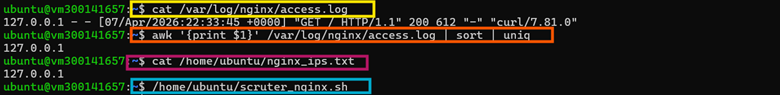
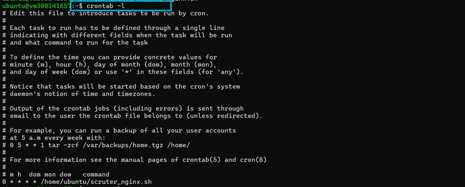
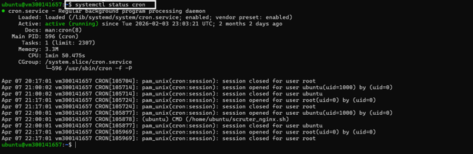

# TP PowerShell - 300141657 Leandre Manizan
## Captures d’écran

### 1. Extraction des IPs et exécution du script

<p align="center">
  
</p>

---

### 2. Vérification de la tâche CRON

<p align="center">
  
</p>

---

### 3. Vérification de l’état du service CRON

<p align="center">
  
</p>

## Structure du projet

```bash
300141657/
├── README.md
└── images/
    ├── Image6.png
    ├── Image7.png
    └── Image8.png
