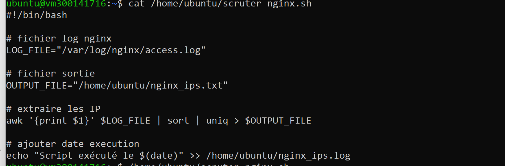
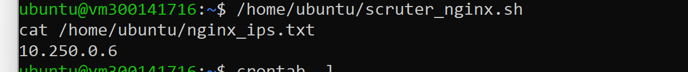
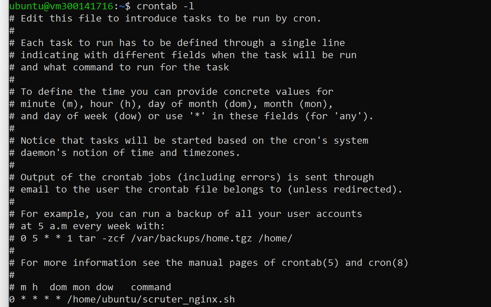
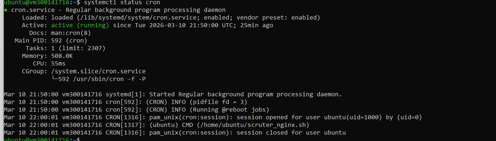

# CRON Task – Analyse des logs Nginx

## Étudiant
ID Boréal : 300141716  
Cours : Programmation système / DevOps  

## Objectif
L’objectif de ce laboratoire est d’automatiser l’analyse des logs du serveur web **Nginx** afin d’extraire les adresses IP des visiteurs et d’exécuter cette tâche automatiquement avec **CRON**.

---

## Script utilisé

Fichier : `scruter_nginx.sh`

```bash
#!/bin/bash

LOG_FILE="/var/log/nginx/access.log"
OUTPUT_FILE="/home/ubuntu/nginx_ips.txt"

awk '{print $1}' $LOG_FILE | sort | uniq > $OUTPUT_FILE

echo "Script exécuté le $(date)" >> /home/ubuntu/nginx_ips.log

## Vérification

### Script scruter_nginx.sh


### Résultat du script (IP extraites)


### Configuration de la tâche CRON


### Service cron actif


