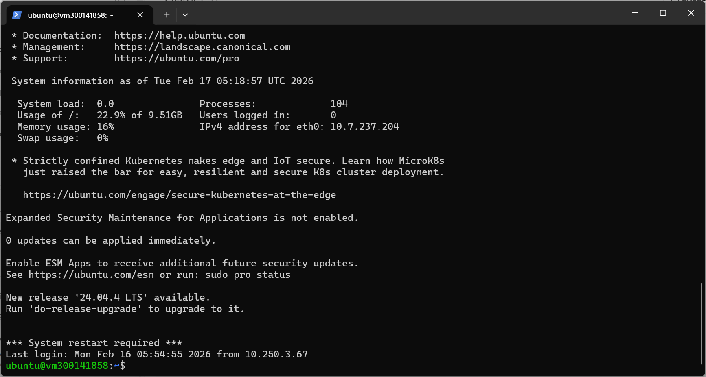
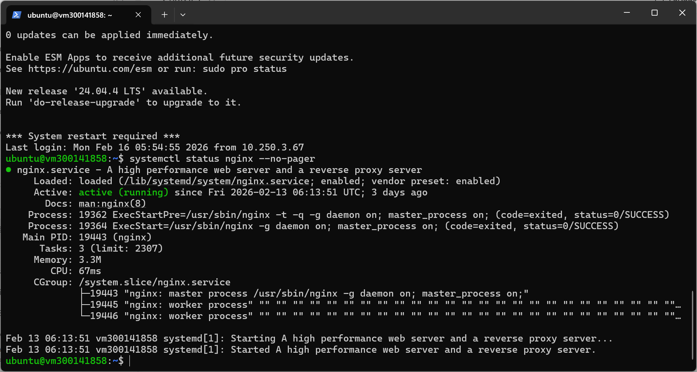
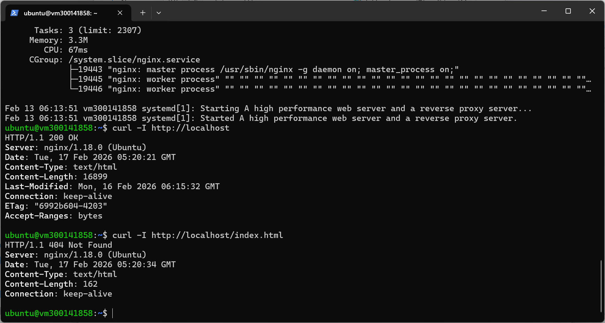
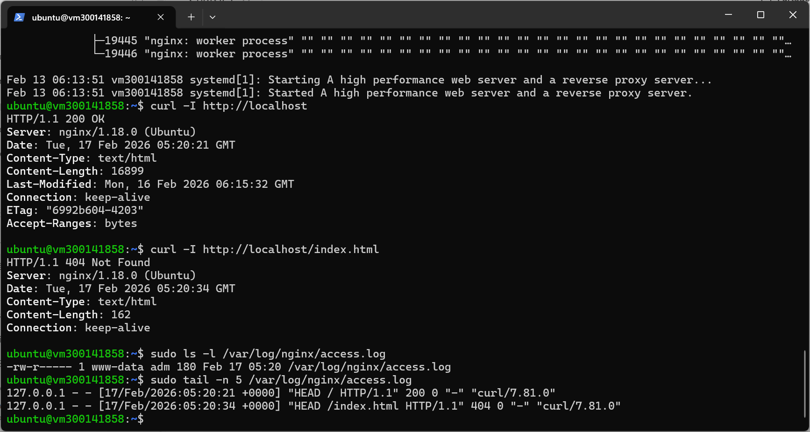
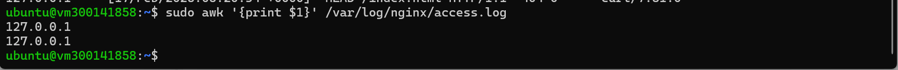
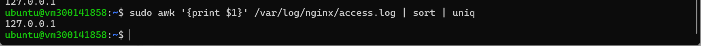
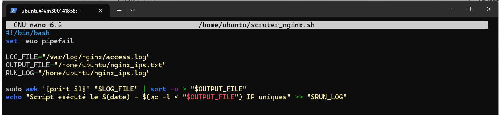
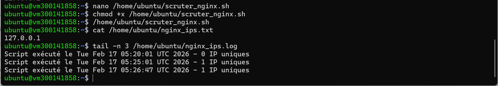
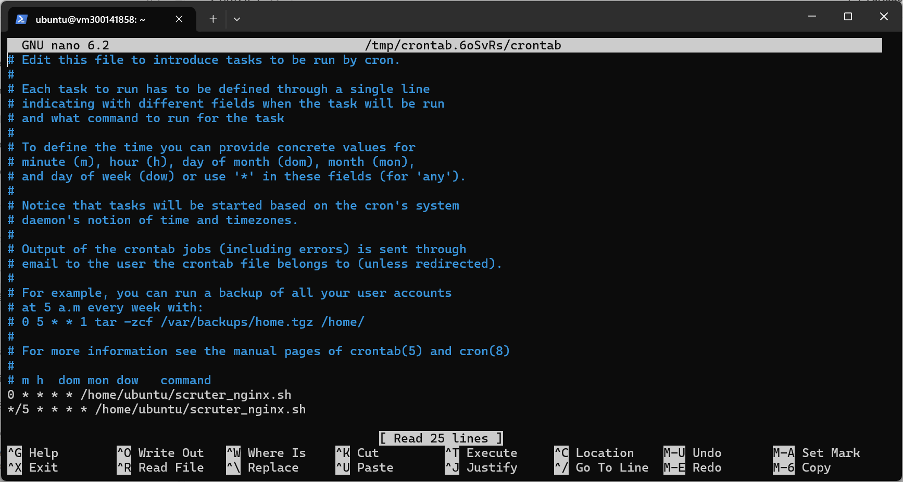

# 🔍 TP – Surveillance des logs Nginx avec Cron

👨‍🎓 Étudiant : Abdou Karim NIANG  
📚 Cours : INF1102  
🖥️ VM : vm300141858  
🌐 Serveur : Nginx  

---

# 🎯 Objectif

Analyser les logs Nginx, extraire les IP visiteurs et automatiser l’analyse avec Cron.

---

# 🔐 1️⃣ Connexion SSH

Commande :

ssh ubuntu@10.7.237.204

📸 Résultat :

---

# 🌍 2️⃣ Vérification Nginx

Commande :

systemctl status nginx

📸 Résultat :

---

# 🧪 3️⃣ Tests curl

Commandes :

curl -I http://localhost  
curl -I http://localhost/index.html

📸 Résultat :

---

# 📄 4️⃣ Vérification access.log

Commande :

sudo tail -n 5 /var/log/nginx/access.log

📸 Résultat :

---

# 📊 5️⃣ Extraction IP

Commande :

sudo awk '{print $1}' /var/log/nginx/access.log

📸 Résultat :

---

# 🔍 6️⃣ IP uniques

Commande :

sudo awk '{print $1}' /var/log/nginx/access.log | sort | uniq

📸 Résultat :

---

# 🤖 7️⃣ Script Bash

Création :

nano /home/ubuntu/scruter_nginx.sh

📸 Script :

---

# ⏰ 8️⃣ Cron

Commande :

crontab -e

Ligne ajoutée :

0 * * * * /home/ubuntu/scruter_nginx.sh

📸 Résultat :

---

# ⚙️ 9️⃣ Statut Cron

Commande :

sudo systemctl status cron

📸 Résultat :

---

# 🧠 Compétences acquises

- Analyse de logs Linux  
- awk, sort, uniq  
- Script Bash  
- Planification Cron  
- Administration Nginx  

---

# ✅ Conclusion

Le script fonctionne.  
Les IP sont extraites automatiquement.  
Cron exécute le script toutes les heures.

TP terminé avec succès.

