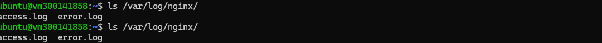
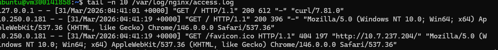
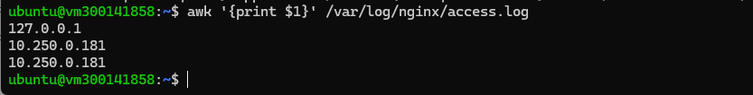
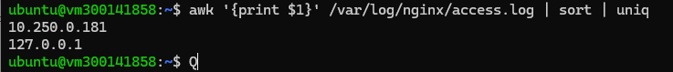
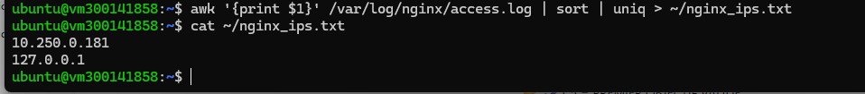
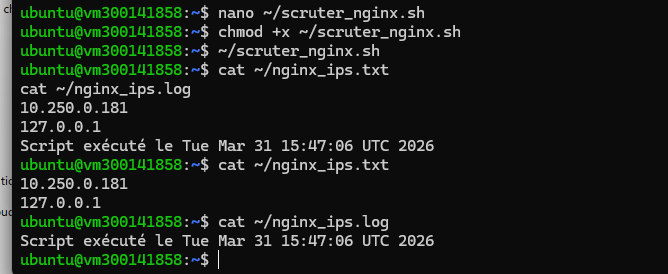
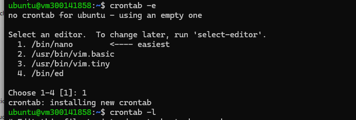
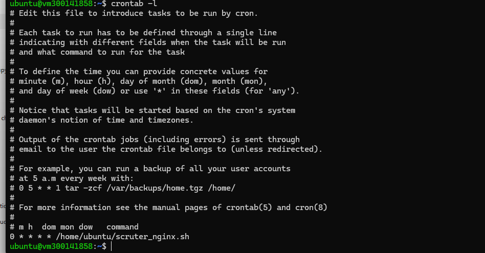

# CRON-TASK - 300141858

## 🎯 Objectif

L’objectif de cet exercice est de :

- analyser les logs du serveur Nginx
- extraire les adresses IP des visiteurs
- supprimer les doublons
- enregistrer les IP dans un fichier
- automatiser la tâche avec `cron` pour une exécution chaque heure

---

## 📁 Fichier analysé

Le fichier de logs utilisé :

/var/log/nginx/access.log

Chaque ligne contient :

- l’adresse IP du visiteur
- la date et l’heure
- la requête HTTP
- le code de réponse

---

## ⚙️ Commande utilisée

### 🔎 Explication :

- `awk '{print $1}'` → extrait la première colonne (IP)
- `sort` → trie les IP
- `uniq` → supprime les doublons

---

## 🧾 Script shell

#!/bin/bash

LOG_FILE="/var/log/nginx/access.log"
OUTPUT_FILE="$HOME/nginx_ips.txt"
EXEC_LOG="$HOME/nginx_ips.log"

awk '{print $1}' "$LOG_FILE" | sort | uniq > "$OUTPUT_FILE"
echo "Script exécuté le $(date)" >> "$EXEC_LOG"

### ✅ Fonctionnalités du script :

- extraction des IP
- suppression des doublons
- enregistrement dans `nginx_ips.txt`
- journalisation dans `nginx_ips.log`

---

## ⏰ Automatisation avec cron
0 * * * * /home/ubuntu/scruter_nginx.sh

---

## 🔍 Vérification

cat ~/nginx_ips.txt
cat ~/nginx_ips.log
crontab -l
systemctl status cron

---

## 📸 Preuves

### 📌 Logs Nginx

### 📌 Extraction des IP

### 📌 Résultat des IP uniques

### 📌 Script exécuté

### 📌 Fichier nginx_ips.txt

### 📌 Log d’exécution

### 📌 Cron configuré

### 📌 Service cron actif

---

## ✅ Conclusion

Ce projet permet de :

- comprendre l’analyse des logs sous Linux
- utiliser les commandes `awk`, `sort`, `uniq`
- automatiser des tâches avec `cron`
- structurer un travail professionnel avec des preuves

✔ Script fonctionnel  
✔ Extraction des IP réussie  
✔ Cron actif  
✔ Automatisation réussie  

