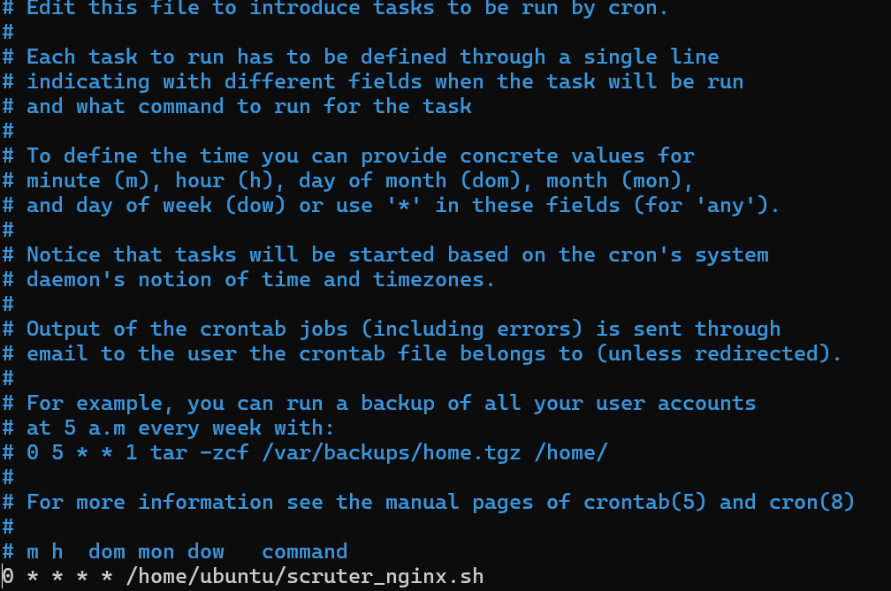
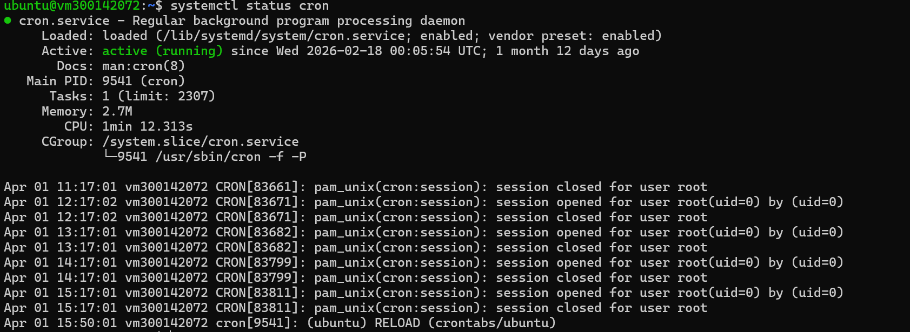

 💥RAPPORT DU TRAVAIL SUR LA CRON TASK
 
 ⭐ Création du ficher scruter_nginx.sh ( pour céeer un script automatisé) 

 ```
#!/bin/bash

# Fichier des logs
LOG_FILE="/var/log/nginx/access.log"

# Fichier de sortie
OUTPUT_FILE="/home/ubuntu/nginx_ips.txt"

# Extraire les IP uniques et les stocker
awk '{print $1}' $LOG_FILE | sort | uniq > $OUTPUT_FILE

# Optionnel : ajouter un timestamp à chaque exécution
echo "Script exécuté le $(date)" >> /home/ubuntu/nginx_ips.log
```
⭐ Rendre le script éxécutable
```
/home/ubuntu/scruter_nginx.sh
cat /home/ubuntu/nginx_ips.txt
```
⭐ Vérification du scprit

```
/home/ubuntu/scruter_nginx.sh
cat /home/ubuntu/nginx_ips.txt
```
⭐ Automatisation avec cron 

on edit la crontab avec la commande suivante : ``` crontab -e```

Ajout de la ligne 0 * * * * /home/ubuntu/scruter_nginx.sh au niveau de la crontab



verifier que le cron est bien actif 


