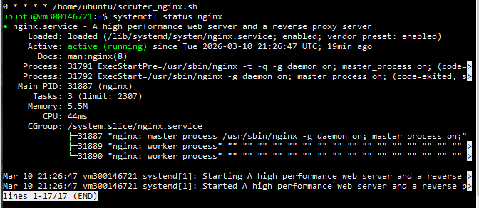
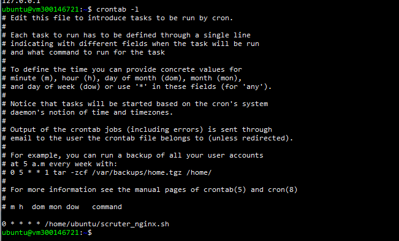
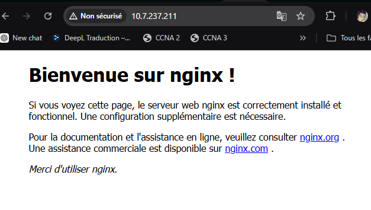

## Vérification du service Nginx

Commande utilisée :
```bash
systemctl status nginx
```


# Analyse des logs Nginx

## 1. Vérification du service Nginx
```bash
systemctl status nginx
```


---

## 2. Extraction des adresses IP
```bash
awk '{print $1}' /var/log/nginx/access.log
```


---

## 3. Création du script shel
```bash
nano scruter_nginx.sh
```


---

## 4. Automatisation avec cron
```bash
crontab -e
```




