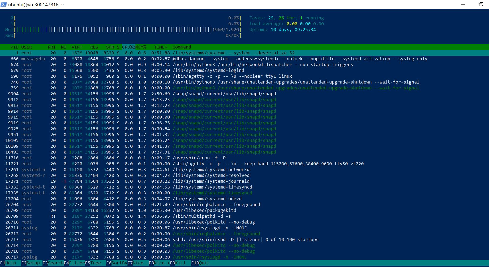
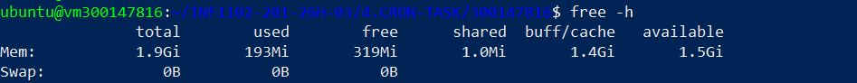
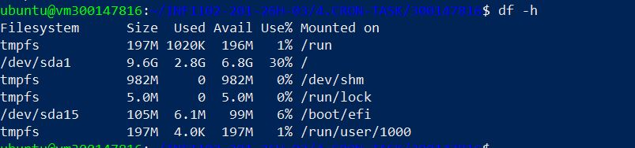
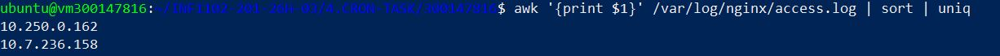
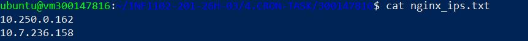
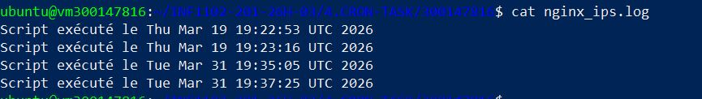
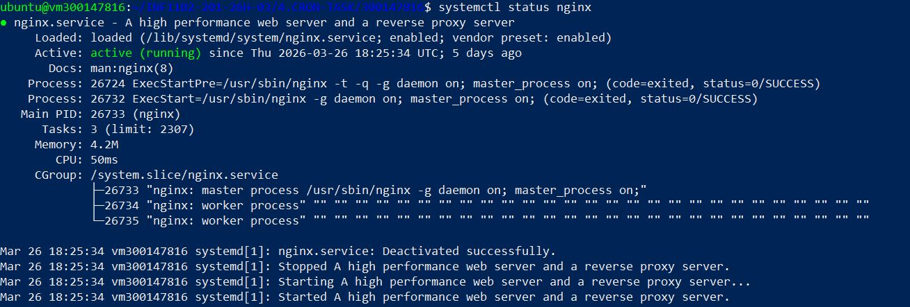
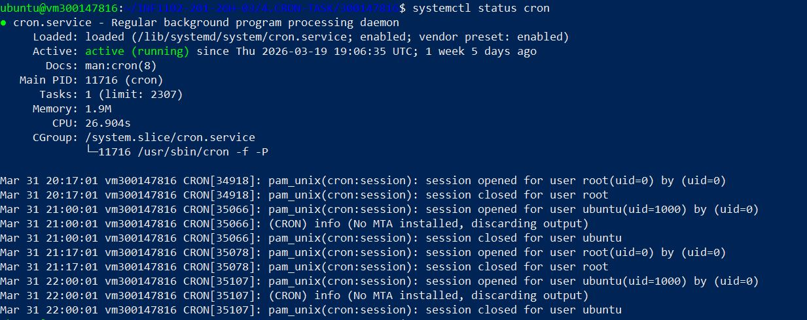

**📊 README :** Surveillance Système et Automatisation des Logs

**👤 Étudiant :** 300147816

**Cours :** Programmation Système / Administration Linux

**Sujet :** Gestionnaire de tâches, Observateur d'événements et Automatisation (CRON)

**🎯 Objectif du Projet**

L'objectif est d'apprendre à surveiller un serveur Linux en temps réel et à analyser les données a posteriori (logs) pour automatiser la détection des adresses IP des visiteurs sur un serveur Web Nginx afin d'assurer un suivi du trafic et de la sécurité

1️⃣ Surveillance en temps réel

Pour surveiller les performances de ma VM (CPU, Mémoire, Disque), j'utilise les outils suivants :

• Processus : htop (pour visualiser la charge CPU et RAM de manière interactive).



• Mémoire : free -h (pour voir la RAM disponible).



• Stockage : df -h (pour l'espace disque).



**📂 3. Analyse des Logs et Extraction d'IP**

Le serveur Nginx enregistre les requêtes dans /var/log/nginx/access.log. Pour isoler les visiteurs, j'utilise une combinaison de commandes puissantes :



**Explication**

- **awk** extrait la première colonne (IP)

- **sort** trie les données

- **uniq** élimine les doublons.

L'image montre bien la liste des IP obtenue par cette commande

**⚙️ 4. Automatisation avec Script Shell**

J'ai créé le script scruter_nginx.sh pour automatiser cette tâche de diagnostic. 

## Contenu du script :
```powershell
#!/bin/bash

LOG_FILE="/var/log/nginx/access.log"

OUTPUT_FILE="/home/ubuntu/nginx_ips.txt"

awk '{print $1}' $LOG_FILE | sort | uniq > $OUTPUT_FILE

echo "Script exécuté le $(date)" >> /home/ubuntu/nginx_ips.log
```


***Explication*

Pour que ce script puisse être lancé automatiquement par le système, j'ai dû modifier ses permissions avec la commande chmod +x. La capture ci-dessous confirme que le script est maintenant prêt :

* Le préfixe **-rwxrwxr-x** (en vert) indique que les droits d'exécution sont activés.

* Le script appartient à l'utilisateur ubuntu et est localisé dans mon dossier de projet.

**Contenu du script :**

* Extraction des IP vers `nginx_ips.txt`. L'image suivante confirme le contenu de fichier **nginx_ips.txt**



* Ajout d'un horodatage (timestamp) dans un fichier log pour confirmer chaque exécution réussie.


---

**🕒 5. Programmation CRON (Tâches planifiées)**

- Pour garantir une surveillance continue sans intervention manuelle, le script est planifié avec cron.

- Configuration : 0 * * * * /home/ubuntu/scruter_nginx.sh.

L'image suivante montre ma ligne de planification


Fréquence : Exécution automatique de script au début de chaque heure.

**✅ 6. Vérification du statut des services**

Pour s'assurer que le système d'analyse et le serveur sont opérationnels, on vérifie les services systemd.

Statut Nginx : systemctl status nginx.



Statut Cron : systemctl status cron.



**✅ 7. Conclusion**

Ce laboratoire sur la gestion des tâches planifiées (Cron) et l'analyse de logs m'a permis de mettre en place une solution de monitoring complète pour un serveur Web Nginx.

## Points clés retenus :

- **Analyse de données brutes :** L'utilisation de awk, sort et uniq permet de transformer des milliers de lignes de logs complexes en une liste simple et exploitable d'adresses IP (nginx_ips.txt).

- **Fiabilité de l'automatisation :** La configuration du Crontab (vérifiée par crontab -l) garantit que le diagnostic est effectué toutes les heures sans intervention humaine, ce qui est crucial en production.

- **Traçabilité :** La création d'un fichier journal (nginx_ips.log) avec la commande date permet de confirmer a posteriori que le script a bien fonctionné, même en cas d'absence de l'administrateur.

- **Gestion de projet et Git :** Le regroupement de tous les fichiers (script, logs, résultats et images de preuves) dans mon dossier étudiant 300147816 assure un rendu propre et professionnel sur GitHub.

## Résultat final : 

Le système est désormais autonome, documenté et prêt pour une analyse plus poussée du trafic réseau.
