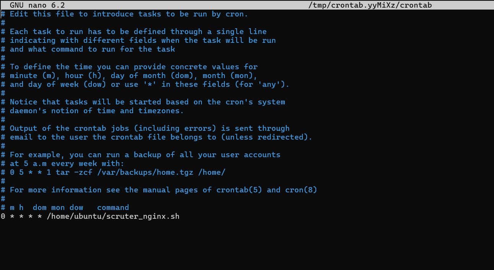
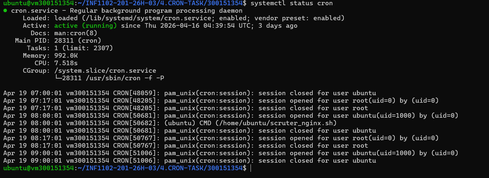

# 🕵️ Scruter les Logs Nginx — CRON TASK
 
> **INF1102-201-26H-03 | 4.CRON-TASK | Étudiant : 300151354**
 
---
 
## 📋 Description
 
Ce projet automatise l'extraction des **adresses IP des visiteurs** depuis les logs du serveur web **Nginx**, puis stocke ces IP dans un fichier texte. La tâche est planifiée pour s'exécuter **automatiquement toutes les heures** grâce à `cron`.
 
---
 
## 🎯 Objectifs
 
- 👁️ Surveiller le système en temps réel
- 📂 Analyser les logs Nginx (`access.log`)
- 🔍 Extraire les adresses IP uniques des visiteurs
- 💾 Stocker les résultats dans un fichier
- ⏰ Automatiser l'exécution avec `cron`
---
 
## 🗂️ Structure du projet
 
```
300151354/
├── scruter_nginx.sh       # Script principal d'extraction des IP
├── images/                # Captures d'écran de la démonstration
└── README.md              # Documentation du projet
```
 
---
 
## ⚙️ Prérequis
 
- Système **Ubuntu/Linux**
- Serveur **Nginx** installé et actif
- Accès aux logs : `/var/log/nginx/access.log`
- Service **cron** actif
---
 
## 🚀 Installation et utilisation
 
### Étape 1 — Vérifier les logs Nginx
 
```bash
ls /var/log/nginx/
# Résultat attendu : access.log  error.log
 
head /var/log/nginx/access.log
```
 
### Étape 2 — Tester l'extraction des IP
 
```bash
# Extraire les IP (colonne 1)
awk '{print $1}' /var/log/nginx/access.log
 
# Supprimer les doublons
awk '{print $1}' /var/log/nginx/access.log | sort | uniq
```
 
### Étape 3 — Créer le script
 
```bash
nano /home/ubuntu/scruter_nginx.sh
```
 
### Étape 4 — Contenu du script
 
```bash
#!/bin/bash
 
# Fichier des logs Nginx
LOG_FILE="/var/log/nginx/access.log"
 
# Fichier de sortie
OUTPUT_FILE="/home/ubuntu/nginx_ips.txt"
 
# Extraire les IP uniques et les stocker
awk '{print $1}' $LOG_FILE | sort | uniq > $OUTPUT_FILE
 
# Ajouter un timestamp à chaque exécution
echo "Script exécuté le $(date)" >> /home/ubuntu/nginx_ips.log
```
 
### Étape 5 — Rendre le script exécutable
 
```bash
chmod +x /home/ubuntu/scruter_nginx.sh
```
 
### Étape 6 — Tester le script
 
```bash
/home/ubuntu/scruter_nginx.sh
cat /home/ubuntu/nginx_ips.txt
```
 
### Étape 7 — Automatiser avec cron
 
```bash
crontab -e
```
 
Ajouter la ligne suivante :
 
```
0 * * * * /home/ubuntu/scruter_nginx.sh
```
 
> 📸 **Capture — Configuration du crontab dans nano :**
 

 
| Champ   | Valeur  | Signification |
|---------|---------|---------------|
| `0`     | minute  | À la minute 0 |
| `*`     | heure   | Chaque heure  |
| `*`     | jour    | Chaque jour   |
| `*`     | mois    | Chaque mois   |
| `*`     | weekday | Chaque jour   |
 
### Étape 8 — Vérifier que cron est actif
 
```bash
systemctl status cron
```
 
> 📸 **Capture — Cron actif et exécutions automatiques confirmées :**
 

 
✅ Les logs confirment que le script `scruter_nginx.sh` s'est exécuté **automatiquement toutes les heures** :
 
- `Apr 19 07:00:01` → exécution à 7h00
- `Apr 19 08:00:01` → `CMD (/home/ubuntu/scruter_nginx.sh)` ✔
- `Apr 19 09:00:01` → exécution à 9h00
---
 
## 🌟 Bonus — IP les plus fréquentes
 
```bash
awk '{print $1}' /var/log/nginx/access.log | sort | uniq -c | sort -nr > /home/ubuntu/nginx_ips_freq.txt
```
 
---
 
## 📊 Résumé des commandes clés
 
| Commande | Description |
|----------|-------------|
| `awk '{print $1}' access.log` | Extraire la première colonne (IP) |
| `sort \| uniq` | Trier et supprimer les doublons |
| `uniq -c` | Compter les occurrences |
| `crontab -e` | Programmer le script automatiquement |
| `chmod +x script.sh` | Rendre le script exécutable |
| `systemctl status cron` | Vérifier le service cron |
 
---
 
## 📁 Fichiers générés
 
| Fichier | Description |
|---------|-------------|
| `/home/ubuntu/nginx_ips.txt` | Liste des IP uniques des visiteurs |
| `/home/ubuntu/nginx_ips.log` | Journal d'exécution du script (timestamps) |
| `/home/ubuntu/nginx_ips_freq.txt` | IP classées par fréquence (bonus) |
 
---
 
## 🔑 Concepts clés abordés
 
- **Logs Linux** : `/var/log/nginx/`, `/var/log/syslog`, `journalctl`
- **Traitement de texte** : `awk`, `sort`, `uniq`
- **Scripting Bash** : variables, redirection, timestamps
- **Automatisation** : `cron`, `crontab`
- **Permissions** : `chmod +x`
---
