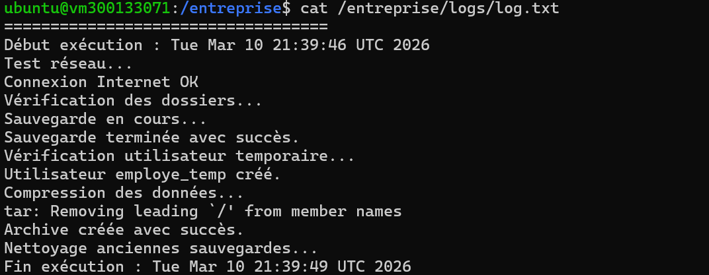

# Rapport – Script Bash d'automatisation sous Linux

## Objectif

L'objectif de ce travail est de créer un script Bash permettant d’automatiser plusieurs tâches d’administration système dans un environnement Linux.  

Le script doit permettre de :

- Sauvegarder des fichiers d’entreprise
- Tester la connectivité réseau
- Créer un utilisateur temporaire
- Générer un fichier journal (log)
- Compresser les sauvegardes
- Planifier l’exécution automatique avec **cron**

---

