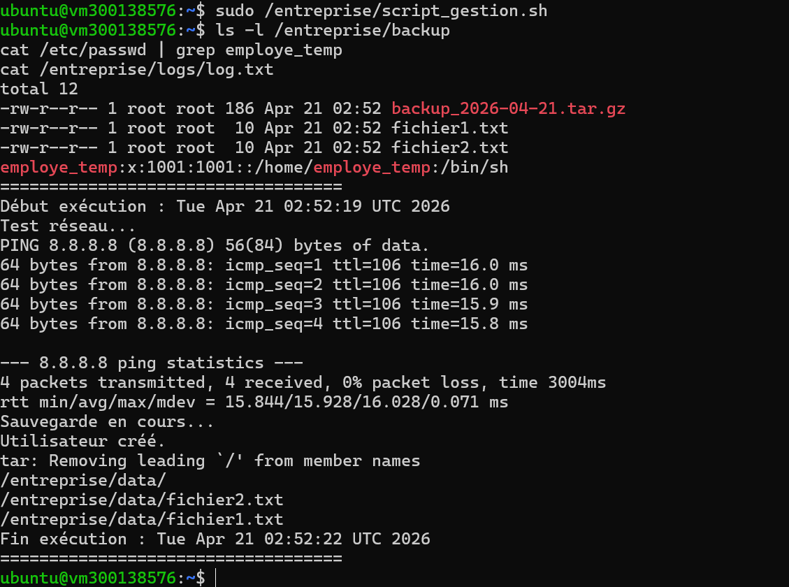

# 🔧 Lab BATCH – Script de gestion d’une entreprise

## 🎯 Objectif

Ce laboratoire consiste à créer un script Bash permettant de :

* Sauvegarder les fichiers d’un dossier
* Tester la connectivité réseau
* Créer un utilisateur temporaire
* Générer un fichier journal (log)
* Automatiser l’exécution avec CRON

---

## 🗂️ Structure du projet

```bash
5.BATCH/
└── 300138576/
    ├── script_gestion.sh
    ├── log.txt
    ├── fichier1.txt
    ├── fichier2.txt
    ├── backup_2026-04-21.tar.gz
    └── images/
        └── 1.png
```

---

## ⚙️ Description du script

### 📌 1. Test de connectivité réseau

```bash
ping -c 4 8.8.8.8
```

Permet de vérifier si la machine a accès à Internet.

---

### 📌 2. Sauvegarde des fichiers

```bash
cp -r /entreprise/data/* /entreprise/backup/
```

Copie les fichiers du dossier `data` vers `backup`.

---

### 📌 3. Création d’un utilisateur temporaire

```bash
useradd employe_temp
```

Crée un utilisateur temporaire s’il n’existe pas déjà.

---

### 📌 4. Compression des données

```bash
tar -czvf backup_YYYY-MM-DD.tar.gz /entreprise/data
```

Crée une archive compressée contenant tous les fichiers.

---

### 📌 5. Journalisation

Toutes les opérations sont enregistrées dans :

```bash
/entreprise/logs/log.txt
```

Exemple :

* Début exécution
* Test réseau
* Sauvegarde
* Création utilisateur
* Fin exécution

---

## 📊 Résultat obtenu

✔ Fichiers copiés dans `/entreprise/backup`
✔ Archive créée (`backup_2026-04-21.tar.gz`)
✔ Utilisateur `employe_temp` créé
✔ Log complet généré avec succès

---

## 🖼️ Preuve d’exécution



---

## ⏰ Planification avec CRON

```bash
0 2 * * * /entreprise/script_gestion.sh
```

➡ Exécution automatique chaque jour à 2h00

---

## 🔎 Vérification

```bash
systemctl status cron
journalctl -u cron
```

---

## ⚠️ Dépannage

| Problème               | Cause                  | Solution               |
| ---------------------- | ---------------------- | ---------------------- |
| Permission denied      | Script non exécutable  | chmod +x               |
| Cron ne fonctionne pas | Mauvais chemin         | Utiliser chemin absolu |
| Archive vide           | Mauvais dossier source | Vérifier chemin        |
| useradd échoue         | Pas de sudo            | Exécuter en root       |

---

## ✅ Conclusion

Ce TP permet de maîtriser :

* L’écriture de scripts Bash
* La gestion des fichiers et utilisateurs
* L’automatisation avec CRON
* L’analyse des logs système

Il représente un cas réel d’administration système.

---
