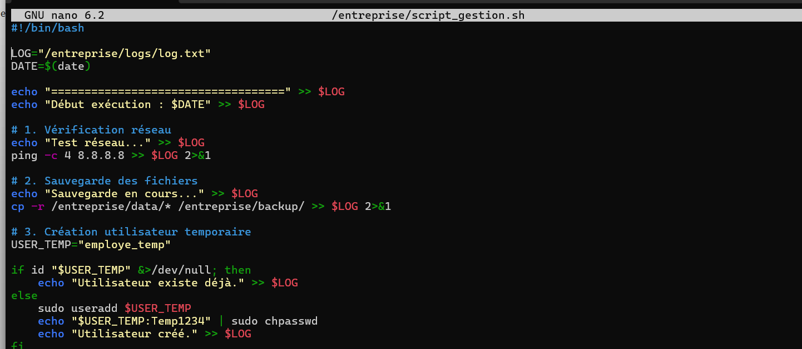

1. Cette partie consiste à créer la structure de dossiers et les fichiers de test nécessaires afin de préparer l’environnement dans lequel le script pourra fonctionner correctement.

```powershell
sudo mkdir -p /entreprise/data
sudo mkdir -p /entreprise/backup
sudo mkdir -p /entreprise/logs
```


```powershell
echo "Fichier 1" | sudo tee /entreprise/data/fichier1.txt
echo "Fichier 2" | sudo tee /entreprise/data/fichier2.txt
```


2. Cette partie consiste à créer et écrire le script Batch script_gestion.sh, qui automatise la sauvegarde des fichiers, le test réseau, la création d’un utilisateur temporaire, la compression des données et la génération d’un fichier log.
   ```powershell
   sudo nano /entreprise/script_gestion.sh
   ```
   
