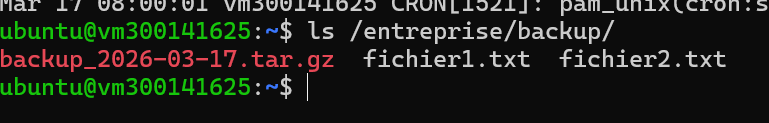
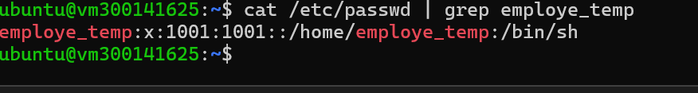
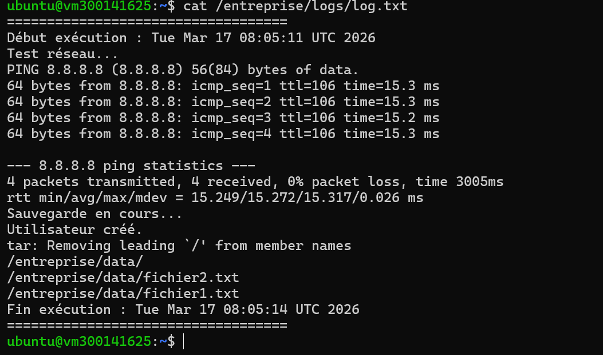
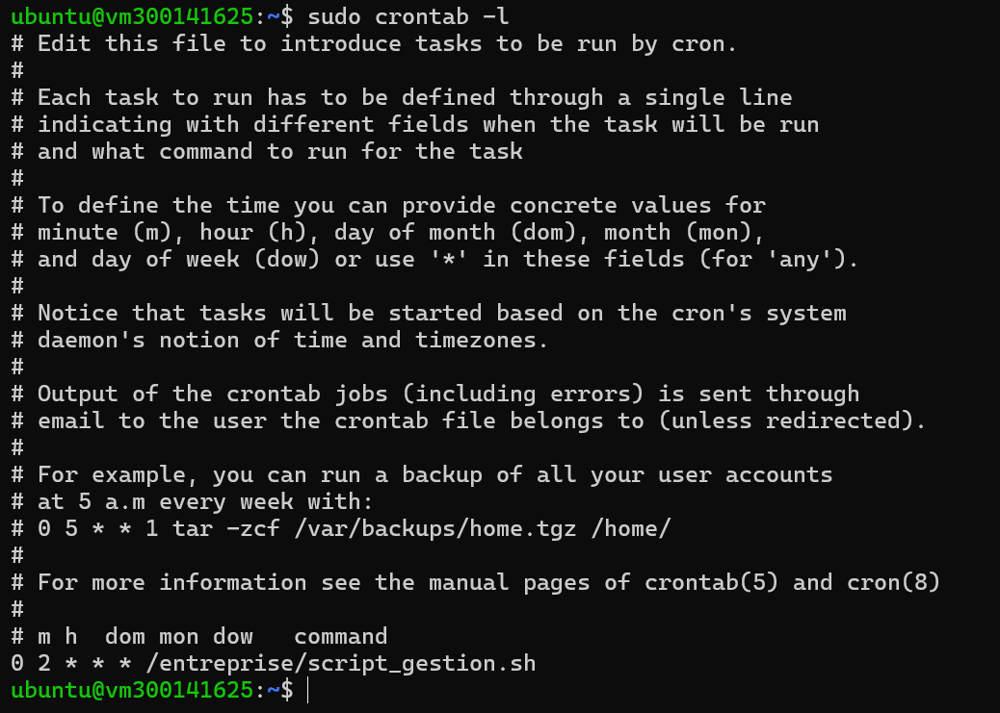
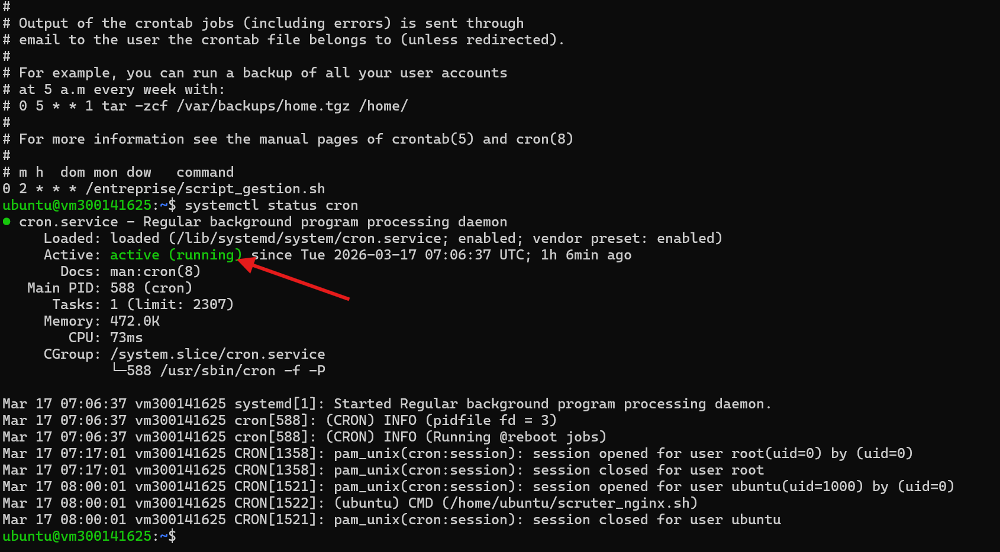

# Rapport – Script Bash d'automatisation sous Linux

## 🎯 Objectif
Automatiser la sauvegarde, la création d'utilisateur temporaire, 
la vérification réseau et la planification avec cron.

## 1️⃣ Sauvegarde des fichiers
Vérification des fichiers copiés dans `/entreprise/backup/`

## 2️⃣ Utilisateur temporaire créé
Vérification de l'utilisateur `employe_temp`

## 3️⃣ Fichier log
Contenu du journal d'exécution

## 4️⃣ Crontab configuré
Exécution automatique tous les jours à 2h00

## 5️⃣ Cron actif
Vérification que le service cron est en cours d'exécution

