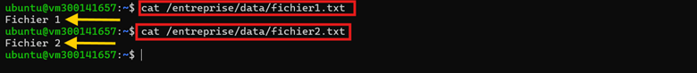
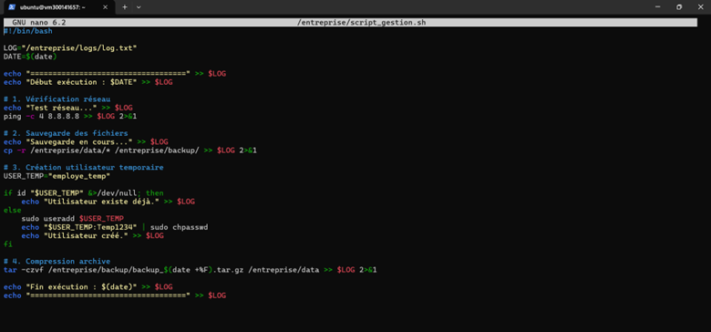
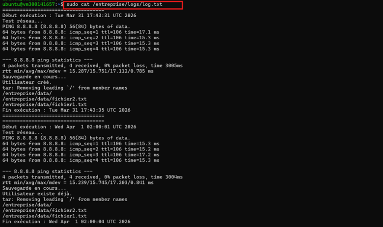
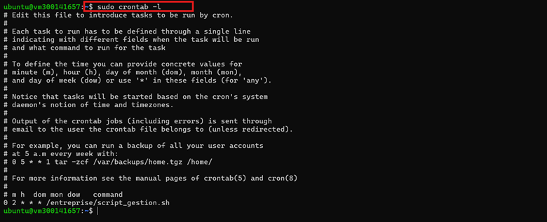
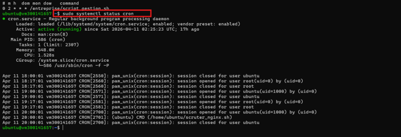
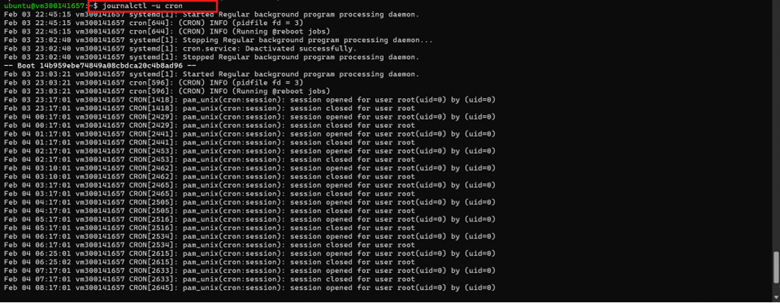
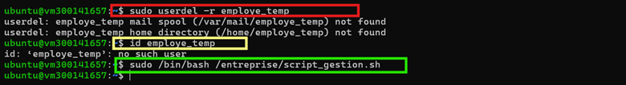

🔹 PARTIE 1 – Préparation de l’environnement

La première étape consiste à créer l’arborescence du projet ainsi que les fichiers de test nécessaires au bon fonctionnement du script.

Commandes utilisées
sudo mkdir -p /entreprise/data
sudo mkdir -p /entreprise/backup
sudo mkdir -p /entreprise/logs

echo "Fichier 1" | sudo tee /entreprise/data/fichier1.txt
echo "Fichier 2" | sudo tee /entreprise/data/fichier2.txt
Vérification du contenu des fichiers
cat /entreprise/data/fichier1.txt
cat /entreprise/data/fichier2.txt
Explication

Cette étape permet de préparer le répertoire de travail et d’ajouter deux fichiers simples dans le dossier data. Ces fichiers serviront ensuite à tester la copie et l’archivage.

Capture

  

🔹 PARTIE 2 – Création du script Batch

Le script principal est ensuite créé dans le fichier /entreprise/script_gestion.sh.

Commande utilisée
sudo nano /entreprise/script_gestion.sh
Capture de la création du script

  

Code complet intégré
#!/bin/bash

LOG="/entreprise/logs/log.txt"
DATE=$(date)

echo "===================================" >> $LOG
echo "Début exécution : $DATE" >> $LOG

# 1. Vérification réseau
echo "Test réseau..." >> $LOG
ping -c 4 8.8.8.8 >> $LOG 2>&1

# 2. Sauvegarde des fichiers
echo "Sauvegarde en cours..." >> $LOG
cp -r /entreprise/data/* /entreprise/backup/ >> $LOG 2>&1

# 3. Création utilisateur temporaire
USER_TEMP="employe_temp"

if id "$USER_TEMP" &>/dev/null; then
    echo "Utilisateur existe déjà." >> $LOG
else
    sudo useradd $USER_TEMP
    echo "$USER_TEMP:Temp1234" | sudo chpasswd
    echo "Utilisateur créé." >> $LOG
fi

# 4. Compression archive
tar -czvf /entreprise/backup/backup_$(date +%F).tar.gz /entreprise/data >> $LOG 2>&1

echo "Fin exécution : $(date)" >> $LOG
echo "===================================" >> $LOG
Explication

Ce script automatise quatre actions principales :

il teste la connectivité réseau avec ping
il copie les fichiers du dossier data vers backup
il crée un utilisateur temporaire nommé employe_temp
il génère une archive compressée datée du dossier data

Toutes les opérations sont enregistrées dans le fichier log.txt.

Capture du script

  

🔹 PARTIE 3 – Rendre le script exécutable

Une fois le script créé, il faut lui attribuer les permissions d’exécution.

Commande utilisée
sudo chmod +x /entreprise/script_gestion.sh
Rôle

Cette commande permet au système de reconnaître le script comme un fichier exécutable.

🔹 PARTIE 4 – Test manuel du script

Avant de planifier l’exécution automatique, le script doit être testé manuellement.

Commande utilisée
sudo /entreprise/script_gestion.sh
Vérifications possibles
ls -lh /entreprise/backup
cat /entreprise/logs/log.txt
cat /etc/passwd | grep employe_temp
Explication

Le test manuel permet de vérifier immédiatement que :

la connexion réseau est testée
les fichiers sont bien copiés dans backup
l’utilisateur temporaire est créé
une archive .tar.gz est produite
le fichier log contient bien toutes les étapes de l’exécution
Capture du fichier journal

  

🔹 PARTIE 5 – Planification avec Cron

Afin d’automatiser l’exécution du script, une tâche cron est ajoutée pour lancer le script tous les jours à 02h00.

Commandes utilisées
sudo crontab -e
sudo crontab -l
Ligne ajoutée dans la crontab
0 2 * * * /entreprise/script_gestion.sh
Explication

Cette ligne signifie que le script sera exécuté automatiquement chaque jour à 2 heures du matin.

Capture de la crontab

  

🔹 PARTIE 6 – Vérification de l’exécution automatique

Après avoir configuré la planification, il faut vérifier que le service cron fonctionne correctement.

Commandes utilisées
sudo systemctl status cron
journalctl -u cron
Vérification du service cron

La sortie de systemctl status cron confirme que le service est bien actif et en fonctionnement.

Capture de l’état du service

  

Vérification des journaux cron

La commande journalctl -u cron permet de consulter l’historique du service et d’observer les exécutions ainsi que les événements liés à cron.

Capture des journaux cron

  

🔹 PARTIE 7 – Dépannage et amélioration

Pour tester la robustesse du script, l’utilisateur temporaire a été supprimé manuellement, puis le script a été relancé.

Commandes utilisées
sudo userdel -r employe_temp
id employe_temp
sudo /bin/bash /entreprise/script_gestion.sh
Explication

Cette étape permet de vérifier que :

l’utilisateur employe_temp peut être supprimé
la commande id employe_temp confirme ensuite qu’il n’existe plus
une nouvelle exécution du script permet de le recréer automatiquement

Cela montre que le script reste fonctionnel même après suppression de l’utilisateur temporaire.

Capture du dépannage

  

🔹 PARTIE 8 – Résultat attendu

À la fin de ce TP, l’étudiant est capable de :

✔ écrire un script Batch structuré
✔ automatiser une tâche système
✔ planifier son exécution
✔ lire les logs système
✔ diagnostiquer et corriger un problème
📊 Diagramme avant et après exécution
Avant exécution
/entreprise/
│
├── data/
│   ├── fichier1.txt
│   └── fichier2.txt
│
├── backup/
│   └── (vide ou ancien contenu)
│
└── logs/
    └── log.txt
Après exécution
/entreprise/
│
├── data/
│   ├── fichier1.txt
│   └── fichier2.txt
│
├── backup/
│   ├── fichier1.txt
│   ├── fichier2.txt
│   └── backup_YYYY-MM-DD.tar.gz
│
└── logs/
    └── log.txt
        ├── Début exécution
        ├── Test réseau
        ├── Sauvegarde en cours
        ├── Création utilisateur
        ├── Compression archive
        └── Fin exécution
Flux de données
data/  ─────copie─────▶  backup/
data/  ─────archive───▶  backup/backup_YYYY-MM-DD.tar.gz
script ───────────────▶  logs/log.txt
✅ Conclusion

Ce TP m’a permis de mettre en pratique l’automatisation de tâches d’administration système sous Linux à l’aide d’un script Batch.

J’ai pu préparer l’environnement, créer un script complet, tester son exécution manuellement, automatiser son lancement avec cron, consulter les journaux système et valider son bon fonctionnement à travers les différentes captures d’écran.

Les résultats obtenus montrent que la sauvegarde, la création de l’utilisateur temporaire, l’archivage et la journalisation fonctionnent correctement. Ce travail démontre donc une automatisation simple, efficace et vérifiable dans un environnement Linux.
