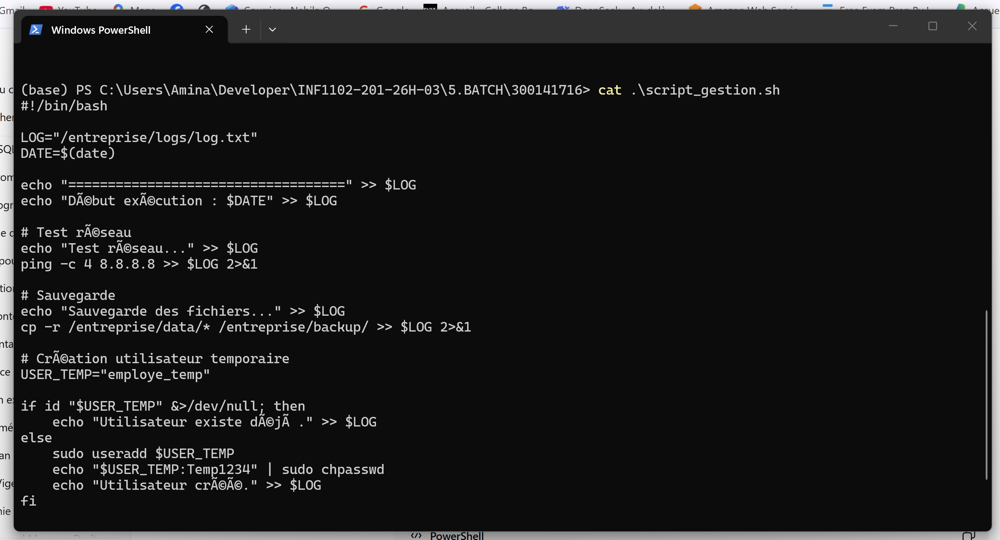
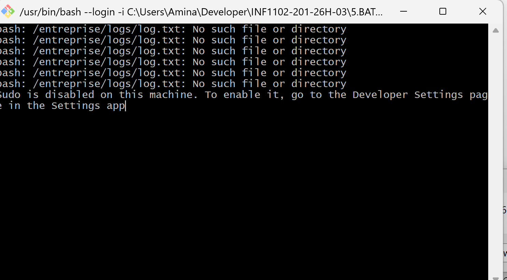
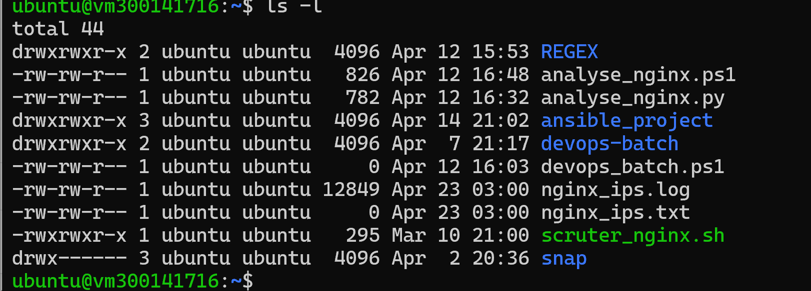

# TP – Script Batch Linux (Bash)

## 👩‍🎓 Étudiante
Nom : Nabila Oulad-Bouih  
ID Boréal : 300141716  
Cours : Programmation système / DevOps  

---

## 🎯 Objectif

Le but de ce TP est de créer un script Bash permettant d’automatiser plusieurs tâches administratives :

- Sauvegarder un dossier (backup)
- Tester la connectivité réseau
- Créer un utilisateur temporaire
- Générer un fichier journal (log)
- Automatiser l’exécution avec une tâche cron

---

## ⚙️ Script utilisé

Nom du fichier : `script_gestion.sh`

Ce script regroupe toutes les commandes nécessaires pour automatiser les tâches demandées.

---

## 🧪 Étapes de vérification

### 1️⃣ Contenu du script
Capture montrant le code complet du script Bash.

---

### 2️⃣ Exécution du script
Capture de l’exécution dans le terminal avec les messages affichés.

---

### 3️⃣ Sauvegarde (Backup)
Capture du dossier de sauvegarde créé après exécution.

---

### 4️⃣ Fichier journal (Log)
Capture du fichier `.log` généré avec les actions enregistrées.

---

### 5️⃣ Tâche planifiée (Cron)
Capture de la configuration de la tâche cron.

---

## ✅ Résultat

Le script fonctionne correctement et permet :

- d’automatiser les tâches système
- de garantir une sauvegarde régulière des données
- de surveiller la connectivité réseau
- de tracer les actions via un fichier journal
- d’exécuter automatiquement les tâches avec cron

Ce TP démontre l’importance de l’automatisation dans un environnement DevOps.
