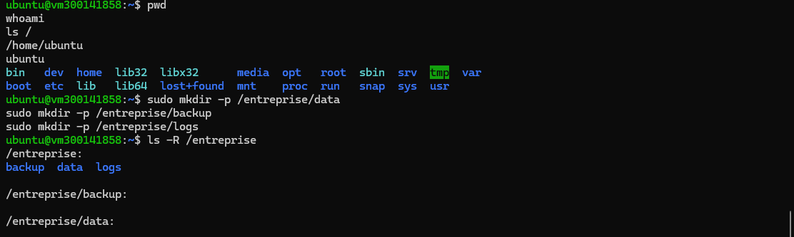
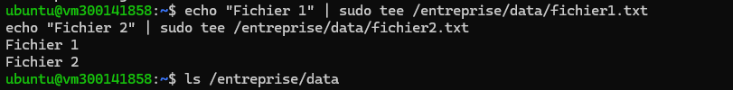
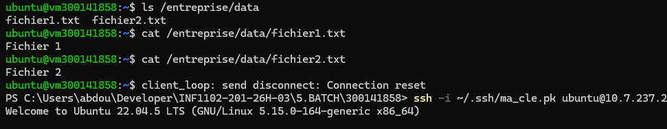
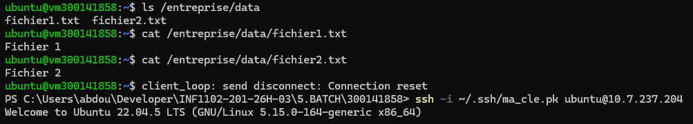
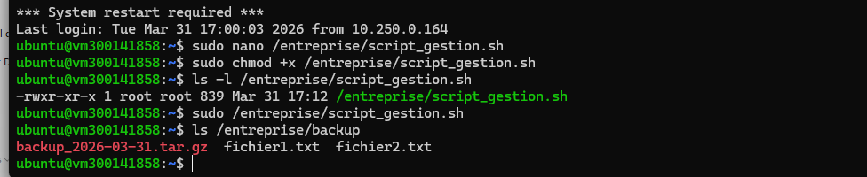
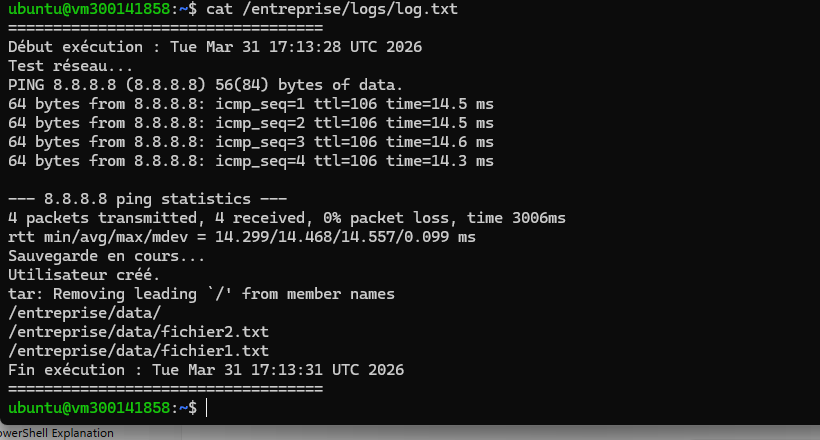
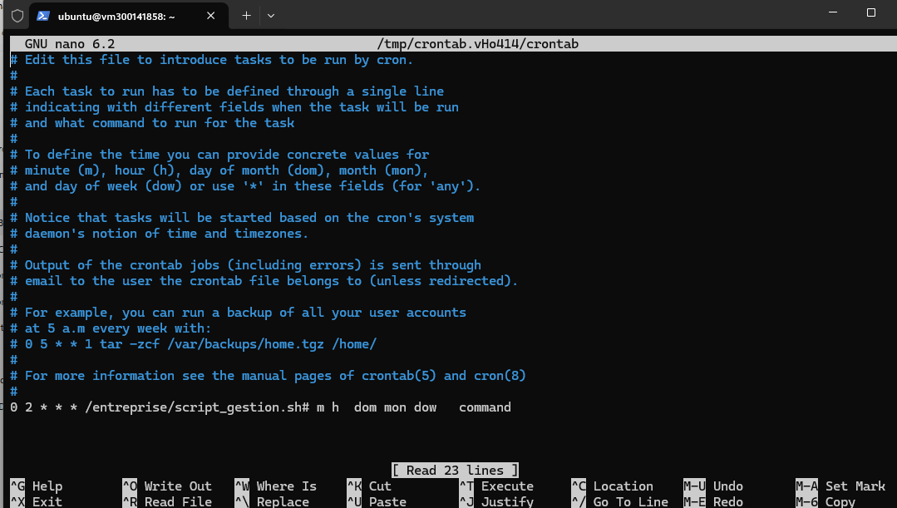

# 🧪 TP – Automatisation d’administration avec script Batch (Linux)

## 👤 Étudiant
**Nom : Abdou Karim NIANG**  
**ID : 300141858**

---

## 🎯 Objectif

L’objectif de ce TP est de mettre en pratique l’automatisation des tâches système sous Linux à l’aide d’un script Bash.

Le script permet de :

- sauvegarder un dossier d’entreprise
- créer un utilisateur temporaire
- tester la connectivité réseau
- générer un fichier journal (log)
- compresser les données
- automatiser l’exécution avec `cron`
- vérifier et diagnostiquer les erreurs

---

## 🏗️ Structure du projet

```bash
/entreprise/
├── data/       # fichiers sources
├── backup/     # sauvegardes et archives
└── logs/       # journaux d’exécution

📂 Création de l’environnement
sudo mkdir -p /entreprise/data
sudo mkdir -p /entreprise/backup
sudo mkdir -p /entreprise/logs
📁 Création des fichiers de test
echo "Fichier 1" | sudo tee /entreprise/data/fichier1.txt
echo "Fichier 2" | sudo tee /entreprise/data/fichier2.txt
📜 Script Bash utilisé
🔹 script_gestion.sh
#!/bin/bash

LOG="/entreprise/logs/log.txt"
DATE=$(date)

echo "===================================" >> $LOG
echo "Début exécution : $DATE" >> $LOG

# Test réseau
echo "Test réseau..." >> $LOG
ping -c 4 8.8.8.8 >> $LOG 2>&1

# Sauvegarde
echo "Sauvegarde en cours..." >> $LOG
cp -r /entreprise/data/* /entreprise/backup/ >> $LOG 2>&1

# Création utilisateur
USER_TEMP="employe_temp"

if id "$USER_TEMP" &>/dev/null; then
    echo "Utilisateur existe déjà." >> $LOG
else
    sudo useradd $USER_TEMP
    echo "$USER_TEMP:Temp1234" | sudo chpasswd
    echo "Utilisateur créé." >> $LOG
fi

# Compression
tar -czvf /entreprise/backup/backup_$(date +%F).tar.gz /entreprise/data >> $LOG 2>&1

echo "Fin exécution : $(date)" >> $LOG
echo "===================================" >> $LOG
⚙️ Fonctionnalités du script
✔ Test de connectivité réseau (ping)
✔ Sauvegarde des fichiers (cp)
✔ Création d’un utilisateur (useradd)
✔ Compression des données (tar)
✔ Journalisation complète (log.txt)
▶️ Exécution du script
sudo /entreprise/script_gestion.sh
💾 Résultat obtenu

Après exécution :

les fichiers sont copiés dans /entreprise/backup
une archive .tar.gz est créée
un utilisateur employe_temp est ajouté
un fichier log est généré dans /entreprise/logs
⏰ Automatisation avec cron
sudo crontab -e

Ajouter :

0 2 * * * /entreprise/script_gestion.sh

➡ Exécution automatique tous les jours à 2h00

🔍 Vérification
ls /entreprise/backup
cat /etc/passwd | grep employe_temp
cat /entreprise/logs/log.txt
sudo crontab -l
systemctl status cron

## 📸 Preuves

### 📌 Structure créée
[](images/1_structure.png)

### 📌 Fichiers data
[](images/2_data.png)

### 📌 Script Bash
[](images/3_script.png)

### 📌 Exécution du script
[](images/4_execution.png)

### 📌 Backup et archive
[](images/5_backup.png)

### 📌 Utilisateur créé
[](images/6_user.png)

### 📌 Fichier log
[](images/7_log.png)

### 📌 Cron configuré
[](images/8_cron.png)