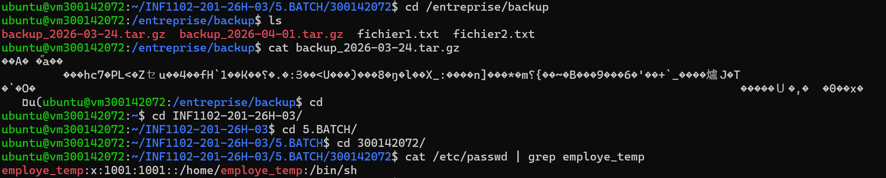
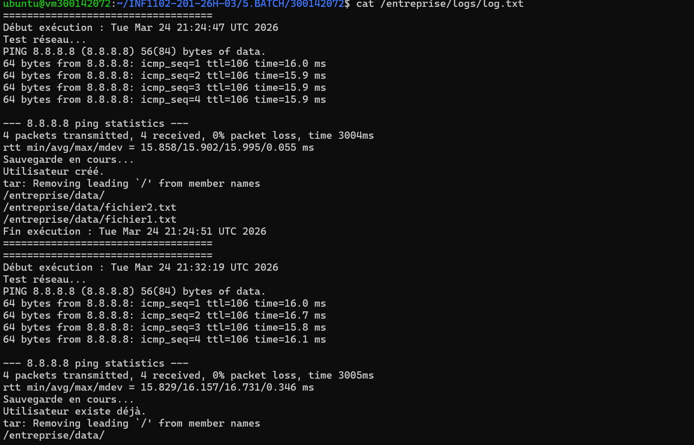
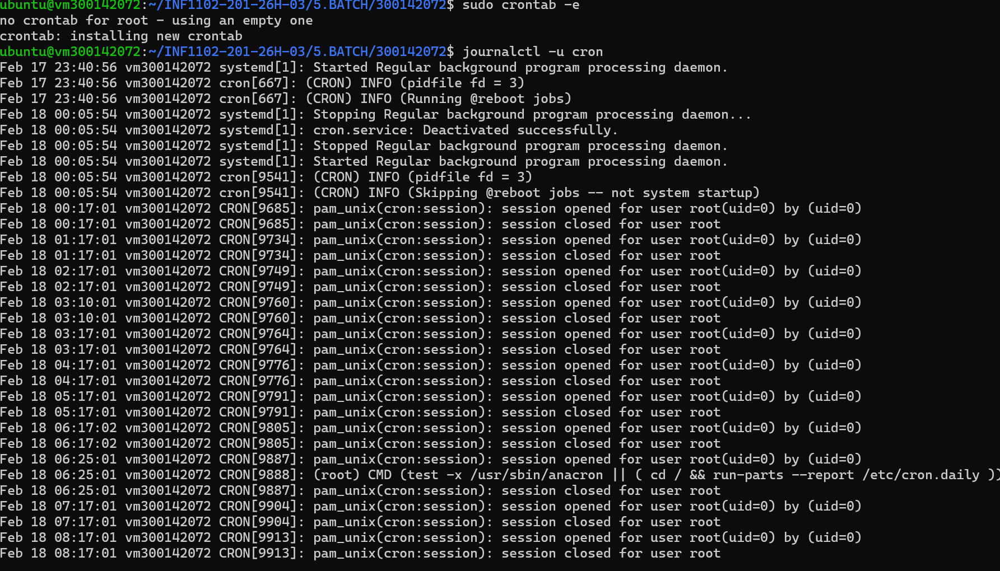
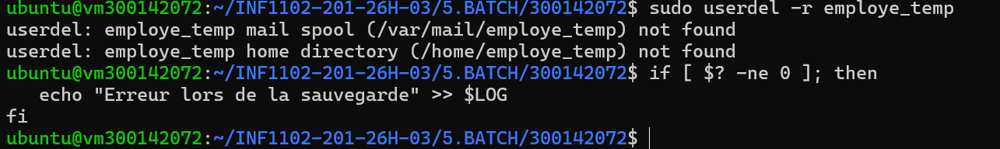

🧑 RAPPORT DU TRAVAIL SUR LE BATCH

⭐ Création du sritpt batch

- création du fichier nano avec ```sudo nano /entreprise/script_gestion.sh```
  
  
⭐ Tests manuels


Vérfier :

-Les fichiers copiés dans /entreprise/backup

-L’archive .tar.gz

-L’utilisateur créé :




-Verification du fichier log




⭐Plannification avec Cron et Vérification de l'éxécution




⭐ Gestion des erreurs





