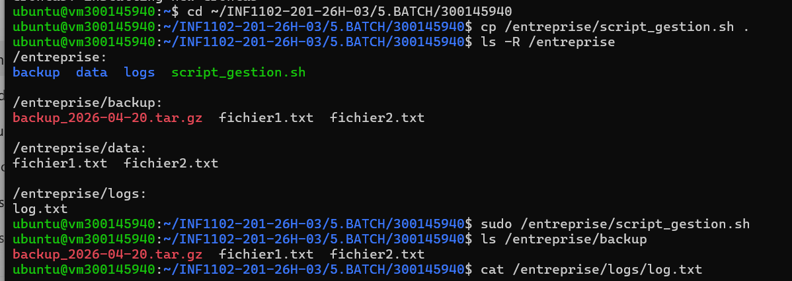
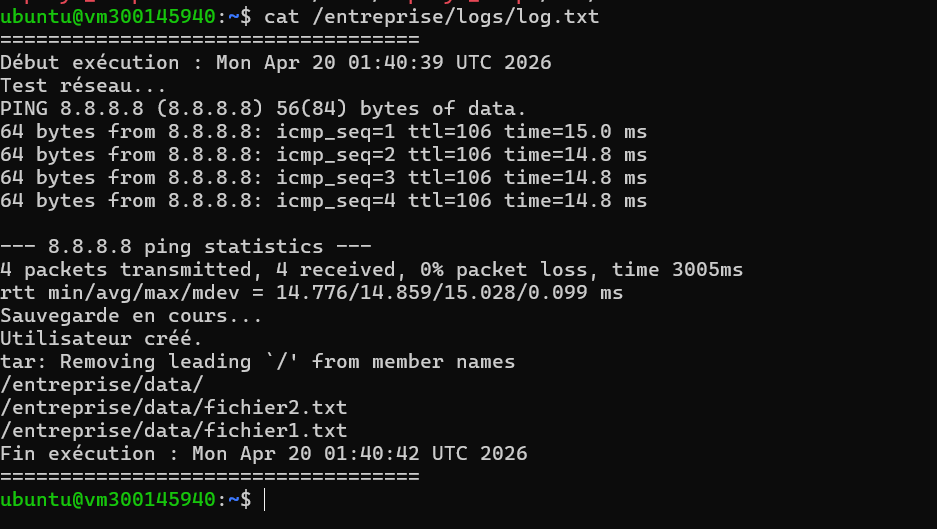

# TP 5 – Automatisation d’administration avec script Batch (Linux)

## 🎯 Objectif

L’objectif de ce TP est d’automatiser des tâches d’administration système sous Linux à l’aide d’un script Bash. Le script permet de sauvegarder des fichiers, tester la connectivité réseau, créer un utilisateur temporaire et générer un fichier log.

---

## 🖥 Environnement

* Système : Ubuntu Server
* Accès : sudo
* Outils : Terminal Linux, Bash

---

## ⚙️ Étapes réalisées

### 1. Préparation de l’environnement

Création des dossiers :

* `/entreprise/data`
* `/entreprise/backup`
* `/entreprise/logs`

Ajout de fichiers de test.

---

### 2. Création du script

Création du fichier **script_gestion.sh** permettant :

* Test réseau
* Sauvegarde des fichiers
* Création d’un utilisateur temporaire
* Génération d’une archive
* Création d’un log

---

### 3. Exécution

Le script a été exécuté avec succès et toutes les opérations ont fonctionné correctement.

---

## 📸 Preuves d’exécution

### 🔹 Structure des dossiers

### 🔹 Résultat du script (logs et exécution)

---

## ✅ Résultats obtenus

* ✔ Fichiers sauvegardés dans `/backup`
* ✔ Archive `.tar.gz` créée
* ✔ Utilisateur **employe_temp** créé
* ✔ Logs générés correctement
* ✔ Test réseau réussi

---

## 🔎 Vérifications

* Vérification des fichiers copiés
* Vérification utilisateur (`/etc/passwd`)
* Vérification du fichier log

---

## 🧠 Conclusion

Ce TP permet de comprendre l’automatisation avec Bash et l’importance de la gestion des tâches système sous Linux.

---

## 🚀 Améliorations possibles

* Suppression automatique de l’utilisateur
* Ajout de gestion d’erreurs
* Planification avec cron

---
