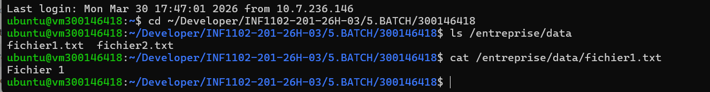
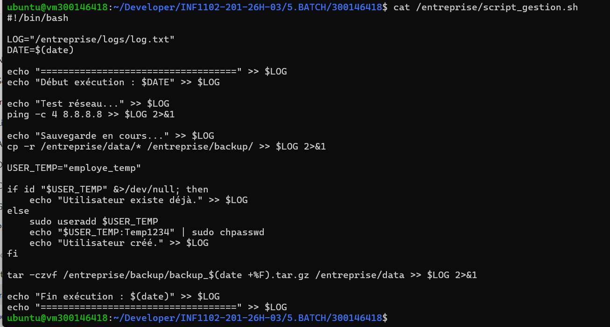
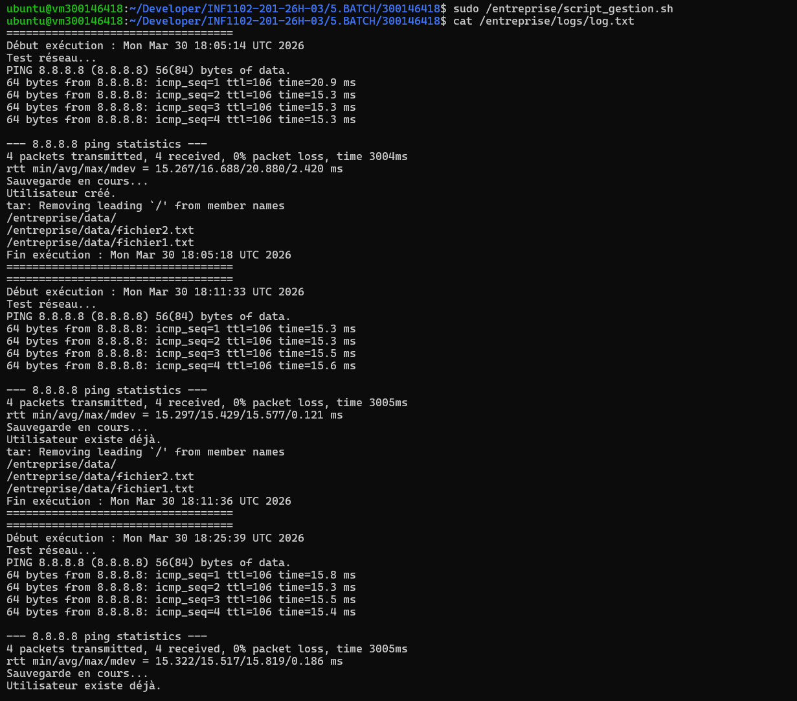
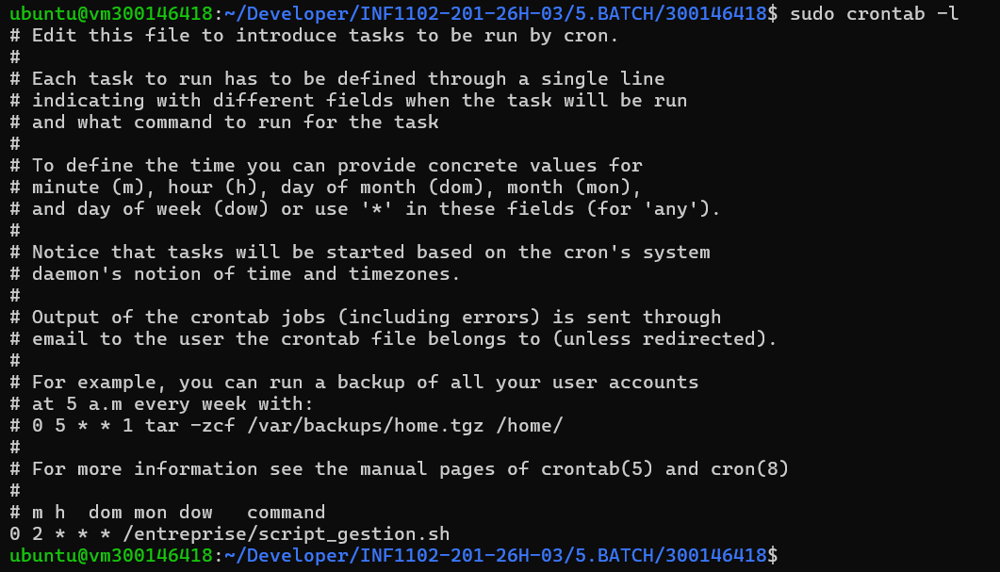

# 🧪 TP – Automatisation d’administration avec script Bash

**Nom :** Ikram Sidhoum
**ID :** 300146418

---

## 🎯 Objectif

Ce TP consiste à créer un script Bash sous Linux permettant d’automatiser plusieurs tâches d’administration système :

* Sauvegarde des fichiers
* Test de connectivité réseau
* Création d’un utilisateur temporaire
* Génération de logs
* Compression des données
* Planification avec cron

---

## 🏗️ Structure du projet

```
300146418/
├── script_gestion.sh
├── README.md
└── images/
```

---

## ⚙️ Étapes réalisées

### 1️⃣ Préparation de l’environnement

Création des dossiers :

```bash
sudo mkdir -p /entreprise/data
sudo mkdir -p /entreprise/backup
sudo mkdir -p /entreprise/logs
```

Création des fichiers :

```bash
echo "Fichier 1" | sudo tee /entreprise/data/fichier1.txt
echo "Fichier 2" | sudo tee /entreprise/data/fichier2.txt
```

---

### 2️⃣ Script Bash

Le script permet :

* Tester la connexion réseau (`ping`)
* Copier les fichiers
* Créer un utilisateur temporaire
* Générer un log
* Créer une archive `.tar.gz`

Exécution :

```bash
sudo /entreprise/script_gestion.sh
```

---

### 3️⃣ Planification avec cron

```bash
sudo crontab -e
```

Ajout :

```bash
0 2 * * * /entreprise/script_gestion.sh
```

---

## 📜 Commandes utilisées (Résumé)

| Commande     | Description                      |
| ------------ | -------------------------------- |
| `mkdir -p`   | Créer des dossiers               |
| `tee`        | Écrire dans un fichier avec sudo |
| `cp -r`      | Copier des fichiers              |
| `ping`       | Tester le réseau                 |
| `useradd`    | Créer utilisateur                |
| `chpasswd`   | Définir mot de passe             |
| `tar -czvf`  | Créer archive                    |
| `chmod +x`   | Rendre script exécutable         |
| `crontab -e` | Planifier tâches                 |
| `cat`        | Lire fichier                     |
| `grep`       | Rechercher texte                 |

---

## 📸 Captures d’écran

### 🔹 Création des fichiers



### 🔹 Script Bash


### 🔹 Exécution + logs



### 🔹 Cron


### 🔹 Résultat backup


---

## ✅ Résultat final

Après exécution :

✔ Les fichiers sont copiés dans `/entreprise/backup`
✔ Une archive `.tar.gz` est créée
✔ Un utilisateur temporaire est créé
✔ Un fichier log est généré
✔ Le script est automatisé avec cron

---

## 🧠 Conclusion

Ce TP m’a permis de :

* Comprendre l’automatisation avec Bash
* Manipuler les utilisateurs Linux
* Utiliser cron pour planifier des tâches
* Gérer et analyser des logs
* Diagnostiquer des erreurs système
