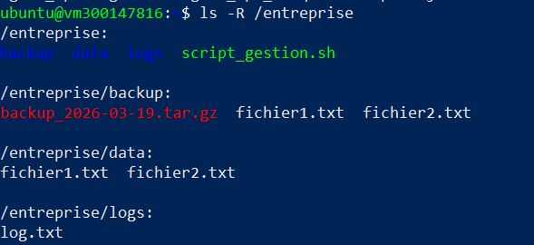
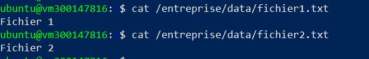
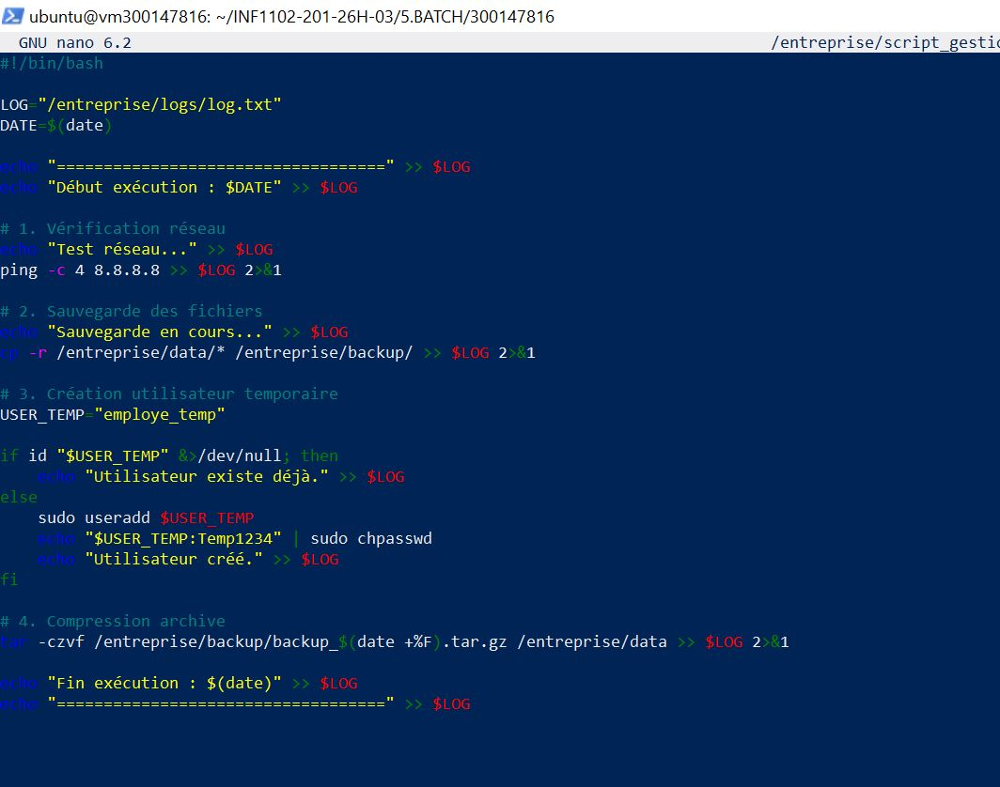
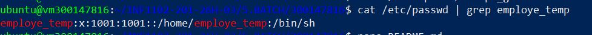
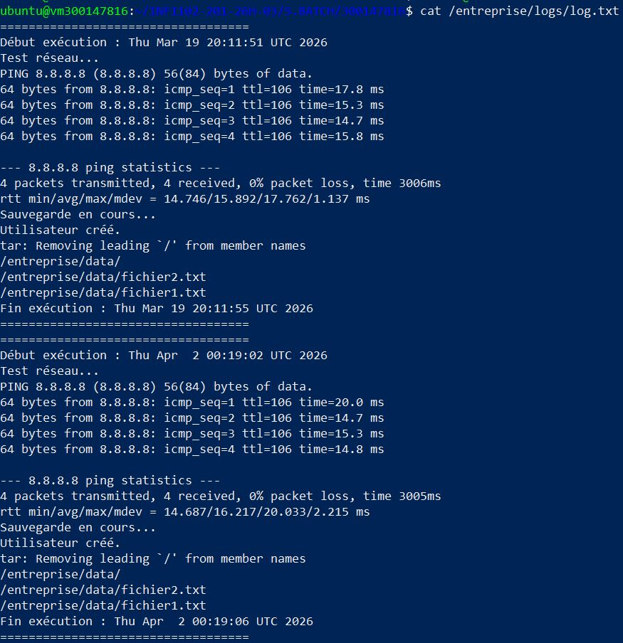
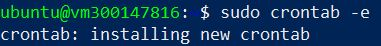
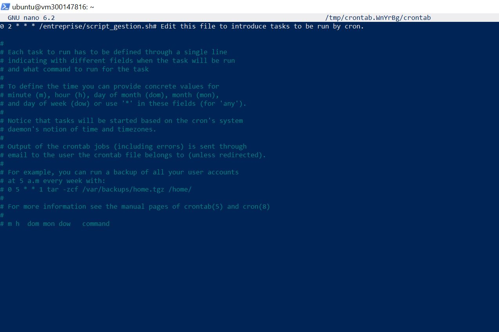
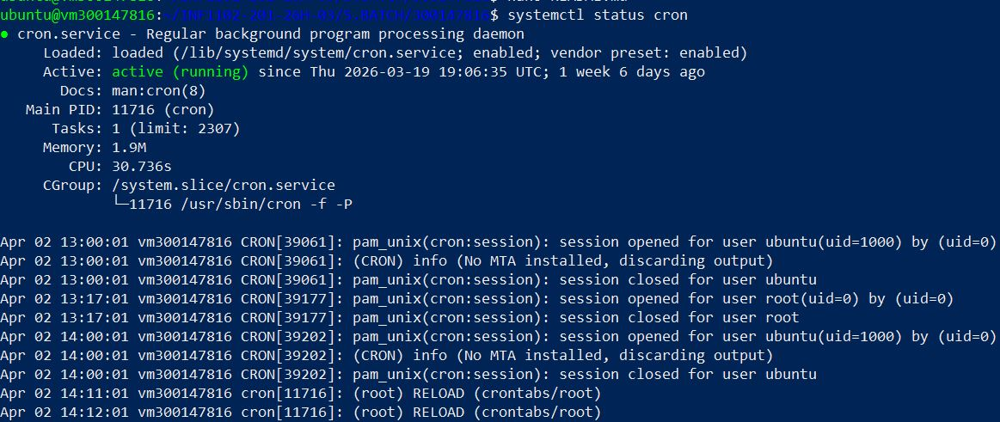
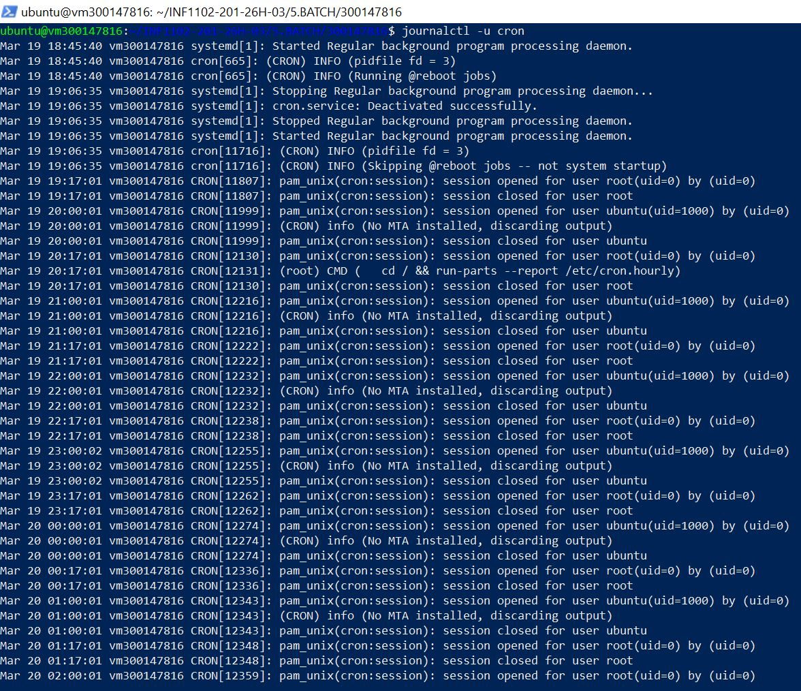
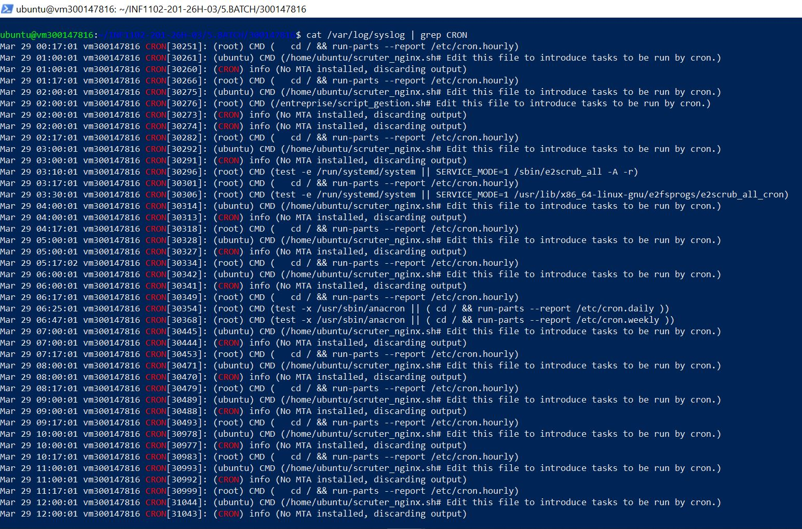

**🚀 Rapport : Automatisation d'administration avec Script Shell (Linux)**

**👤 Étudiant :** 300147816

**📅 Date :** Mars 2026

**🎯 Objectif :** 

- Développer un script de gestion industrielle pour automatiser la sauvegarde, la gestion des utilisateurs et le diagnostic réseau.

- Planifier l’exécution automatique avec cron

- Vérifier l’exécution et diagnostiquer les erreurs

- Générer un fichier journal (log)

## 🖥 Environnement requis

- Distribution Linux (ex : Ubuntu Server)

- Accès sudo

- Terminal

- Service cron actif

## 📁 Structure du projet

**1- Création des dossiers nécessaires :**

```bash
sudo mkdir -p /entreprise/data
sudo mkdir -p /entreprise/backup
sudo mkdir -p /entreprise/logs
```


**2- Création des fichiers test :**

```bash
echo "Fichier 1" | sudo tee /entreprise/data/fichier1.txt
echo "Fichier 2" | sudo tee /entreprise/data/fichier2.txt
```


La photo montre la liste des deux fichiers et le fait qu'ils appartiennent à l'utilisateur root.

**🔹 PARTIE 2 – Création du script Batch**

## ⚙️ Création du fichier script

J'ai rédigé le script script_gestion.sh dans /entreprise/. Ce script est le cœur de l'automatisation.


Ce script a le contenu suivant:


**Points clés du code**:

- **Test réseau :** Vérifie la connexion avec un ping vers Google.

- **Sauvegarde :** Copie les données vers le dossier backup.

- **Gestion utilisateur :** Crée un compte employe_temp s'il n'existe pas.

- **Archivage :** Compresse les données en .tar.gz avec la date du jour.

Le script utilise des chemins absolus pour garantir son exécution par Cron.

**Permissions :** J'ai activé les droits d'exécution avec sudo chmod +x /entreprise/script_gestion.sh.

**🔹 PARTIE 4 – Test manuel**

Avant d'automatiser, j'ai lancé le script manuellement pour vérifier chaque étape, donc,j'exécute le script :

```bash
sudo /entreprise/script_gestion.sh
```


## Vérification de l'utilisateur :



La photo confirme que l'utilisateur a bien été injecté dans le système

## Vérification du Log :



Le fichier /entreprise/logs/log.txt montre le succès de toutes les opérations.

**⏰ 4. Planification avec Cron**

Pour que la sauvegarde soit totalement autonome, j'ai configuré la crontab de l'utilisateur root.

Éditons la crontab :



Ajouter :

```
0 2 * * * /entreprise/script_gestion.sh
```


➡ Exécution tous les jours à 2h00

- J'ai également validé que le service Cron est actif sur la machine :



- Consulter les journaux :



 ou:



**📊 Résultat attendu**

Après exécution automatique :

✔ Sauvegarde des fichiers effectuée

✔ Archive compressée générée

✔ Utilisateur temporaire créé

✔ Logs détaillés disponibles

✔ Exécution automatique quotidienne fonctionnelle

**🧨. Conclusion**

Ce TP m'a permis de maîtriser les piliers de l'administration Linux :

- **Industrialisation :** Passer de commandes manuelles à un script reproductible.

- **Sécurité :** Automatiser les sauvegardes critiques et la gestion des accès.

- **Surveillance :** Utiliser les fichiers logs pour diagnostiquer l'état du système en différé.

## ✍️ Auteur
**HANANE ZERROUKI** 🆔 Étudiante : 300147816

📅 Mars 2026 — Laboratoire BATCH


