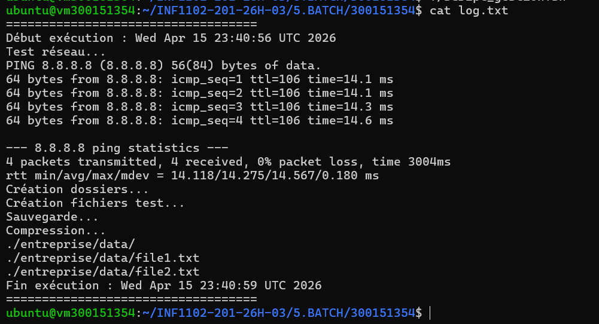
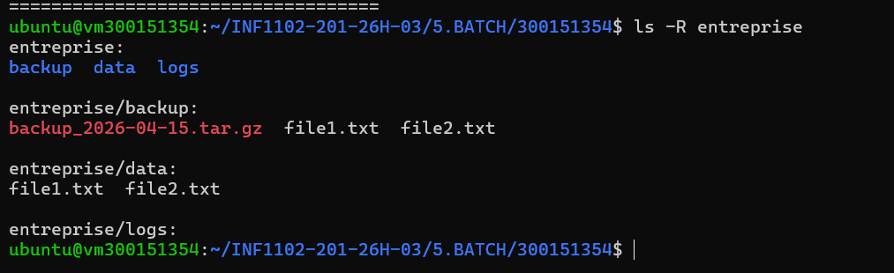
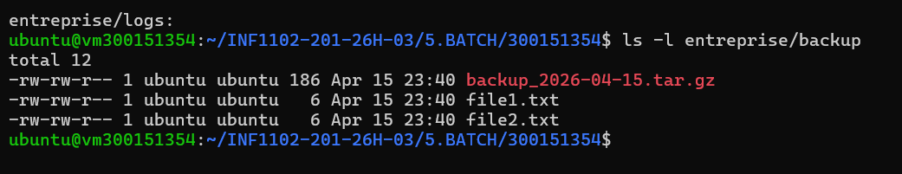
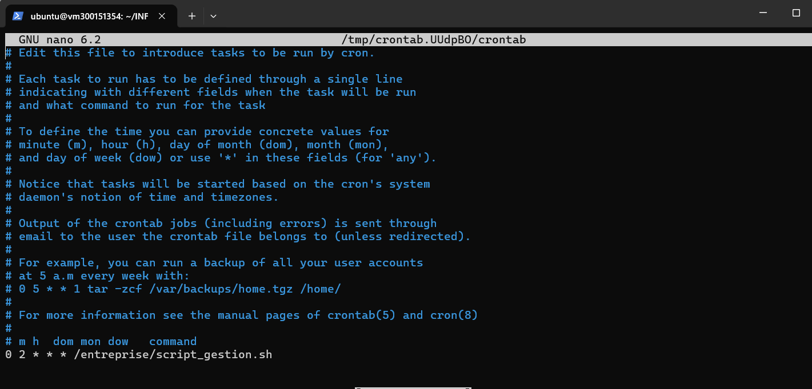

# 📁 Script de Gestion d'Entreprise — INF1102
 
Script Bash automatisé pour la gestion de fichiers d'entreprise : création de structure de dossiers, sauvegarde compressée, test réseau et journalisation, avec exécution planifiée via `cron`.
 
---
 
## 📋 Description
 
Ce script (`script_gestion.sh`) effectue automatiquement les tâches suivantes à chaque exécution :
 
1. **Test réseau** — Vérifie la connectivité Internet via `ping` vers `8.8.8.8`
2. **Création de la structure de dossiers** — Initialise les répertoires `entreprise/data`, `entreprise/backup` et `entreprise/logs`
3. **Création de fichiers test** — Génère `file1.txt` et `file2.txt` dans `entreprise/data/`
4. **Sauvegarde compressée** — Archive le contenu du dossier `data/` dans `entreprise/backup/` au format `.tar.gz` avec la date du jour
5. **Journalisation** — Enregistre toutes les étapes avec horodatage dans un fichier `log.txt`
---
 
## 🗂️ Structure des fichiers
 
```
entreprise/
├── backup/
│   ├── backup_2026-04-15.tar.gz
│   ├── file1.txt
│   └── file2.txt
├── data/
│   ├── file1.txt
│   └── file2.txt
└── logs/
```
 
---
 
## ▶️ Exemple d'exécution
 
```
====================================
Début exécution : Wed Apr 15 23:40:56 UTC 2026
Test réseau...
PING 8.8.8.8 (8.8.8.8) 56(84) bytes of data.
64 bytes from 8.8.8.8: icmp_seq=1 ttl=106 time=14.1 ms
...
4 packets transmitted, 4 received, 0% packet loss, time 3004ms
Création dossiers...
Création fichiers test...
Sauvegarde...
Compression...
./entreprise/data/
./entreprise/data/file1.txt
./entreprise/data/file2.txt
Fin exécution : Wed Apr 15 23:40:59 UTC 2026
====================================
```
 
---
 
## 🖼️ Captures d'écran
 
### Fichier log.txt

 
### Structure des dossiers (`ls -R entreprise`)

 
### Contenu du dossier backup (`ls -l entreprise/backup`)

 
### Configuration crontab

 
---
 
## ⏰ Planification avec Cron
 
Le script est configuré pour s'exécuter automatiquement **tous les jours à 2h00** grâce à `cron` :
 
```
0 2 * * * /entreprise/script_gestion.sh
```
 
Pour modifier la planification :
```bash
crontab -e
```
 
---
 
## ⚙️ Utilisation
 
### Exécution manuelle
 
```bash
chmod +x script_gestion.sh
./script_gestion.sh
```
 
### Consulter les logs
 
```bash
cat log.txt
```
 
### Vérifier la sauvegarde
 
```bash
ls -l entreprise/backup
```
 
---
 
## 🛠️ Prérequis
 
- Système Linux/Unix
- Bash
- Commandes disponibles : `ping`, `tar`, `mkdir`, `date`
---
