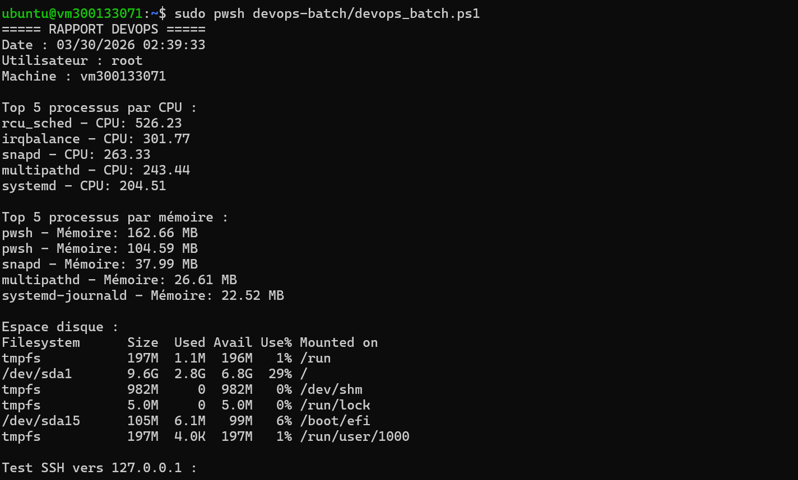
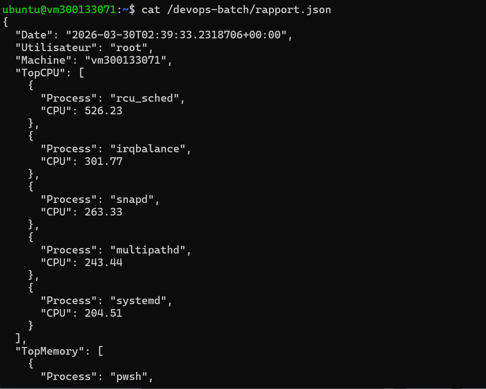
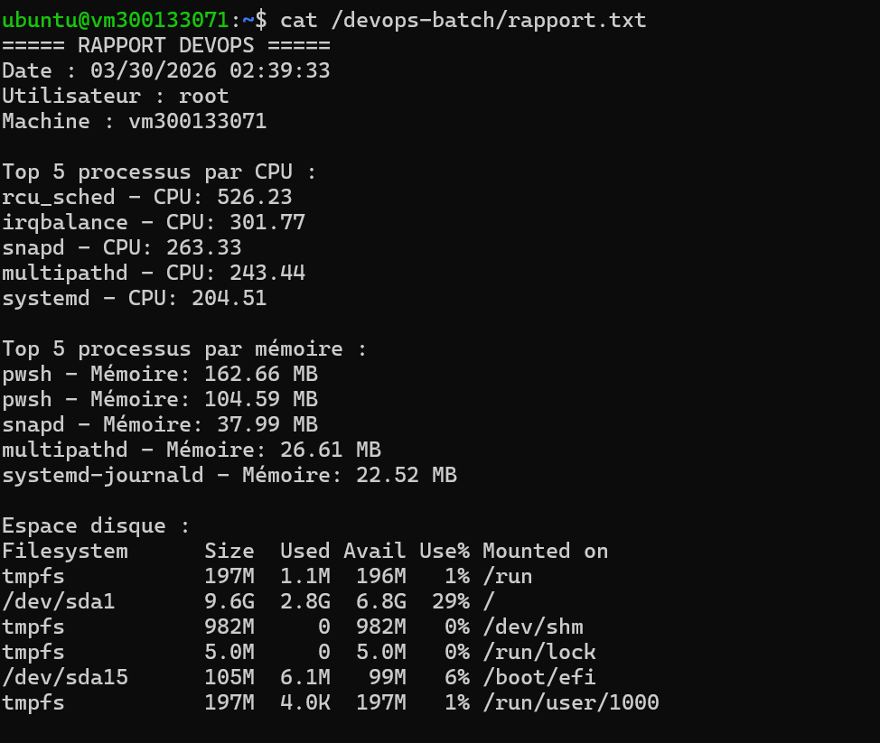

# 🧪 Laboratoire DevOps — Script Batch PowerShell (Linux)

## 📌 Aperçu
Ce laboratoire consiste à créer un script batch DevOps en PowerShell sous Linux (Ubuntu 22.04).  
Le script permet d’automatiser des vérifications système, tester la connectivité SSH et générer des rapports en format texte et JSON.

---

## 🎯 Objectifs

À la fin de ce laboratoire, j’ai été capable de :

- Créer un script PowerShell fonctionnel sous Linux  
- Automatiser des tâches administratives et DevOps  
- Surveiller les ressources système (CPU, mémoire, disque)  
- Vérifier la connectivité SSH  
- Générer des rapports structurés (TXT et JSON)  
- Comprendre le pipeline orienté objets en PowerShell  

---

## 🗂️ Structure du projet 

/devops-batch
  │── devops_batch.ps1
  │── rapport.txt
  │── rapport.json

---
Execution du script devops_batch.ps1 

---
rapport.json  

--- 
rapport.txt 

