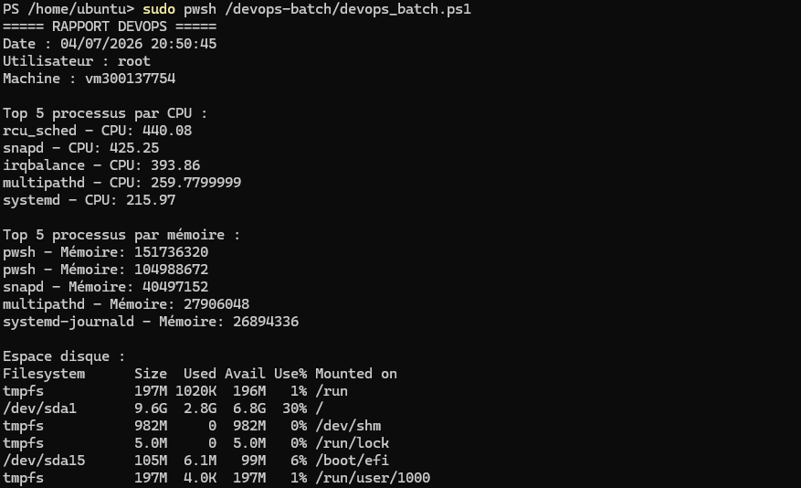

# TP PowerShell

**Nom :** Beni Mundhu
**ID :** 300137754

---

## 🎯 Objectif

Ce projet consiste à créer un script PowerShell sous Linux permettant d’automatiser des tâches d’administration système et de générer des rapports.

---

## ⚙️ Étapes réalisées

### 🔹 1. Installation de PowerShell

```bash
sudo apt update
sudo apt install -y wget apt-transport-https software-properties-common

wget https://packages.microsoft.com/config/ubuntu/22.04/packages-microsoft-prod.deb
sudo dpkg -i packages-microsoft-prod.deb

sudo apt update
sudo apt install -y powershell
```

---

### 🔹 2. Lancement de PowerShell

```bash
pwsh
```


---

### 🔹 3. Création du dossier du projet

```bash
sudo mkdir /devops-batch
cd /devops-batch
```


---

### 🔹 4. Création du script

```bash
sudo nano devops_batch.ps1
```


Ajout du script PowerShell pour :

* Vérifier CPU
* Vérifier mémoire
* Vérifier disque
* Tester SSH
* Générer rapport TXT et JSON

---

### 🔹 5. Exécution du script

```bash
sudo pwsh devops_batch.ps1
```


---

## 📸 Captures d’écran

### 🖥️ Lancement de PowerShell


---

### ⚙️ Exécution du script




---

## 📁 Structure du projet

```
300137754/
├── README.md
└── devops-batch/
    ├── devops_batch.ps1
    ├── rapport.txt
    └── rapport.json
```

---

## 📊 Résultats

Après exécution du script :

* ✔️ Affichage des informations système
* ✔️ Vérification disque
* ✔️ Test SSH
* ✔️ Génération :

  * `rapport.txt`
  * `rapport.json`

---

## 💡 Technologies utilisées

* PowerShell (pwsh)
* Linux Ubuntu
* Git & GitHub

---

## 🧠 Conclusion

Ce TP m’a permis de comprendre :

* L’automatisation avec PowerShell sous Linux
* L’utilisation des scripts DevOps
* La génération de rapports exploitables


