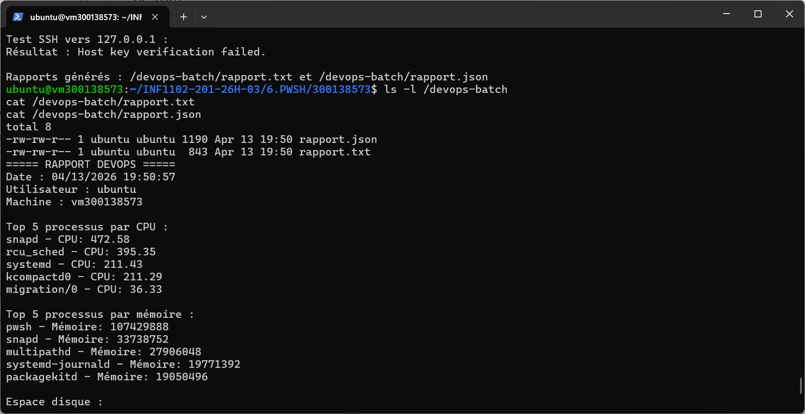
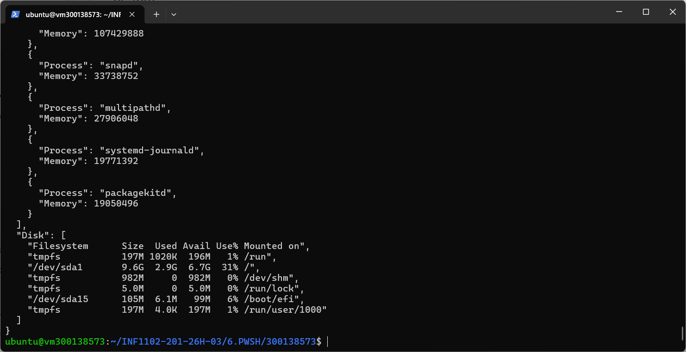

## 📌 Description du script

Le script `devops_batch.ps1` permet de générer automatiquement un rapport DevOps contenant plusieurs informations importantes sur le système.

### 🔹 Fonctionnalités du script

Le script réalise les actions suivantes :

- Affiche la date actuelle
- Affiche l’utilisateur connecté
- Affiche le nom de la machine
- Affiche le top 5 des processus utilisant le CPU
- Affiche le top 5 des processus utilisant la mémoire
- Vérifie l’espace disque avec la commande `df -h`
- Teste la connexion SSH vers `127.0.0.1`
- Génère deux fichiers :
  - `/devops-batch/rapport.txt`
  - `/devops-batch/rapport.json`

---

## 📸 Résultats du script

### 🔹 1. Rapport texte généré

Le fichier `rapport.txt` contient toutes les informations système collectées par le script, comme les processus CPU, la mémoire et les informations générales.

---

### 🔹 2. Rapport JSON généré

Le fichier `rapport.json` contient les mêmes informations mais sous format structuré JSON, ce qui permet une utilisation plus avancée dans des outils DevOps.

---

## ✅ Remarque

Le test SSH peut afficher une erreur (`Host key verification failed`), ce qui est normal si la connexion SSH n’est pas encore configurée. Cela ne bloque pas le fonctionnement du script.

---

## 🎯 Conclusion

Ce script permet d’automatiser la collecte d’informations système et de générer des rapports utiles en DevOps, en format texte et JSON.
