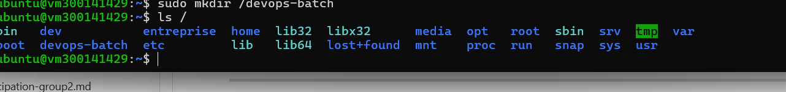
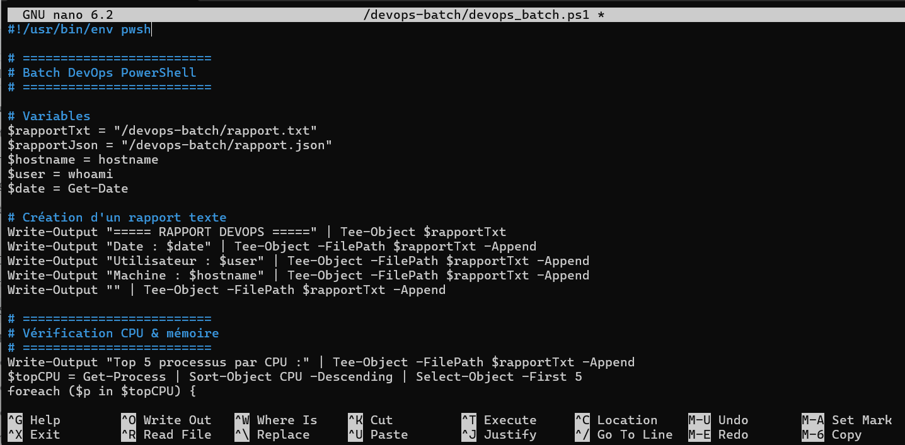
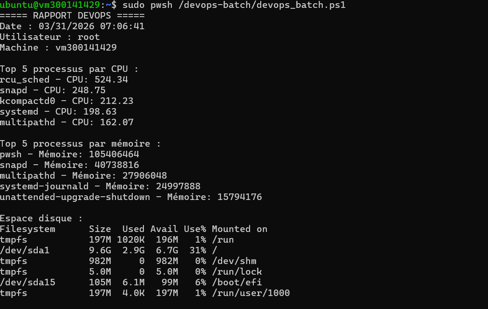
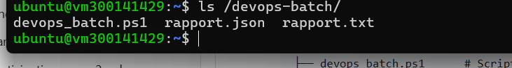

### 1. Mettre à jour le système

```bash
sudo apt update
```

---

### 2. Installer les dépendances

```bash
sudo apt install -y wget apt-transport-https software-properties-common
```

---

### 3. Ajouter le dépôt Microsoft

Télécharger la clé du dépôt :

```bash
wget https://packages.microsoft.com/config/ubuntu/22.04/packages-microsoft-prod.deb
```

Installer le dépôt :

```bash
sudo dpkg -i packages-microsoft-prod.deb
```

---

### 4. Mettre à jour les dépôts

```bash
sudo apt update
```

---

### 5. Installer PowerShell

```bash
sudo apt install -y powershell
```

---

### 6. Lancer PowerShell

```bash
pwsh
```

Prompt :

```
PS /home/user>
```

---

### 7. Vérifier la version

Dans PowerShell :

```powershell
$PSVersionTable
```

---

### 8. Astuce utile pour lancer ton script

Pour exécuter un script :

```bash
pwsh script.ps1
```

ou

```bash
./script.ps1
```

avec le shebang :

```powershell
#!/usr/bin/env pwsh
```

---

# :test_tube: Laboratoire — Créer un batch DevOps PowerShell

Durée : **90 à 120 minutes**
Environnement : **Ubuntu 22.04 (Jammy)**
Shell : **PowerShell (pwsh)**

---

## :o: Objectifs

À la fin de ce laboratoire, l’étudiant sera capable de :

1. Créer un **script batch PowerShell** pour Linux.
2. Vérifier l’état du système (CPU, mémoire, disque).
3. Vérifier la connectivité réseau (SSH).
4. Générer un **rapport texte et JSON**.
5. Automatiser des tâches **administratives et DevOps**.
6. Comprendre le pipeline **PowerShell orienté objets**.

---
## 🔹 PARTIE 1 – Préparation de l’environnement

- [ ]  Créer le dossier du TP

```bash
sudo mkdir /devops-batch
```

---

## 🔹 PARTIE 2 – Créer le script principal

Créer le fichier `devops_batch.ps1` :

```bash
sudo nano /devops-batch/devops_batch.ps1
```

Ajouter le **shebang** pour Linux :

```powershell
#!/usr/bin/env pwsh
```

---

## 🔹 PARTIE 3 - Script complet (exemple)

📄 CODE COMPLET À INTÉGRER

```powershell
#!/usr/bin/env pwsh

# =========================
# Batch DevOps PowerShell
# =========================

# Variables
$rapportTxt = "/devops-batch/rapport.txt"
$rapportJson = "/devops-batch/rapport.json"
$hostname = hostname
$user = whoami
$date = Get-Date

# Création d'un rapport texte
Write-Output "===== RAPPORT DEVOPS =====" | Tee-Object $rapportTxt
Write-Output "Date : $date" | Tee-Object -FilePath $rapportTxt -Append
Write-Output "Utilisateur : $user" | Tee-Object -FilePath $rapportTxt -Append
Write-Output "Machine : $hostname" | Tee-Object -FilePath $rapportTxt -Append
Write-Output "" | Tee-Object -FilePath $rapportTxt -Append

# =========================
# Vérification CPU & mémoire
# =========================
Write-Output "Top 5 processus par CPU :" | Tee-Object -FilePath $rapportTxt -Append
$topCPU = Get-Process | Sort-Object CPU -Descending | Select-Object -First 5
foreach ($p in $topCPU) {
    Write-Output ("{0} - CPU: {1}" -f $p.ProcessName, $p.CPU) | Tee-Object -FilePath $rapportTxt -Append
}

Write-Output "" | Tee-Object -FilePath $rapportTxt -Append
Write-Output "Top 5 processus par mémoire :" | Tee-Object -FilePath $rapportTxt -Append
$topMem = Get-Process | Sort-Object WS -Descending | Select-Object -First 5
foreach ($p in $topMem) {
    Write-Output ("{0} - Mémoire: {1}" -f $p.ProcessName, $p.WorkingSet) | Tee-Object -FilePath $rapportTxt -Append
}

# =========================
# Vérification disque
# =========================
Write-Output "" | Tee-Object -FilePath $rapportTxt -Append
Write-Output "Espace disque :" | Tee-Object -FilePath $rapportTxt -Append
$disk = df -h
Write-Output $disk | Tee-Object -FilePath $rapportTxt -Append

# =========================
# Vérification SSH
# =========================
Write-Output "" | Tee-Object -FilePath $rapportTxt -Append
$sshHost = "127.0.0.1"
Write-Output "Test SSH vers $sshHost :" | Tee-Object -FilePath $rapportTxt -Append
try {
    $result = ssh -o BatchMode=yes -o ConnectTimeout=5 $sshHost "echo 'OK'" 2>&1
    Write-Output "Résultat : $result" | Tee-Object -FilePath $rapportTxt -Append
} catch {
    Write-Output "SSH échoué vers $sshHost" | Tee-Object -FilePath $rapportTxt -Append
}

# =========================
# Génération JSON
# =========================
$reportObj = [PSCustomObject]@{
    Date       = $date
    Utilisateur = $user
    Machine    = $hostname
    TopCPU     = $topCPU | ForEach-Object { @{Process = $_.ProcessName; CPU = $_.CPU} }
    TopMemory  = $topMem | ForEach-Object { @{Process = $_.ProcessName; Memory = $_.WorkingSet} }
    Disk       = $disk
}

$reportObj | ConvertTo-Json -Depth 5 | Set-Content $rapportJson

Write-Output ""
Write-Output "Rapports générés : $rapportTxt et $rapportJson"
```

---

## 🔹 PARTIE 4. Exécuter le batch

```bash
sudo pwsh /devops-batch/devops_batch.ps1
```

Résultat attendu :

* Affichage console avec **CPU, mémoire, disque, SSH**
* Création des fichiers :

  * `rapport.txt`
  * `rapport.json`




