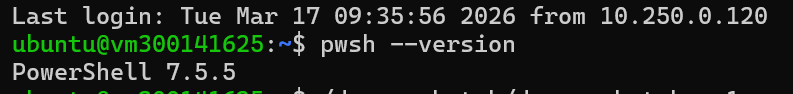
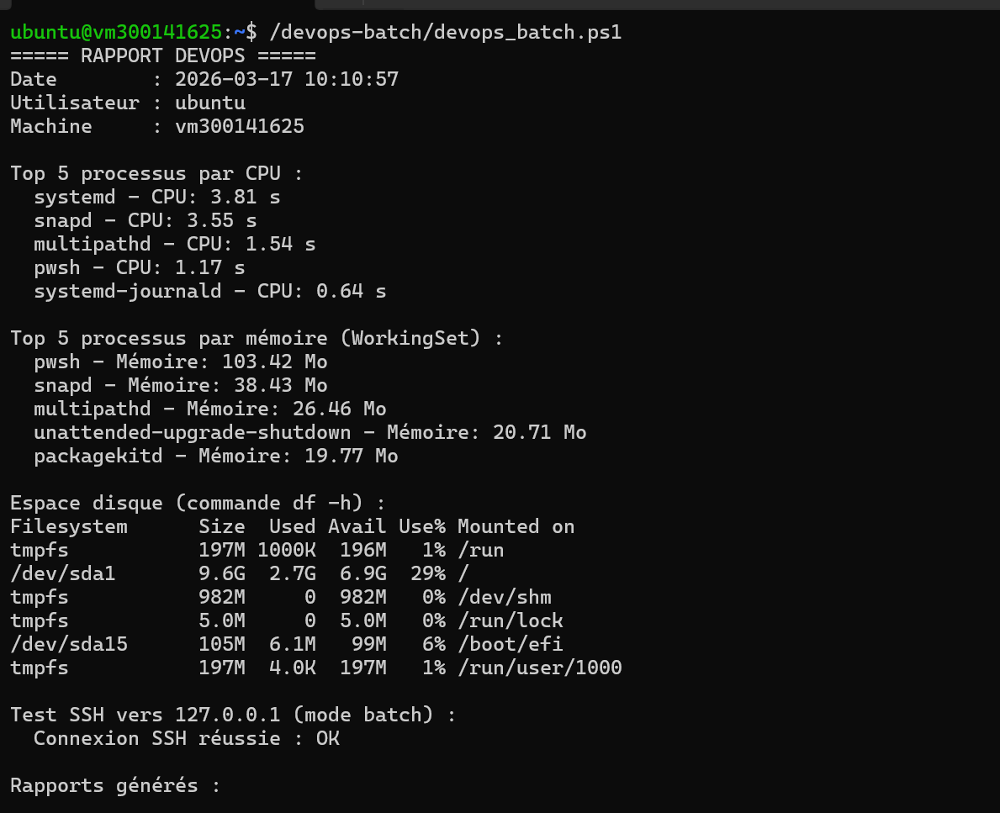
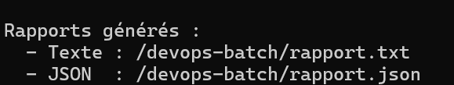
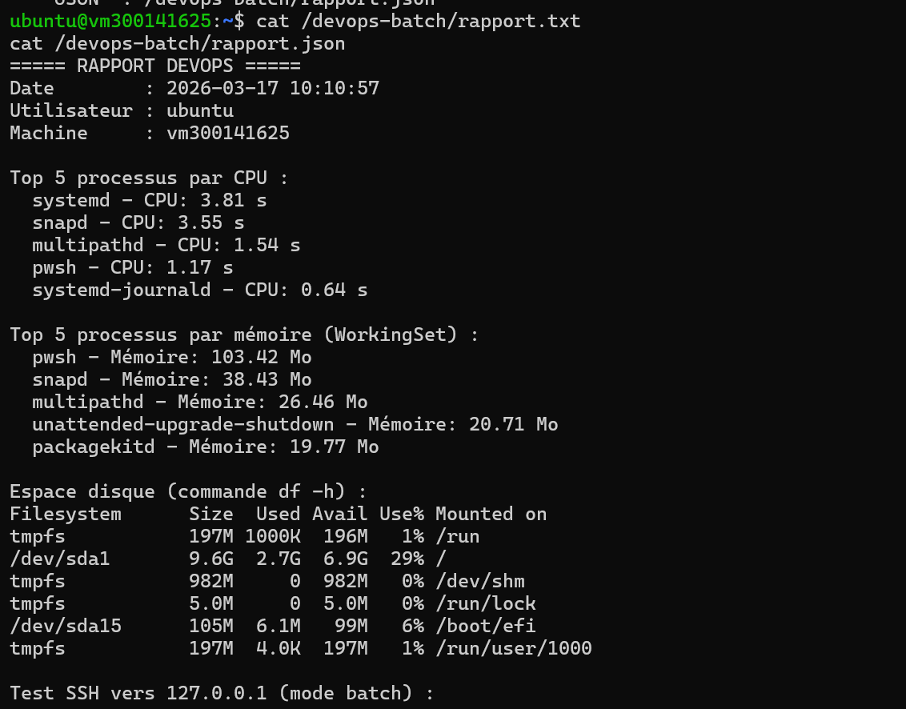
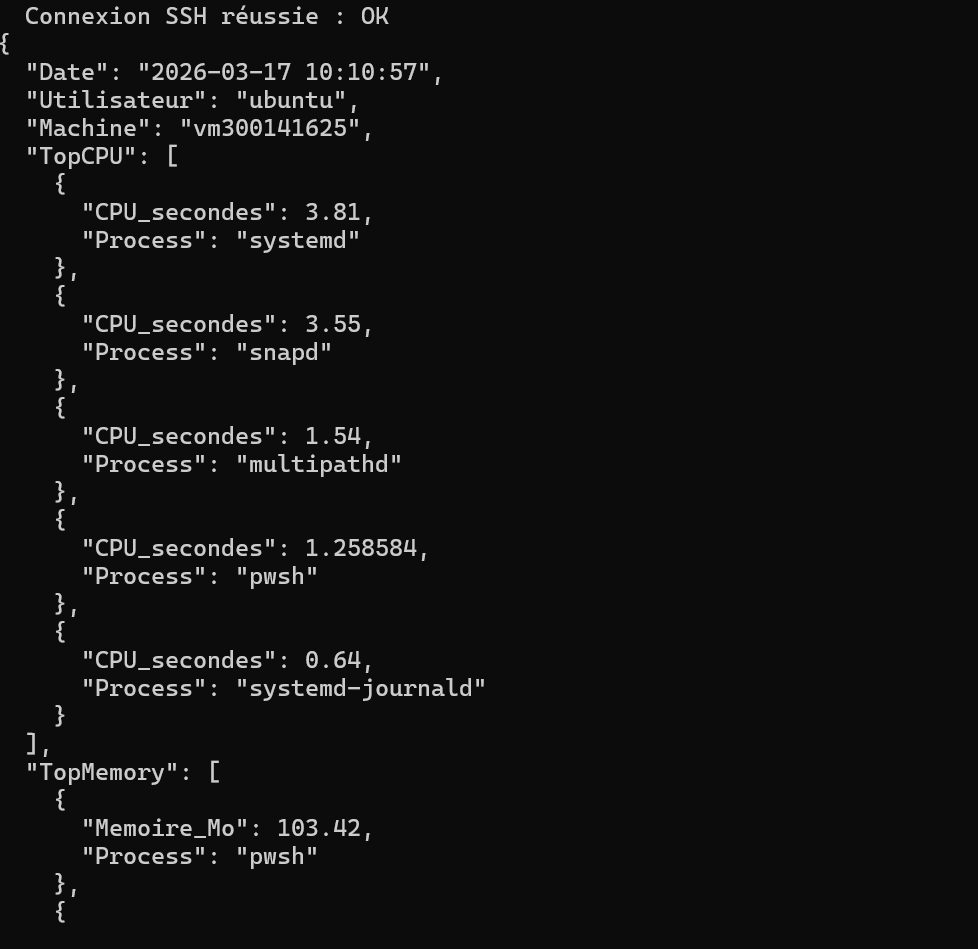
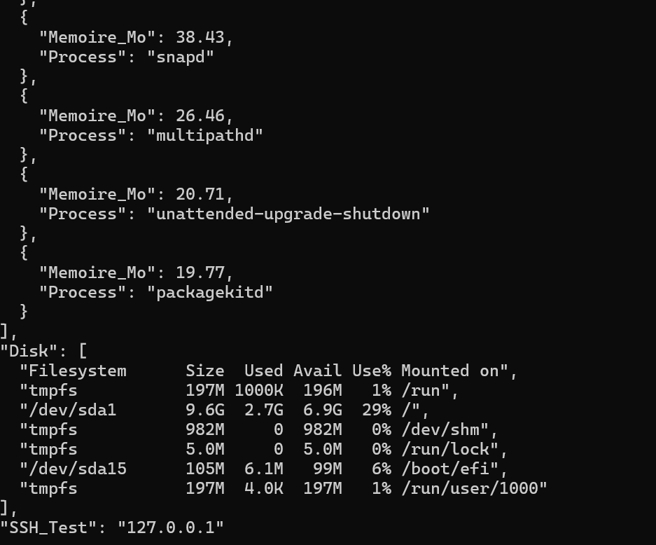

# TP DevOps PowerShell – Ubuntu 22.04

## 👤 Auteur
- Nom : Fatou Dione
- ID : 300141625
- Date : 17 mars 2026

## 🎯 Objectifs
- Installer PowerShell sur Ubuntu 22.04
- Créer un script de vérification système (CPU, mémoire, disque, SSH)
- Générer des rapports texte et JSON
- Automatiser une tâche DevOps

## 📂 Structure
300141625/
├── devops-batch/
│   └── devops_batch.ps1
├── images/
└── README.md
## 📸 Étapes effectuées sur Ubuntu

### 1. Installation PowerShell


### 2. Début de l'exécution du script


### 3. Fin de l'exécution du script


### 4. Rapport texte (rapport.txt)


### 5. Rapport JSON (début)


### 6. Rapport JSON (fin)


## ▶️ Exécution
```bash
sudo pwsh /devops-batch/devops_batch.ps1
```

## ✅ Conclusion
Ce TP a permis de maîtriser PowerShell sous Linux et d'automatiser des tâches d'administration système. Tous les objectifs sont atteints, avec la production de rapports exploitables en texte et JSON.
