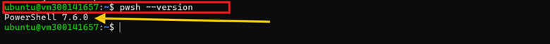
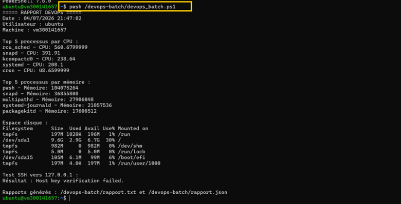
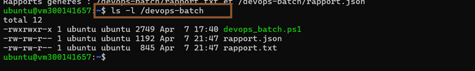
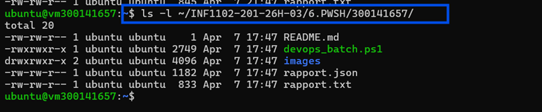
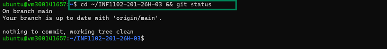

# TP PowerShell - 300141657 Leandre Manizan

Ce laboratoire consiste à installer et utiliser **PowerShell sous Ubuntu 22.04** afin d’exécuter un script DevOps permettant de vérifier l’état du système, tester le SSH, puis générer un rapport texte et JSON.

---

## Capture 1 - Vérification de PowerShell

Cette capture montre la vérification de la version de PowerShell installée sur Ubuntu.



```bash
pwsh --version
```

---

## Capture 2 - Exécution du script PowerShell

Cette capture montre l’exécution du script `devops_batch.ps1`.



```bash
pwsh /devops-batch/devops_batch.ps1
```

---

## Capture 3 - Vérification des fichiers générés

Cette capture montre les fichiers générés automatiquement après l’exécution du script.



```bash
ls -l /devops-batch
```

---

## Capture 4 - Vérification du dossier de remise

Cette capture montre les fichiers copiés dans le dossier de remise de l’étudiant.



```bash
ls -l ~/INF1102-201-26H-03/6.PWSH/300141657/
```

---

## Capture 5 - Vérification Git

Cette capture montre que le dépôt Git est propre et à jour.



```bash
cd ~/INF1102-201-26H-03 && git status
```

---

## Fichiers remis

- `devops_batch.ps1`
- `rapport.txt`
- `rapport.json`
- `README.md`

---

## Structure du dossier

```plaintext
300141657/
├── README.md
├── devops_batch.ps1
├── rapport.txt
├── rapport.json
└── images/
    ├── Image1.png
    ├── Image2.png
    ├── Image3.png
    ├── Image4.png
    └── Image5.png
```

---

## Conclusion

Ce laboratoire m’a permis de comprendre comment utiliser **PowerShell dans un environnement Linux** pour automatiser des tâches administratives. Le script exécuté permet de vérifier plusieurs informations système et de générer des rapports en **texte** et en **JSON**.
