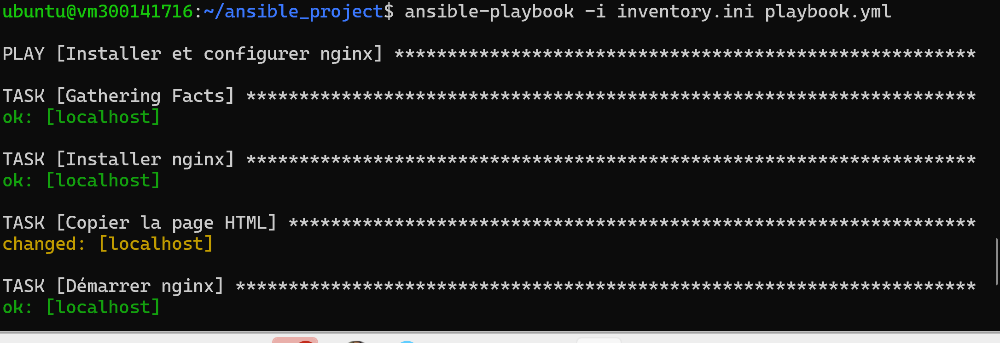
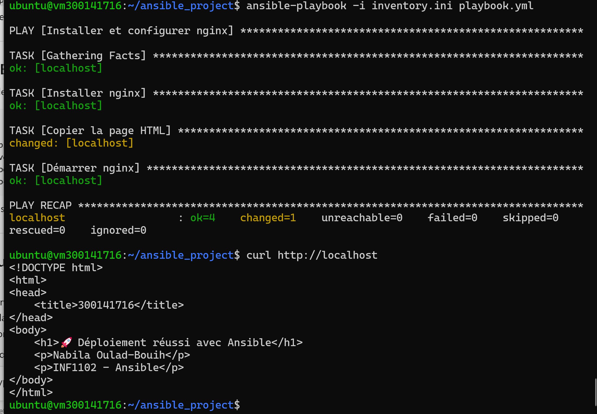

# 🚀 Laboratoire DevOps — Déploiement Nginx avec Ansible

## 📌 Aperçu

Ce laboratoire consiste à automatiser le déploiement d’un serveur web avec Ansible sous Linux (Ubuntu).

Le playbook permet d’installer Nginx, de déployer une page HTML personnalisée et de démarrer automatiquement le service.

---

## 🎯 Objectifs

À la fin de ce laboratoire, j’ai été capable de :

* Créer un playbook Ansible fonctionnel
* Automatiser le déploiement d’un serveur web
* Installer et configurer Nginx
* Déployer une page HTML personnalisée
* Vérifier le fonctionnement du serveur via HTTP
* Comprendre l’approche Infrastructure as Code (IaC)

---

## 🗂️ Structure du projet</br>

```text
300141716/
│── inventory.ini
│── playbook.yml
│── files/
│   └── index.html
│── images/
```


---

## ▶️ Test de connexion Ansible</br>

Commande :</br>

```bash
ansible -i inventory.ini web -m ping
```


---

## ▶️ Exécution du playbook</br>

Commande :</br>

```bash
ansible-playbook -i inventory.ini playbook.yml
```



---

## 🌐 Vérification du serveur web</br>

Commande :</br>

```bash
curl http://localhost
```



---

## 🚀 Résultat

Le déploiement fonctionne correctement et permet :

* d’installer automatiquement Nginx
* de configurer un serveur web
* de déployer une page HTML personnalisée
* de démarrer le service automatiquement
* de vérifier l’accès via HTTP

---

## 🧠 Avantages d’Ansible

⚡ Automatisation rapide : déploie des services en quelques commandes

🔐 Connexion sécurisée : utilise SSH sans agent

🧩 Idempotence : évite les changements inutiles

🌍 Infrastructure as Code : configuration reproductible

📦 Gestion simple : pas besoin d’installation côté client

---

## 💡 Conclusion

Ce laboratoire montre que Ansible permet d’automatiser efficacement le déploiement et la configuration des serveurs.

Grâce à cette approche, l’infrastructure devient rapide à déployer, reproductible et fiable.
