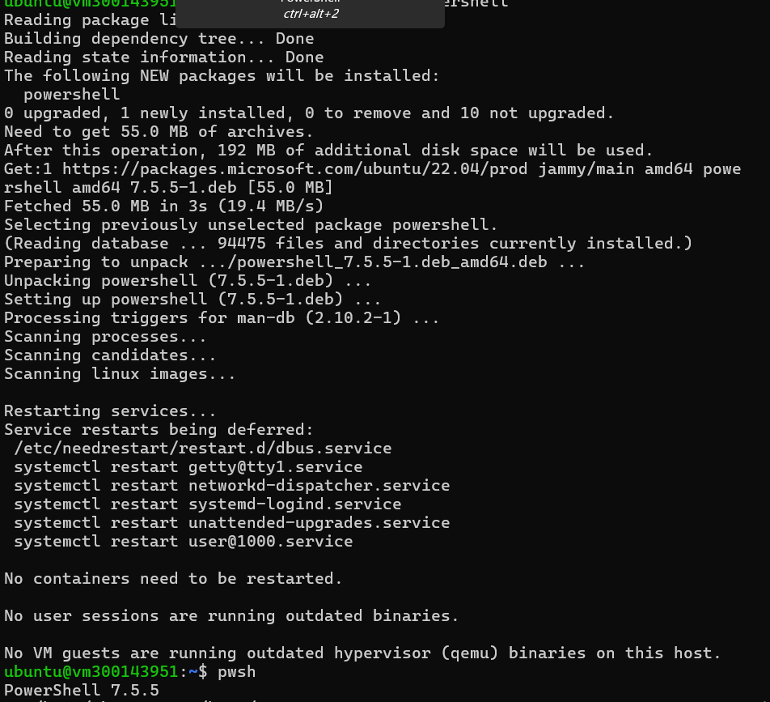
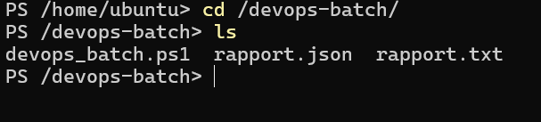
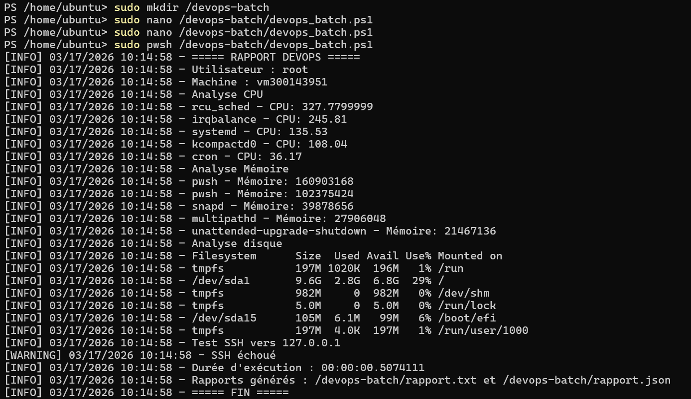

# Batch DevOps PowerShell (Linux)

## Objectif
Mettre en place un script PowerShell sous Linux permettant de superviser l’état du système (CPU, mémoire, disque), tester la connectivité SSH et générer des rapports automatisés.

## Environnement
- Ubuntu 22.04 (Jammy)
- PowerShell (pwsh)
- Accès sudo

## Étapes réalisées
- Installation de PowerShell via le dépôt Microsoft
- Création du dossier de travail `/devops-batch`
- Création du script `devops_batch.ps1`
- Exécution du script avec PowerShell
- Génération des fichiers `rapport.txt` et `rapport.json`

## Vérifications
- Analyse CPU et mémoire
- Vérification de l’espace disque
- Test de connectivité SSH
- Génération des rapports

## Captures d’écran

### Installation de PowerShell

### Structure des fichiers

### Exécution du script

## Résultat
Le script fonctionne correctement et permet d’automatiser la collecte d’informations système ainsi que la génération de rapports, conformément aux objectifs du laboratoire DevOps.
