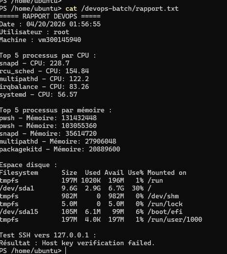
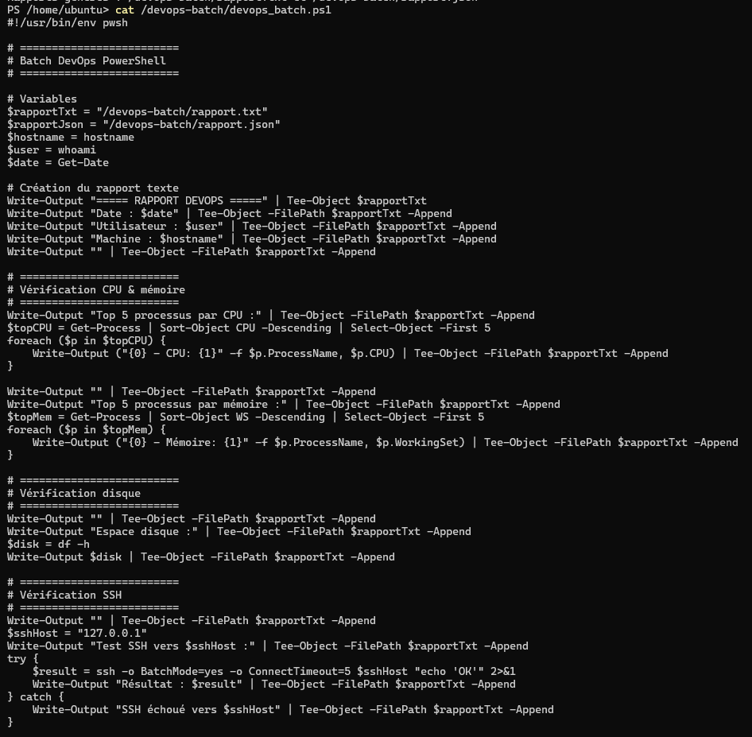
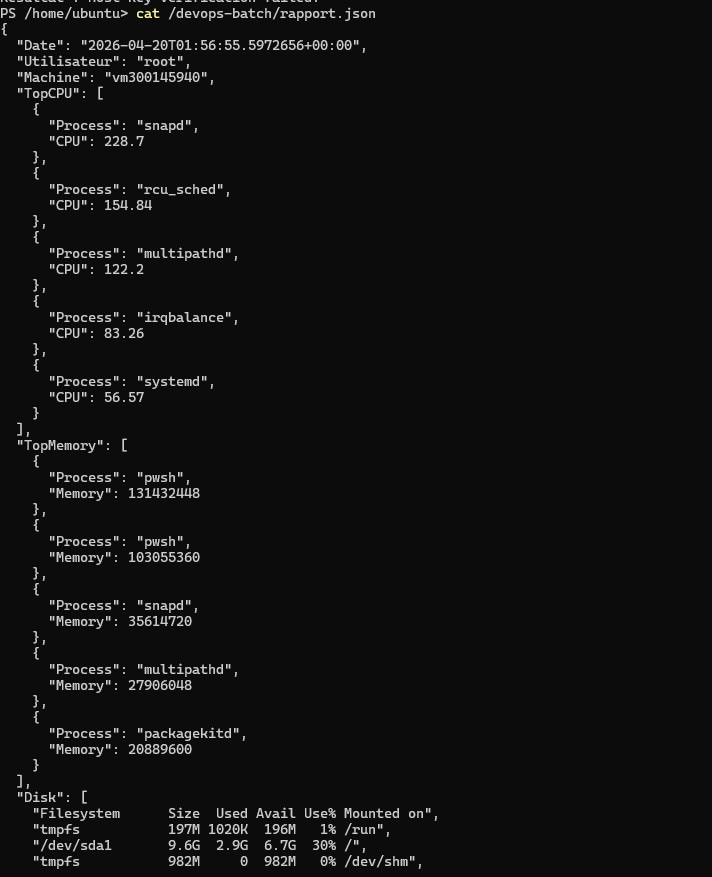

# TP 6 – Automatisation DevOps avec PowerShell sous Linux

## 🎯 Objectif

L’objectif de ce laboratoire est de créer un script PowerShell sous Linux permettant d’automatiser des tâches d’administration système. Le script vérifie l’état du système (CPU, mémoire, disque), teste la connectivité réseau SSH et génère des rapports en format texte et JSON.

---

## 🖥 Environnement

* Système : Ubuntu 22.04
* Shell : PowerShell (pwsh)
* Accès : sudo

---

## ⚙️ Étapes réalisées

### 1. Installation de PowerShell

Installation du dépôt Microsoft et du paquet PowerShell sous Ubuntu.

### 2. Création du script

Création du fichier :

devops_batch.ps1

Le script permet de :

* Générer un rapport système
* Vérifier les processus CPU et mémoire
* Vérifier l’espace disque
* Tester la connectivité SSH
* Générer un fichier JSON

---

## ▶️ Exécution du script

Le script a été exécuté avec la commande :

```bash
sudo pwsh /devops-batch/devops_batch.ps1
```

---

## 📸 Preuves d’exécution

### 🔹 Script PowerShell



---

### 🔹 Exécution du script



---

### 🔹 Rapport texte généré



---

## ✅ Résultats obtenus

* ✔ Génération du rapport texte
* ✔ Génération du rapport JSON
* ✔ Affichage des processus CPU et mémoire
* ✔ Vérification de l’espace disque
* ✔ Test réseau SSH (avec message d’erreur normal si non configuré)

---

## 🔎 Vérifications

* Vérification du fichier `/devops-batch/rapport.txt`
* Vérification du fichier `/devops-batch/rapport.json`
* Vérification de l’exécution correcte du script

---

## 🧠 Conclusion

Ce laboratoire permet de comprendre l’utilisation de PowerShell sous Linux dans un contexte DevOps. Il met en évidence l’automatisation des tâches, la gestion des ressources système et la génération de rapports exploitables.

---

## 🚀 Améliorations possibles

* Automatiser l’exécution avec cron
* Ajouter plus de tests réseau
* Améliorer la gestion des erreurs
* Envoyer les rapports vers un serveur distant

---
