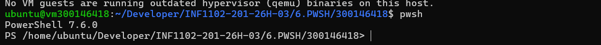
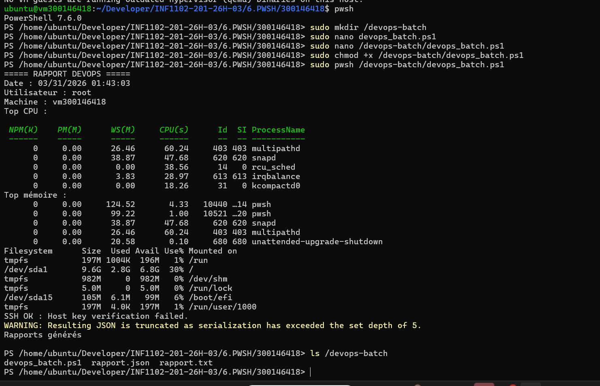

# 🧪 TP 6 – PowerShell DevOps (Linux)

## 👤 Informations
- **Nom** : Ikram Sidhoum  
- **ID** : 300146418  
- **Cours** : INF1102 – Administration systèmes  
- **TP** : 6.PWSH  

---

## 🎯 Objectif

Ce TP consiste à :

- Installer PowerShell sur Linux (Ubuntu)
- Créer un script PowerShell
- Surveiller les ressources système :
  - CPU
  - Mémoire
  - Disque
- Tester la connexion SSH
- Générer un rapport :
  - 📄 format texte
  - 📄 format JSON

---

## 📂 Structure du projet

### Sur la machine :


/devops-batch/
│
├── devops_batch.ps1
├── rapport.txt
└── rapport.json


### Dans GitHub :


6.PWSH/300146418/
│
├── devops_batch.ps1
├── README.md
└── images/


---

## ⚙️ Installation PowerShell

```bash
sudo apt update
sudo apt install -y wget apt-transport-https software-properties-common

wget https://packages.microsoft.com/config/ubuntu/22.04/packages-microsoft-prod.deb
sudo dpkg -i packages-microsoft-prod.deb

sudo apt update
sudo apt install -y powershell
```
## ▶️ Exécution du script
sudo pwsh /devops-batch/devops_batch.ps1
## 📊 Résultats

## Le script génère :

📄 rapport.txt

## Contient :

Date
Utilisateur
Machine
Top CPU
Top mémoire
Utilisation disque
Test SSH
📄 rapport.json

Contient les mêmes informations en format JSON.

## 🔍 Vérifications
ls /devops-batch
cat /devops-batch/rapport.txt
cat /devops-batch/rapport.json
## 🔐 Test SSH

Le script tente une connexion vers :

127.0.0.1

Résultat affiché :

SSH OK ✔
ou erreur (ex: host key)


## Les captures suivantes sont incluses dans le dossier images/ :

Création du script
Exécution du script
Résultat rapport.txt
Résultat rapport.json
Liste des fichiers




## 🧠 Conclusion

Ce TP permet de :

- Automatiser la surveillance système
- Utiliser PowerShell sur Linux
- Générer des rapports exploitables
- Appliquer des pratiques DevOps
