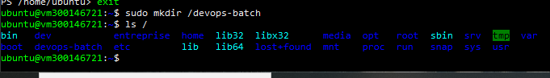
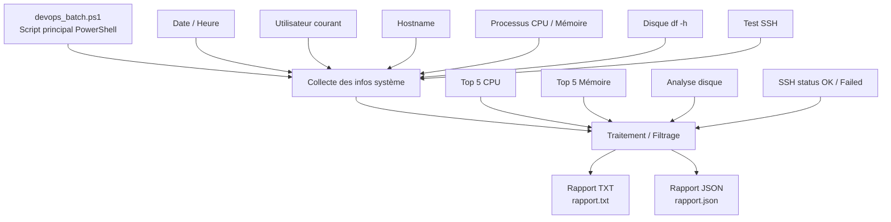

# 6️⃣ PWSH — Laboratoire DevOps PowerShell

> **Étudiant :** 300146721  
> **Cours :** INF1102-201-26H-03  
> **Environnement :** Ubuntu 22.04 (Jammy) — PowerShell (pwsh)  
> **Durée estimée :** 90 à 120 minutes

---

## 🎯 Objectifs du laboratoire

À la fin de ce laboratoire, l'étudiant est capable de :

1. Créer un **script batch PowerShell** pour Linux
2. Vérifier l'état du système (CPU, mémoire, disque)
3. Vérifier la connectivité réseau (SSH)
4. Générer un **rapport texte et JSON**
5. Automatiser des tâches **administratives et DevOps**
6. Comprendre le pipeline **PowerShell orienté objets**

---

## 📁 Structure du projet

```plaintext
/devops-batch/
│
├── devops_batch.ps1      # Script principal PowerShell
├── rapport.txt           # Rapport texte généré
└── rapport.json          # Rapport JSON généré
```

---

## 🔹 PARTIE 1 — Création du dossier de travail

Création du répertoire `/devops-batch` et vérification de sa présence dans le système de fichiers :

```bash
sudo mkdir /devops-batch
ls /
```



---

## 🔹 PARTIE 2 — Exécution du script principal

Lancement du script `devops_batch.ps1` avec PowerShell :

```bash
sudo pwsh /devops-batch/devops_batch.ps1
```

Le script affiche en console :
- La date, l'utilisateur et le hostname
- Le **Top 5 des processus par CPU**
- Le **Top 5 des processus par mémoire**
- L'**espace disque** (`df -h`)
- Le résultat du **test SSH** vers `127.0.0.1`


---

## 🔹 PARTIE 3 — Lecture du rapport texte

Vérification du contenu du fichier `rapport.txt` généré :

```bash
cat /devops-batch/rapport.txt
```


---

## 🔹 PARTIE 4 — Lecture du rapport JSON

Vérification du contenu du fichier `rapport.json` généré par `ConvertTo-Json` :

```bash
cat /devops-batch/rapport.json
```


---

## 🔹 PARTIE 5 — Vérification des fichiers générés

Vérification de la présence et des permissions des trois fichiers dans `/devops-batch/` :

```bash
ls -l /devops-batch/
```

| Fichier             | Taille  | Description              |
|---------------------|---------|--------------------------|
| `devops_batch.ps1`  | 2739 o  | Script PowerShell principal |
| `rapport.json`      | 1196 o  | Rapport au format JSON   |
| `rapport.txt`       | 847 o   | Rapport au format texte  |


---

## 🔄 Diagramme de flux du script



---

## 💡 Points clés — PowerShell vs Bash

| Fonctionnalité        | Bash                     | PowerShell                        |
|-----------------------|--------------------------|-----------------------------------|
| Type de données       | Texte (strings)          | Objets (.NET/PSObjects)           |
| Filtrage              | `grep`, `awk`            | `Where-Object {$_.CPU -gt 10}`   |
| Export JSON           | `jq`                     | `ConvertTo-Json`                  |
| Multi-plateforme      | Linux / macOS seulement  | Linux + Windows + macOS           |
| Variables typées      | Non                      | Oui (`[int]$count = 5`)          |

---

## ✅ Résultats obtenus

- [x] Dossier `/devops-batch` créé avec succès
- [x] Script `devops_batch.ps1` exécuté sans erreur critique
- [x] Top 5 CPU et mémoire affichés correctement
- [x] Espace disque récupéré via `df -h`
- [x] Test SSH effectué (résultat : *Host key verification failed* — comportement attendu sans clé SSH configurée)
- [x] Fichier `rapport.txt` généré (847 octets)
- [x] Fichier `rapport.json` généré (1196 octets)
