# Laboratoire — Batch DevOps PowerShell (300147816)
** 🧨 Objectif de laboratoire:**

Ce projet documente l'installation de PowerShell Core sur Ubuntu 22.04 et la création d'un script de surveillance système capable de générer des rapports aux formats **Texte** et **JSON**

**📢 Étape 1 : Préparation et Installation de PowerShell**

Sous Linux, nous devons "apprendre" au système où trouver PowerShell, car il ne fait pas partie des logiciels installés par défaut.

##1. Mettre à jour le système:

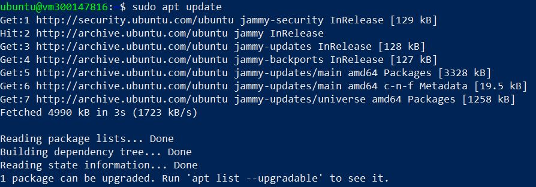

**Explication:**

Cette commande met à jour la liste des logiciels disponibles. C'est comme télécharger le nouveau catalogue avant de passer commande

#2. Installation des outils de communication

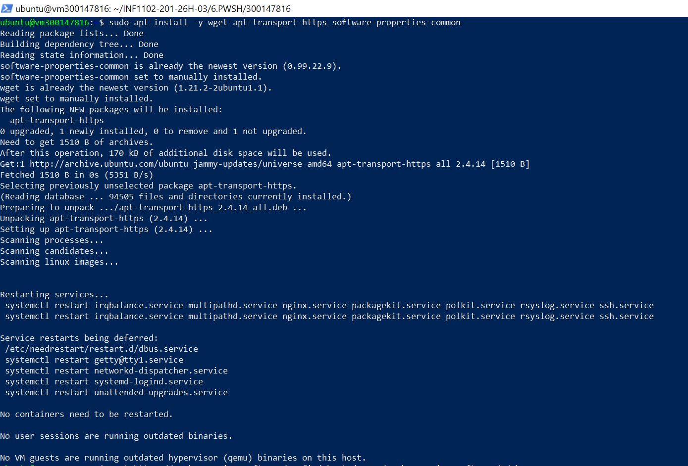

**Explication:**

* wget : Permet de télécharger des fichiers depuis internet via le terminal.

• apt-transport-https : Permet au gestionnaire de paquets de télécharger des logiciels via une connexion sécurisée (HTTPS).

• software-properties-common : Aide à gérer les sources de logiciels provenant de tiers (comme Microsoft).

#3. Récupération de la "clé" Microsoft

Dans cette étape nous allons ajouter le dépot Microsoft. L'image suivante explique:

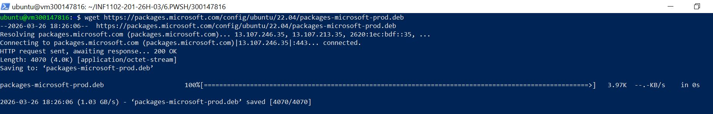

**Explication:**

Nous téléchargeons un petit paquet qui contient l'adresse du serveur de Microsoft et la clé de sécurité pour prouver que les fichiers sont authentiques.

#4. Enregistrement du dépôt Microsoft

Dans cette étape on installe le dépot, l'image suivante explique:

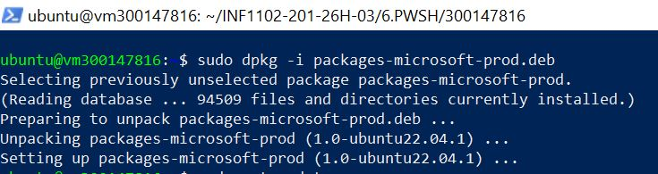

**Explication:**

On installe le fichier téléchargé. Maintenant, Ubuntu sait que pour trouver PowerShell, il doit aller voir chez Microsoft.

#5. Installation finale


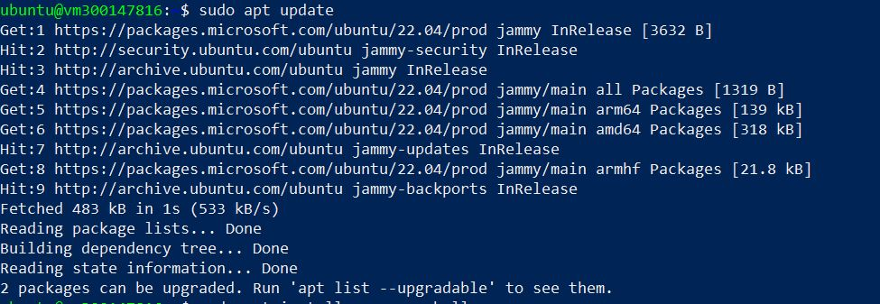

**Explication:**
 
Dans cette étape, On rafraîchit le catalogue (pour qu'Ubuntu voie enfin PowerShell)

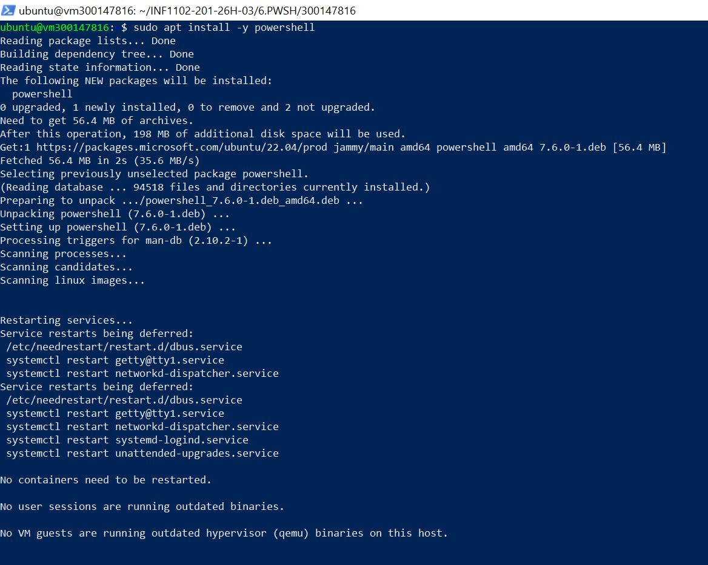

**Explication:**

Cette deuxième photo montre comment lancer l'installation de powershell

**🕹 Étape 2 : Lancement et Vérification**

#1. Démarrage de l'interface

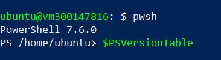

**Explication:**

On quitte l'univers "Bash" pour entrer dans l'univers "PowerShell". Le prompt change pour afficher PS /home/ubuntu>.

**Vérification de l'environnement:**


**Explication**

Cette commande affiche les détails de la version installée pour confirmer que tout est correct.

**🎁Étape 3 : Le Script DevOps Batch (devops_batch.ps1)**

## 🎗 PARTIE 1 – Préparation de l’environnement

Dans cette étape, nous préparons l'espace de travail sur le serveur Linux.

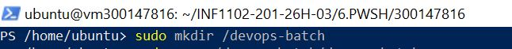

L'image nous donne la commande qui permet de créer un dossier à la racine du système. L'usage de `sudo` est nécessaire car nous écrivons dans un répertoire protégé par le système.

* **Objectif** : Centraliser le script et les rapports générés dans un endroit fixe.

## 🎗 PARTIE 2 : Création du script principal

Ici, Nous utilisons l'éditeur de texte **Nano** pour créer le fichier source.

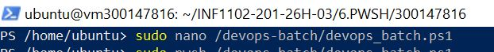

L'image nous donne la commande qui permet d'ouvrir l'éditeur pour créer le script PowerShell (extension `.ps1`).

### **Remarque:**

On a ajouté cette ligne  `#!/usr/bin/env pwsh` dans le script principal : C'est le **Shebang**. Il indique au noyau Linux d'utiliser l'exécutable `pwsh` (PowerShell) pour interpréter ce fichier. Sans cela, Linux essaierait de le lire comme du Bash.

## 🎗 PARTIE 3 : Analyse du code PowerShell

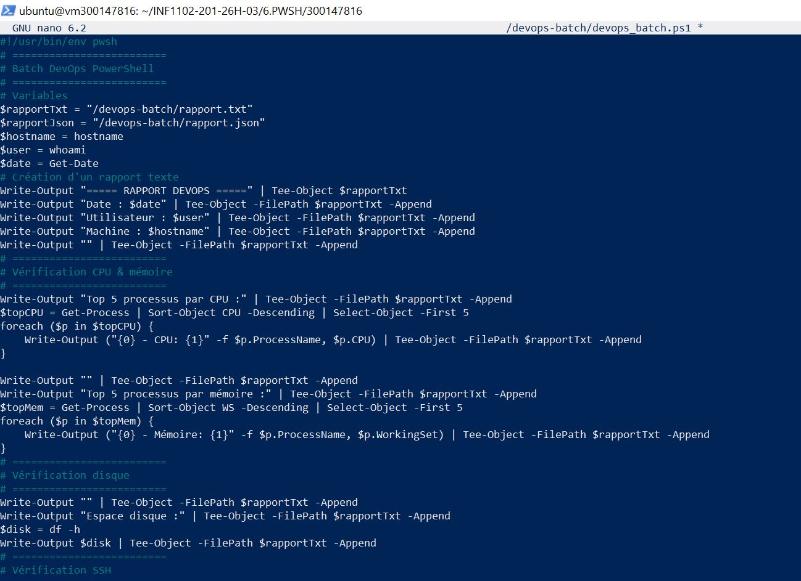

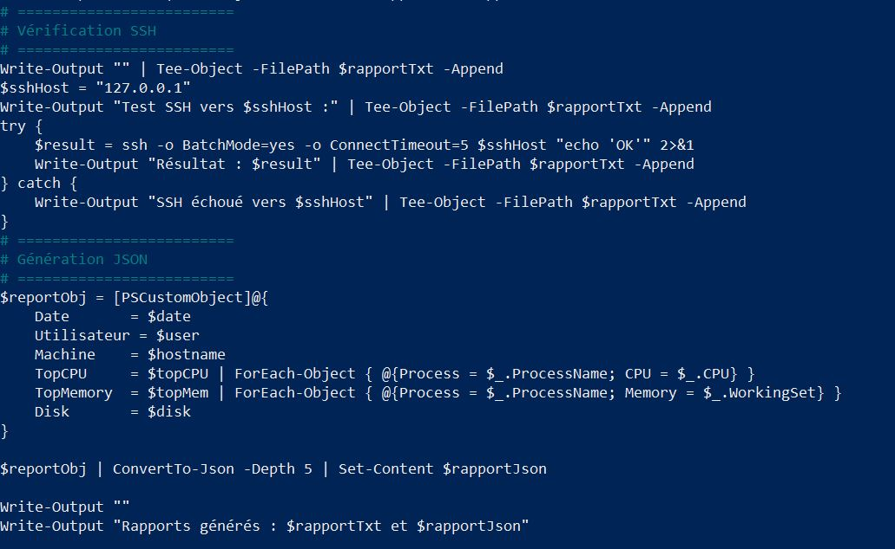

**Explication**

Le script est divisé en sections logiques pour automatiser la surveillance :

1.  **Variables et Initialisation** :

    * On définit les chemins des rapports (`$rapportTxt`, `$rapportJson`).

    * On récupère les infos de base : `$hostname` (nom de la machine), `$user` (qui exécute le script) et `$date`.

2.  **Pipeline et Objets** :

    * `Get-Process | Sort-Object CPU -Descending | Select-Object -First 5` : C'est la force de PowerShell. On récupère les processus, on les trie par CPU et on prend les 5 premiers sous forme d'**objets** (pas juste du texte).

3.  **Tee-Object** :

    * Cette commande est cruciale : elle permet d'afficher le résultat dans la console **ET** de l'écrire dans le fichier texte en même temps.

4.  **Génération JSON** :

    * `ConvertTo-Json` : Transforme nos objets de performance en un format standard (JSON) lisible par d'autres applications DevOps ou des bases de données.

## 🎗 PARTIE 4. Exécuter le batch

Pour lancer le script avec les privilèges administratifs nécessaires (pour lire tous les processus et écrire à la racine), on utilise :

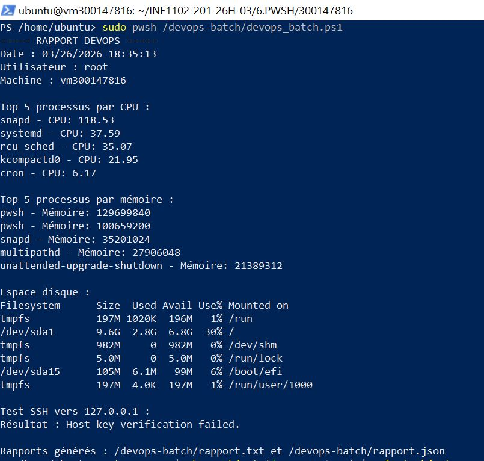

On aura le resultat suivant:

**🧨 Affichage Console **: Le terminal affiche en temps réel le Top 5 des processus (CPU/Mémoire), l'état du disque (df -h) et le succès du test de connectivité SSH.

**🧨 Génération de Artefacts :**  Le script automatise la création de deux fichiers distincts dans /devops-batch/.

Le résultat obtenu est bien clair dans l'image en haut.

## 💎 Le Pipeline orienté objets : La force de PowerShell

Contrairement au Bash (Linux) qui manipule uniquement des chaînes de caractères (du texte), **PowerShell travaille avec des objets**. 

### ⚙️ Comment fonctionne le Pipeline ?

Dans ce laboratoire, nous avons utilisé cette logique pour extraire des données précises. Voici l'analyse de la commande clé avec résultats obtenus :

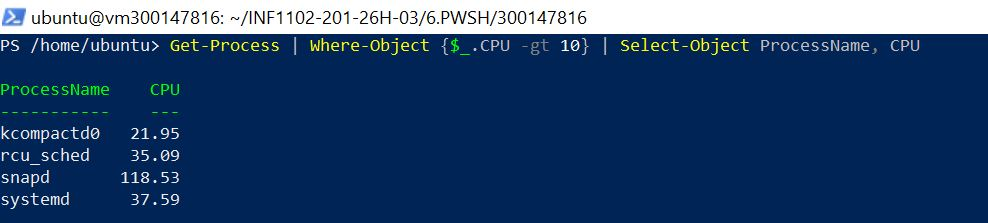


1.  **Get-Process** : Récupère une liste d'objets "Processus" complets (avec ID, Nom, CPU, Mémoire, etc.).

2.  **Le symbole `|` (Pipe)** : Il ne passe pas du texte à la commande suivante, il passe l'**objet entier**.

3.  **Where-Object** : Filtre les objets. Ici, on ne garde que ceux dont la propriété `.CPU` est supérieure à 10.

4.  **Select-Object** : Choisit uniquement les colonnes spécifiques que l'on veut afficher ou exporter.


### 🚀 Pourquoi est-ce un avantage DevOps ?

Le fait de manipuler des objets facilite trois actions cruciales :

* **Le filtrage précis** : On cible une propriété (`$_.CPU`) sans avoir à couper le texte avec des commandes complexes comme `awk`.

* **La sélection propre** : On ne garde que l'essentiel pour le rapport.

* **L'exportation immédiate** : Comme PowerShell connaît la structure de l'objet, il peut le transformer instantanément en **JSON** ou **CSV** avec `ConvertTo-Json`.

## 🌍 Interopérabilité et Environnements Hybrides

L'un des plus grands avantages démontrés dans ce laboratoire est la capacité de PowerShell à fonctionner de manière identique sur **Windows** et **Linux**.

### 🔄 Migration simplifiée (Windows vers Linux)

Dans un contexte DevOps moderne, les entreprises gèrent souvent des serveurs mixtes. Utiliser PowerShell sur Ubuntu permet de :

* Réutiliser des scripts existants sans les réécrire en Bash.

* Maintenir une base de code unique pour toute l'infrastructure.

### 📊 Comparaison concrète : Bash vs PowerShell

Voici la différence pour une tâche courante : *Extraire les 5 processus les plus gourmands en mémoire et générer un JSON.*

| Méthode | Commande | Complexité |

| :--- | :--- | :--- |

| **Bash** | `ps aux --sort=-%mem | head -n 6 | awk '{print $11, $4}' > top.txt` | **Élevée** (Nécessite de découper du texte manuellement avec `awk`). |

| **PowerShell** | `Get-Process | Sort-Object WS -Descending | Select-Object -First 5 Name,WS | ConvertTo-Json` | **Faible** (Utilisation d'objets natifs et export automatique). |


**Conclusion :** Le résultat PowerShell est un **vrai JSON** structuré, prêt à être consommé par une API ou un outil de monitoring, sans risque d'erreur de formatage.

L'image suivante explique:

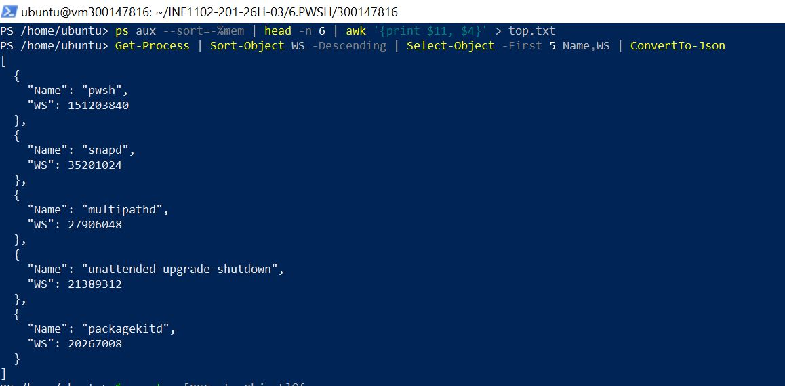

## 📝 Création de rapports structurés : Exemple concret

Dans ce laboratoire, nous avons comparé la méthode traditionnelle (Bash) et la méthode moderne (PowerShell) pour générer un rapport d'état du système: (un rapport DevOps)

### ❌ Méthode Bash (Extraction de texte)

Bash nécessite de rediriger du texte brut vers un fichier. Le résultat est difficile à réutiliser par un autre programme sans faire de "parsing" (découpage de texte).

```bash

ps aux --sort=-%mem | head -n 5 > top_mem.txt

df -h >> top_mem.txt

✅ Méthode PowerShell (Création d'objet JSON)

PowerShell permet de créer un [PSCustomObject]. On définit nos propres étiquettes (TopMemory, Disk) et on y stocke directement les résultats.

[Powershell](./images/powershell.JPG)

**🎯 Pourquoi c'est important ?**

- **Aucun parsing requis** : Le fichier report.json est déjà structuré.

- **Prêt pour l'ingestion **: Ce fichier peut être envoyé directement à une API Web, une base de données ou un tableau de bord de monitoring.

- **Lisibilité **: Le code PowerShell est plus explicite sur ce qu'il contient (on voit clairement les clés TopMemory et Disk).

# Conclusion:

## 🏁 Conclusion du Laboratoire

Ce laboratoire a permis de démontrer l'efficacité de **PowerShell Core** en tant qu'outil d'automatisation sur un système **Linux (Ubuntu 22.04)**. 

### ✅ Points clés retenus :

1. **Puissance des Objets** : Contrairement au Bash qui manipule du texte brut, PowerShell permet de manipuler des données structurées, rendant les scripts plus robustes et moins sujets aux erreurs de "parsing".

2. **Interopérabilité** : La capacité d'utiliser un même langage sur Windows et Linux simplifie grandement la gestion des infrastructures hybrides.

3. **Format Standardisé** : L'exportation native en **JSON** facilite l'intégration immédiate des rapports système dans des pipelines DevOps modernes (monitoring, APIs, bases de données).

En résumé, l'adoption de PowerShell sous Linux offre une alternative sérieuse et performante au Bash traditionnel, particulièrement pour les administrateurs système cherchant une approche orientée programmation et une cohérence multi-plateforme.

---
---

## ✍️ Auteur
**HANANE ZERROUKI** 🆔 Étudiante : 300147816  
📅 Mars 2026 — Laboratoire DevOps PowerShell


