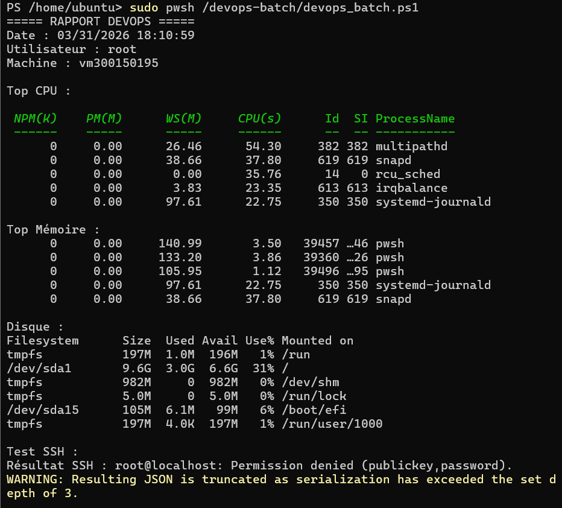

# 300150195 — Amel Zourane

## 📚 TP — Batch DevOps PowerShell
### Cours : INF1102-201-26H-03

## 🖥️ Informations de la VM

| Élément | Valeur |
|---------|--------|
| Étudiant | Amel Zourane |
| Numéro | 300150195 |
| Machine | vm300150195 |
| IP | 10.7.237.214 |
| OS | Ubuntu 22.04 (Jammy) |
| Shell | PowerShell 7.6.0 |

## 📋 Description

Script batch DevOps en PowerShell sur Ubuntu 22.04.  
Il vérifie l'état du système (CPU, mémoire, disque) et la connectivité SSH,  
puis génère automatiquement un rapport texte et JSON.
## 🎯 Objectif

Ce TP vise à développer un script batch **DevOps** en **PowerShell** sur **Ubuntu 22.04**,
permettant d'automatiser la surveillance du système et de générer des rapports détaillés.

### Ce TP permet de :

- ✅ Créer un script batch PowerShell fonctionnel sur Linux
- ✅ Vérifier l'état du système (CPU, mémoire, disque)
- ✅ Tester la connectivité réseau via SSH
- ✅ Générer un rapport texte `.txt` et structuré `.json`
- ✅ Automatiser des tâches administratives et DevOps
- ✅ Comprendre le pipeline PowerShell orienté objets

## 📸 Résultat — PowerShell 7.6.0


## 📊 Résultat — Rapport DevOps



## 📁 Structure du projet

​```
300150195/
│
├── devops_batch.ps1       # Script principal PowerShell
├── README.md              # Ce fichier
└── images/
    ├── pwsh_version.png   # Version PowerShell installée
    └── rapport_devops.png # Résultat du script
​```
## ▶️ Installation de PowerShell
```bash
wget https://packages.microsoft.com/config/ubuntu/22.04/packages-microsoft-prod.deb
sudo dpkg -i packages-microsoft-prod.deb
sudo apt update && sudo apt install -y powershell
```

---

## 🚀 Exécution
```bash
sudo pwsh /devops-batch/devops_batch.ps1
```

---

## 📄 Rapports générés

| Fichier | Description |
|---------|-------------|
| `rapport.txt` | Rapport lisible en texte brut |
| `rapport.json` | Rapport structuré en JSON |

---

## ✅ Compétences couvertes

| Compétence | Détail |
|-----------|--------|
| ⚡ PowerShell | Scripting sur Linux |
| 🐧 Linux | Administration Ubuntu 22.04 |
| 📊 Monitoring | CPU, mémoire, disque |
| 🔌 Réseau | Test SSH |
| 🗂️ JSON | Génération de rapports structurés |


