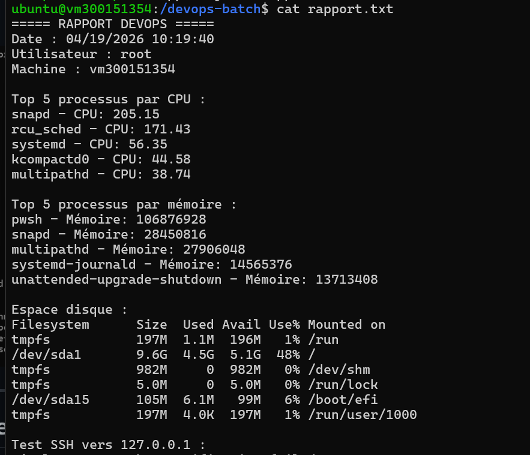

# 📊 DevOps Batch — Script PowerShell de monitoring système
 
> **Cours :** INF1102-201-26H-03  
> **TP :** 6 — PowerShell  
> **Étudiant :** 300151354  
> **Environnement :** Ubuntu 22.04 + PowerShell (pwsh)
 
---
 
## 📋 Description
 
Script PowerShell (`devops_batch.ps1`) qui automatise la collecte d'informations système sur une machine Linux. Il génère deux rapports : un fichier texte lisible par un humain et un fichier JSON structuré pour usage DevOps.
 
---
 
## 🗂️ Structure du projet
 
```
/devops-batch/
├── devops_batch.ps1   # Script principal PowerShell
├── rapport.txt        # Rapport texte généré automatiquement
└── rapport.json       # Rapport JSON généré automatiquement
```
 
---
 
## ⚙️ Fonctionnalités
 
| Fonctionnalité | Description |
|---|---|
| 🖥️ **Infos système** | Date, utilisateur, nom de la machine |
| 🔥 **Top 5 CPU** | Processus les plus gourmands en CPU |
| 🧠 **Top 5 Mémoire** | Processus les plus gourmands en RAM |
| 💾 **Espace disque** | Sortie complète de `df -h` |
| 🔐 **Test SSH** | Connexion test vers `127.0.0.1` |
| 📄 **rapport.txt** | Rapport lisible généré avec `Tee-Object` |
| 📦 **rapport.json** | Rapport structuré généré avec `ConvertTo-Json` |
 
---
 
## 🚀 Installation et exécution
 
### 1. Prérequis — Installer PowerShell sur Ubuntu
 
```bash
sudo apt update
sudo apt install -y wget apt-transport-https software-properties-common
wget https://packages.microsoft.com/config/ubuntu/22.04/packages-microsoft-prod.deb
sudo dpkg -i packages-microsoft-prod.deb
sudo apt update
sudo apt install -y powershell
```
 
### 2. Vérifier l'installation
 
```bash
pwsh
$PSVersionTable
```
 
### 3. Créer le dossier et le script
 
```bash
sudo mkdir /devops-batch
cd /devops-batch
sudo nano devops_batch.ps1
```
 
### 4. Donner les permissions d'exécution
 
```bash
sudo chmod +x devops_batch.ps1
```
 
### 5. Exécuter le script
 
```bash
sudo pwsh devops_batch.ps1
```
 
---
 
## 📄 Script complet — `devops_batch.ps1`
 
```powershell
#!/usr/bin/env pwsh
 
# =========================
# Batch DevOps PowerShell
# =========================
 
# Variables
$rapportTxt  = "/devops-batch/rapport.txt"
$rapportJson = "/devops-batch/rapport.json"
$hostname    = hostname
$user        = whoami
$date        = Get-Date
 
# En-tête
Write-Output "===== RAPPORT DEVOPS =====" | Tee-Object $rapportTxt
Write-Output "Date : $date"               | Tee-Object -FilePath $rapportTxt -Append
Write-Output "Utilisateur : $user"        | Tee-Object -FilePath $rapportTxt -Append
Write-Output "Machine : $hostname"        | Tee-Object -FilePath $rapportTxt -Append
Write-Output ""                           | Tee-Object -FilePath $rapportTxt -Append
 
# CPU
Write-Output "Top 5 processus par CPU :" | Tee-Object -Append $rapportTxt
$topCPU = Get-Process | Sort-Object CPU -Descending | Select-Object -First 5
foreach ($p in $topCPU) {
    Write-Output ("{0} - CPU: {1}" -f $p.ProcessName, $p.CPU) | Tee-Object -Append $rapportTxt
}
 
# Mémoire
Write-Output "" | Tee-Object -Append $rapportTxt
Write-Output "Top 5 processus par mémoire :" | Tee-Object -Append $rapportTxt
$topMem = Get-Process | Sort-Object WS -Descending | Select-Object -First 5
foreach ($p in $topMem) {
    Write-Output ("{0} - Mémoire: {1}" -f $p.ProcessName, $p.WorkingSet) | Tee-Object -Append $rapportTxt
}
 
# Disque
Write-Output "" | Tee-Object -Append $rapportTxt
Write-Output "Espace disque :" | Tee-Object -Append $rapportTxt
$disk = df -h
Write-Output $disk | Tee-Object -Append $rapportTxt
 
# SSH
Write-Output "" | Tee-Object -Append $rapportTxt
$sshHost = "127.0.0.1"
Write-Output "Test SSH vers $sshHost :" | Tee-Object -Append $rapportTxt
try {
    $result = ssh -o BatchMode=yes -o ConnectTimeout=5 $sshHost "echo OK" 2>&1
    Write-Output "Résultat : $result" | Tee-Object -Append $rapportTxt
}
catch {
    Write-Output "SSH échoué vers $sshHost" | Tee-Object -Append $rapportTxt
}
 
# JSON
$reportObj = [PSCustomObject]@{
    Date       = $date
    Utilisateur = $user
    Machine    = $hostname
    TopCPU     = $topCPU | ForEach-Object { @{Process = $_.ProcessName; CPU    = $_.CPU} }
    TopMemory  = $topMem | ForEach-Object { @{Process = $_.ProcessName; Memory = $_.WorkingSet} }
    Disk       = $disk
}
 
$reportObj | ConvertTo-Json -Depth 5 | Set-Content $rapportJson
 
Write-Output ""
Write-Output "Rapports générés : $rapportTxt et $rapportJson"
```
 
---
 
## 📸 Captures d'écran
 
### Fichiers générés dans `/devops-batch`

 
### Exécution du script — rapport affiché dans le terminal

 
### Contenu de `rapport.json`

 
### Contenu de `rapport.txt`

 
---
 
## 📦 Exemple de sortie — `rapport.txt`
 
```
===== RAPPORT DEVOPS =====
Date : 04/19/2026 10:19:40
Utilisateur : root
Machine : vm300151354
 
Top 5 processus par CPU :
snapd        - CPU: 205.15
rcu_sched    - CPU: 171.43
systemd      - CPU: 56.35
kcompactd0   - CPU: 44.58
multipathd   - CPU: 38.74
 
Top 5 processus par mémoire :
pwsh                       - Mémoire: 106876928
snapd                      - Mémoire: 28450816
multipathd                 - Mémoire: 27906048
systemd-journald           - Mémoire: 14565376
unattended-upgrade-shutdown - Mémoire: 13713408
 
Espace disque :
Filesystem      Size  Used Avail Use% Mounted on
/dev/sda1       9.6G  4.5G  5.1G  48% /
 
Test SSH vers 127.0.0.1 :
...
```
 
---
 
## 📦 Exemple de sortie — `rapport.json`
 
```json
{
  "Date": "2026-04-19T10:19:40.861218+00:00",
  "Utilisateur": "root",
  "Machine": "vm300151354",
  "TopCPU": [
    { "CPU": 205.15, "Process": "snapd" },
    { "CPU": 171.43, "Process": "rcu_sched" },
    { "CPU": 56.35,  "Process": "systemd" },
    { "CPU": 44.58,  "Process": "kcompactd0" },
    { "CPU": 38.74,  "Process": "multipathd" }
  ],
  "TopMemory": [
    { "Memory": 106876928, "Process": "pwsh" },
    { "Memory": 28450816,  "Process": "snapd" },
    { "Memory": 27906048,  "Process": "multipathd" },
    { "Memory": 14565376,  "Process": "systemd-journald" }
  ],
  "Disk": "..."
}
```
 
---
 
## 🧠 Concepts PowerShell utilisés
 
| Concept | Utilisation dans le script |
|---|---|
| `Tee-Object` | Affiche ET écrit dans le fichier en même temps |
| `Get-Process` | Récupère la liste des processus en cours |
| `Sort-Object` | Trie les processus par CPU ou mémoire |
| `Select-Object -First 5` | Sélectionne uniquement le Top 5 |
| `ForEach-Object` + `$_` | Itère sur chaque objet du pipeline |
| `PSCustomObject` | Crée un objet structuré pour le JSON |
| `ConvertTo-Json` | Convertit l'objet en format JSON |
| `Set-Content` | Écrit le JSON dans un fichier |
 
---
 
## ✅ Checklist TP
 
- [x] PowerShell installé sur Ubuntu
- [x] Script `devops_batch.ps1` créé et fonctionnel
- [x] Top 5 CPU affiché et exporté
- [x] Top 5 Mémoire affiché et exporté
- [x] Espace disque (`df -h`) intégré
- [x] Test SSH vers `127.0.0.1`
- [x] Fichier `rapport.txt` généré
- [x] Fichier `rapport.json` généré et structuré
---
