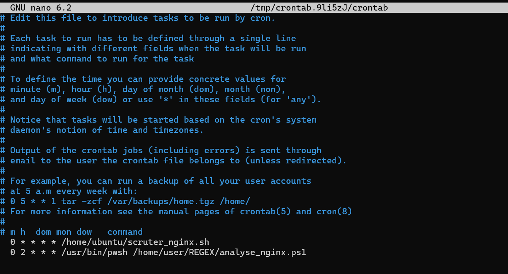

# 🧪 TP : Analyse des logs Nginx avec Regex (PowerShell & Python)

## 🎯 Objectif du laboratoire
Ce laboratoire a pour objectif de développer des scripts permettant d’analyser automatiquement les fichiers de logs d’un serveur Nginx en utilisant des expressions régulières (Regex), puis de générer un rapport détaillé.  

L’analyse est réalisée à l’aide de deux technologies :
- PowerShell
- Python  

Le projet inclut également une automatisation de l’exécution des scripts.

---

## 📂 Structure du projet
```text
REGEX/
├── analyse_nginx.ps1
├── analyse_nginx.py
├── rapport_nginx_ps1_YYYY-MM-DD.txt
└── rapport_nginx_py_YYYY-MM-DD.txt
```
---

## ⚡ Script PowerShell

## 🐍 Script Python

Ajout de la tâche :


## 🎓 Compétences développées

- Expressions régulières (Regex)
- Analyse de logs web
- Scripting PowerShell et Python
- Automatisation des tâches (cron)
- Débogage

---

## ✅ Conclusion

Ce laboratoire démontre l’importance de l’automatisation dans l’analyse des logs serveur.  
Les scripts développés permettent d’extraire rapidement des informations pertinentes, facilitant ainsi la surveillance, le diagnostic et la sécurité des systèmes web.
