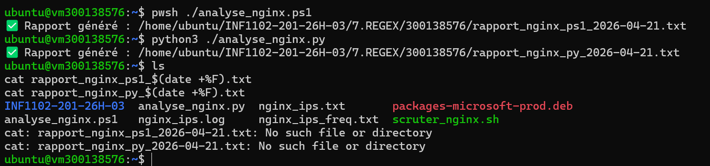
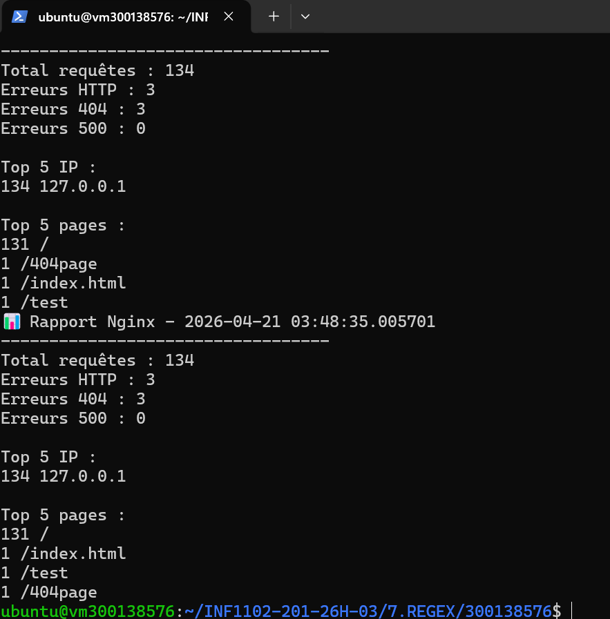

# 🔍 Lab REGEX – Analyse des logs Nginx

## 🎯 Objectif

Ce laboratoire consiste à analyser le fichier de logs Nginx (`access.log`) en utilisant des expressions régulières (Regex) afin d’extraire des informations pertinentes sur le trafic.

---

## 🗂️ Structure du projet

```bash
7.REGEX/
└── 300138576/
    ├── analyse_nginx.ps1
    ├── analyse_nginx.py
    ├── rapport_nginx_ps1_2026-04-21.txt
    ├── rapport_nginx_py_2026-04-21.txt
    └── images/
        ├── 1.png
        └── 2.png
```

---

## ⚙️ Fonctionnalités

### 📌 1. Nombre total de requêtes

```bash
Total requêtes : 134
```

---

### 📌 2. Analyse des codes HTTP

```regex
" (\d{3}) "
```

Résultat :

* Erreurs HTTP : 3
* Erreurs 404 : 3
* Erreurs 500 : 0

---

### 📌 3. Extraction des adresses IP

```regex
^(\d{1,3}(\.\d{1,3}){3})
```

Résultat :

```bash
Top 5 IP :
134 127.0.0.1
```

---

### 📌 4. Extraction des pages visitées

```regex
"GET ([^ ]+)
```

Résultat :

```bash
Top 5 pages :
131 /
1 /index.html
1 /test
1 /404page
```

---

## 📊 Résultat obtenu

✔ Analyse correcte des logs Nginx
✔ Détection des erreurs HTTP
✔ Identification des IPs principales
✔ Identification des pages les plus visitées
✔ Implémentation en PowerShell ET Python

---

## 🖼️ Preuves d’exécution

### 🔹 Exécution des scripts



### 🔹 Résultat des rapports générés



---

## ⚠️ Remarque

Au début, les résultats étaient à 0 car le fichier log ne contenait pas de trafic.
Des requêtes ont été générées avec `curl` afin de produire des données réelles pour l’analyse.

---

## ✅ Conclusion

Ce TP permet de :

* Maîtriser les expressions régulières (Regex)
* Analyser des logs serveur
* Extraire des informations critiques
* Comparer PowerShell et Python

Ce type d’analyse est essentiel en cybersécurité et en administration système.

---
