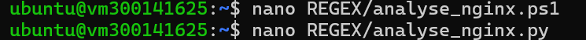
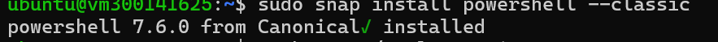
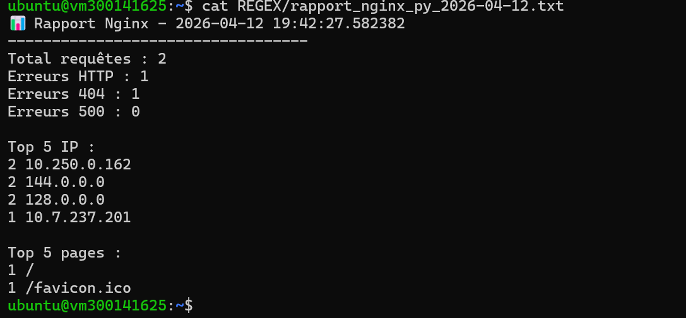

# Lab 7 – Expressions Régulières (REGEX)

## 🎯 Objectif du laboratoire
Ce laboratoire a pour objectif de développer des scripts permettant d'analyser automatiquement les fichiers de logs d'un serveur Nginx en utilisant des expressions régulières (Regex), puis de générer un rapport détaillé.
L'analyse est réalisée à l'aide de deux technologies :

- PowerShell
- Python

Le projet inclut également une automatisation de l'exécution des scripts.

## 🎓 Compétences développées
- Expressions régulières (Regex)
- Analyse de logs web
- Scripting PowerShell et Python
- Automatisation des tâches (cron)
- Débogage

## 📂 Structure
REGEX/
├── README.md
├── images/
├── analyse_nginx.ps1
└── analyse_nginx.py
## ▶️ Étapes effectuées sur Ubuntu

### 1. Création des scripts

### 2. Exécution Python

### 3. Installation PowerShell

### 4. Exécution PowerShell

### 5. Rapport généré

## ✅ Conclusion
Ce laboratoire démontre l'importance de l'automatisation dans l'analyse des logs serveur. Les scripts développés permettent d'extraire rapidement des informations pertinentes, facilitant ainsi la surveillance, le diagnostic et la sécurité des systèmes web.

## 👤 Auteur
- Nom : Fatou
- ID Boréal : 300141625
