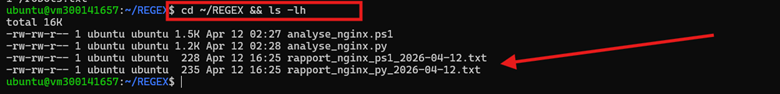
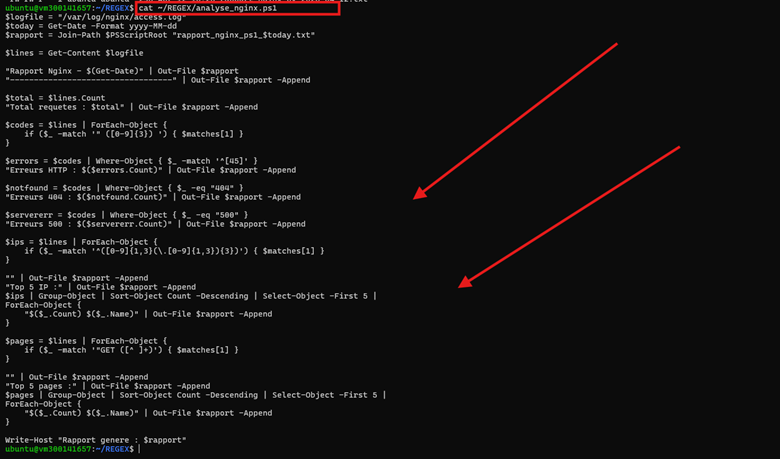
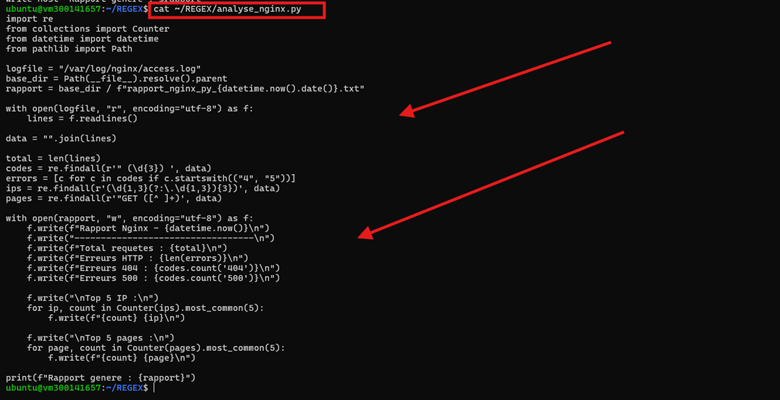
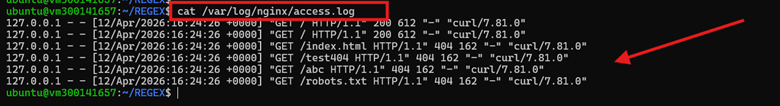
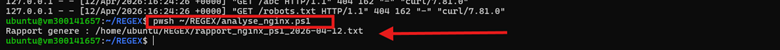
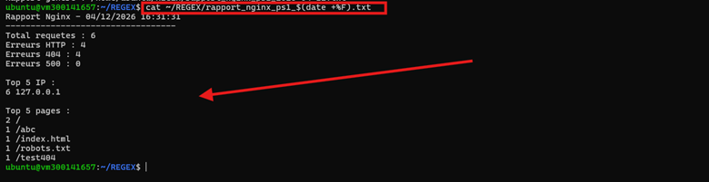
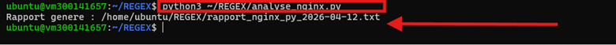
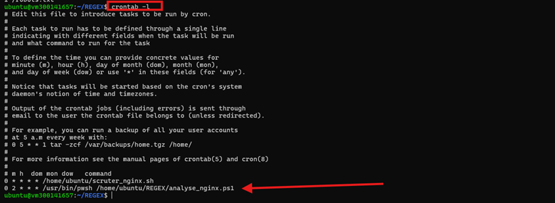
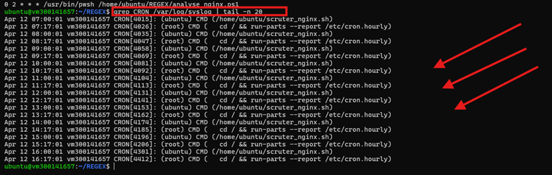

# TP : Analyse des logs Nginx avec Regex (PowerShell & Python)

## Informations

**Nom :** Léandre Manizan  
**Numéro étudiant :** 300141657  
**Cours :** INF1102-201-26H-03  
**Travail :** TP Regex Nginx

---

## Objectif

Ce TP consiste à analyser le fichier de logs Nginx suivant :

```bash
/var/log/nginx/access.log

### 1. Structure du dossier `REGEX`



Cette capture montre les fichiers présents dans le dossier `REGEX`, y compris les scripts et les rapports générés.

---

### 2. Contenu du script PowerShell `analyse_nginx.ps1`



Cette capture présente le script PowerShell utilisé pour analyser les logs Nginx et générer un rapport.

---

### 3. Contenu du script Python `analyse_nginx.py`



Cette capture montre le script Python utilisant des expressions régulières pour analyser le fichier `access.log`.

---

### 4. Contenu du fichier `access.log`



Cette capture montre les lignes de logs Nginx utilisées comme entrée pour l’analyse.

---

### 5. Exécution du script PowerShell



Cette capture confirme l’exécution correcte du script PowerShell et la génération du rapport.

---

### 6. Rapport généré par PowerShell



Cette capture montre le rapport PowerShell contenant le total des requêtes, les erreurs HTTP, les erreurs 404, les erreurs 500, le top 5 des IP et le top 5 des pages.

---

### 7. Exécution du script Python



Cette capture confirme que le script Python s’exécute correctement et génère son propre rapport.

---

### 8. Vérification de la crontab



Cette capture montre la tâche cron ajoutée pour automatiser l’exécution du script PowerShell.

---

### 9. Vérification des journaux cron



Cette capture montre les entrées du service cron dans `/var/log/syslog`.
