# TP 7 - REGEX

## Étudiant
- Nom : Abdou karim NIANG
- ID : 300141858

## Objectif
Ce TP consiste à analyser le fichier `/var/log/nginx/access.log` avec des expressions régulières en PowerShell et en Python, puis à automatiser l’exécution avec cron.

## Fichiers
- `analyse_nginx.ps1`
- `analyse_nginx.py`
- `images/`

## Vérification du log Nginx
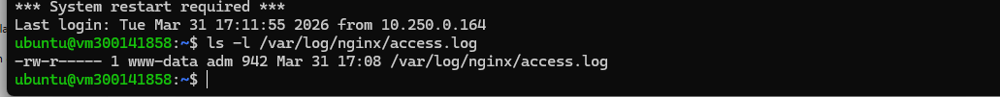

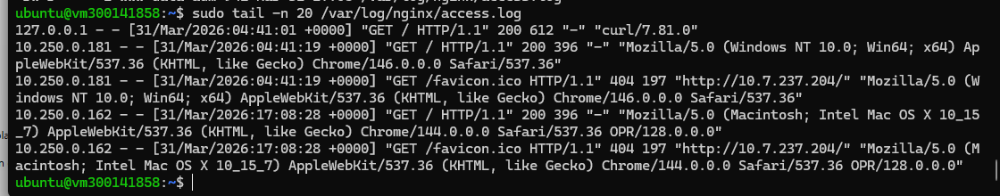

## Création du dossier de travail
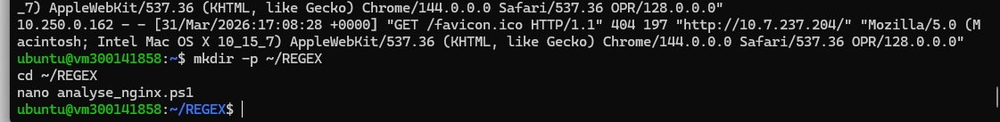

## Script PowerShell
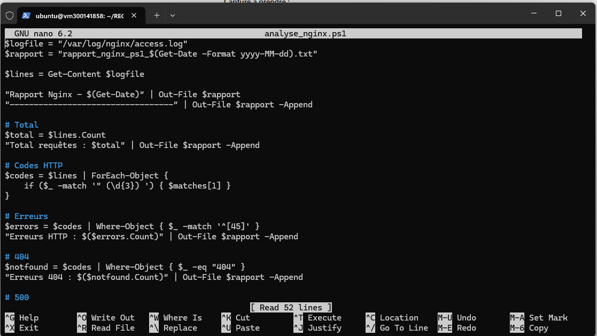

## Vérification des fichiers créés
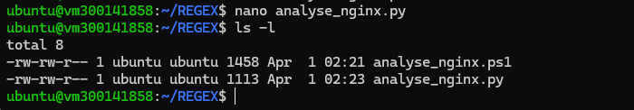

## Installation de PowerShell
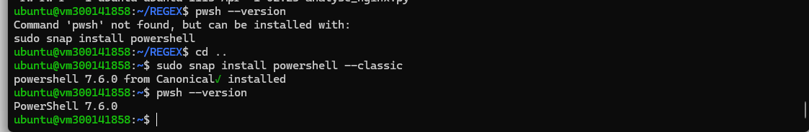

## Exécution du script PowerShell
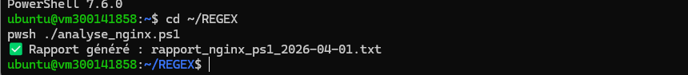

## Rapport PowerShell
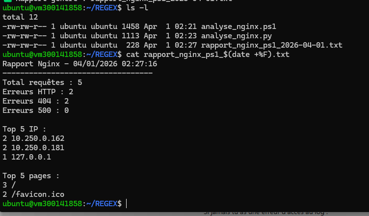

## Première exécution Python
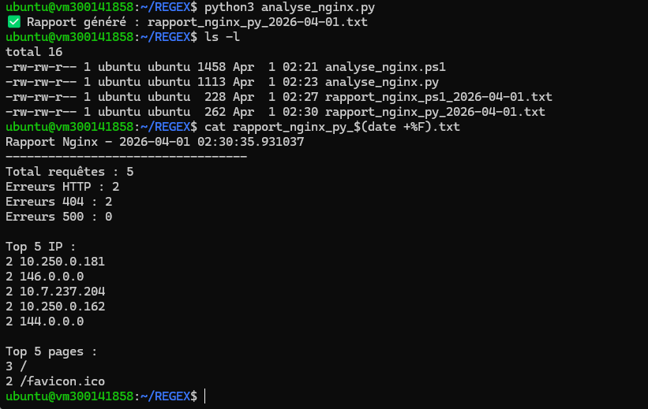

## Correction du script Python
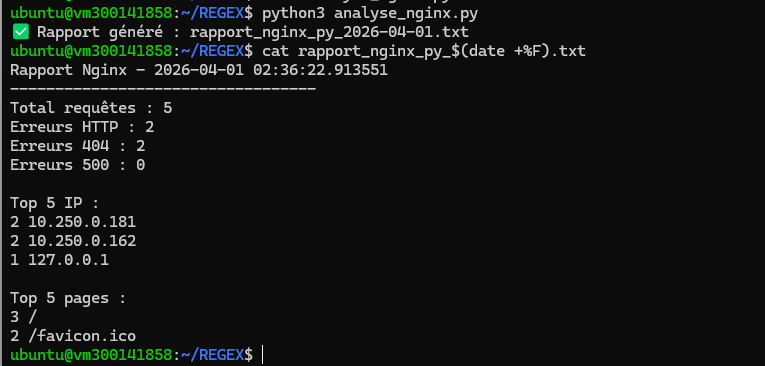

## Automatisation cron
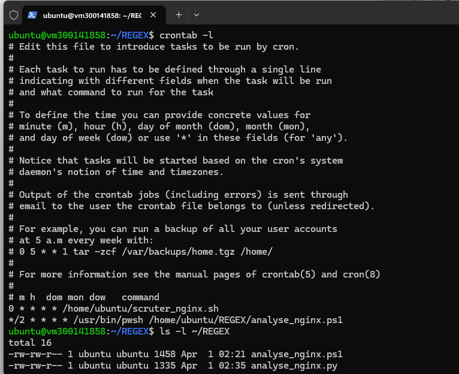

## Vérification cron dans syslog
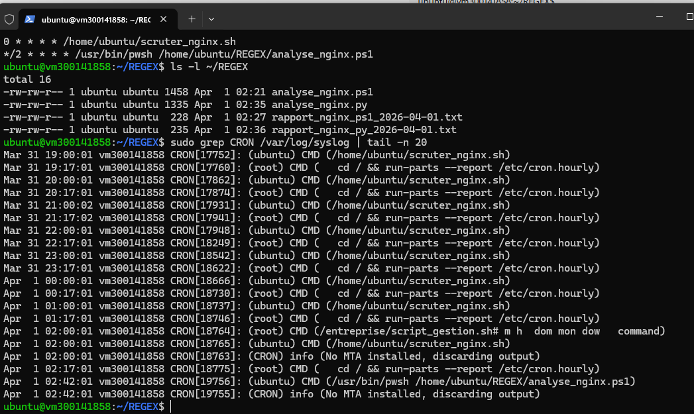

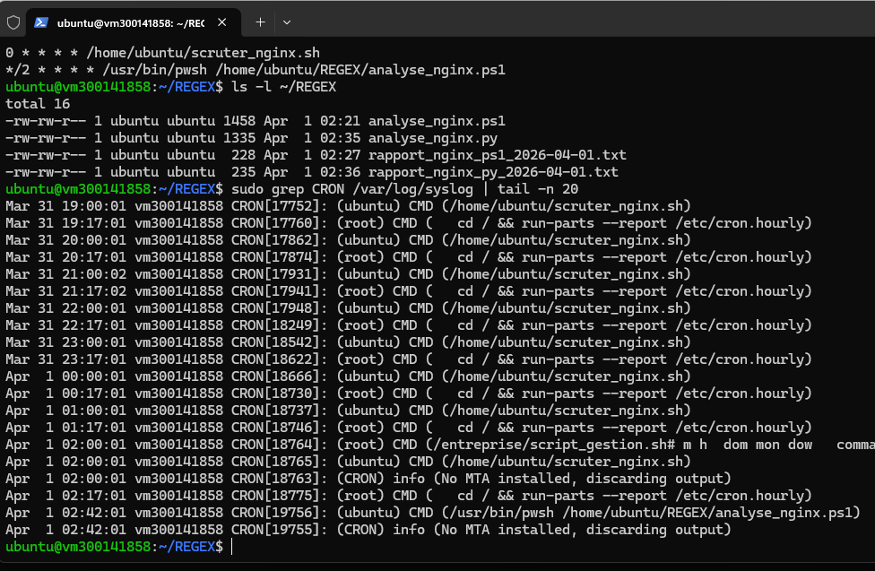