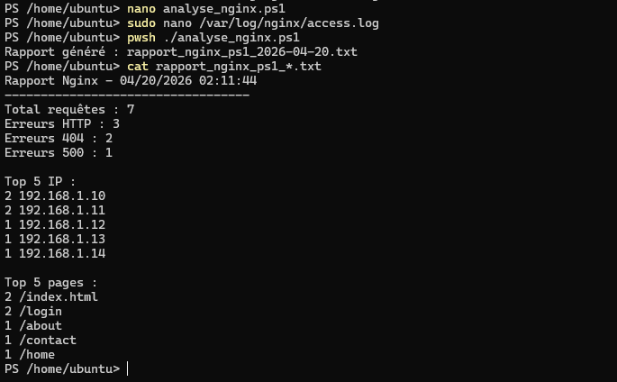

# TP 7 – Analyse des logs Nginx avec Regex (PowerShell)

## 🎯 Objectif

Ce laboratoire consiste à analyser un fichier de logs Nginx en utilisant des expressions régulières (Regex). L’objectif est d’extraire des informations importantes comme les codes HTTP, les adresses IP et les pages consultées afin de générer un rapport automatisé.

---

## 🖥 Environnement

* Système : Ubuntu 22.04
* Shell : PowerShell (pwsh)
* Fichier analysé : `/var/log/nginx/access.log`

---

## ⚙️ Étapes réalisées

### 1. Création du dossier

Création du dossier de travail REGEX.

### 2. Création du script

Création du script `analyse_nginx.ps1` permettant de :

* Lire le fichier de logs
* Extraire les codes HTTP avec Regex
* Identifier les erreurs (404, 500)
* Extraire les adresses IP
* Identifier les pages les plus visitées
* Générer un rapport texte

---

## 🔍 Expressions régulières utilisées

* IP : `(\d{1,3}\.){3}\d{1,3}`
* Code HTTP : `(\d{3})`
* Pages : `GET ([^ ]+)`
* Erreurs : `(4|5)\d{2}`

---

## ▶️ Exécution

```bash
pwsh ./analyse_nginx.ps1
```

---

## 📸 Preuves d’exécution

### 🔹 Script PowerShell



---

### 🔹 Exécution du script


---

### 🔹 Rapport généré


---

## ✅ Résultats obtenus

* ✔ 7 requêtes analysées
* ✔ 3 erreurs HTTP détectées
* ✔ 2 erreurs 404
* ✔ 1 erreur 500
* ✔ Top 5 des adresses IP
* ✔ Top 5 des pages visitées

---

## 🔎 Vérifications

* Vérification du fichier généré :
  `rapport_nginx_ps1_2026-04-20.txt`

* Validation des résultats avec le contenu du log

---

## 🧠 Conclusion

Ce TP démontre l’efficacité des expressions régulières pour analyser des logs système. Il permet d’automatiser l’extraction d’informations importantes et de faciliter la supervision des serveurs web.

---

## 🚀 Améliorations possibles

* Générer un rapport JSON
* Ajouter analyse des requêtes POST
* Automatiser avec cron
* Ajouter graphiques ou dashboard

---
